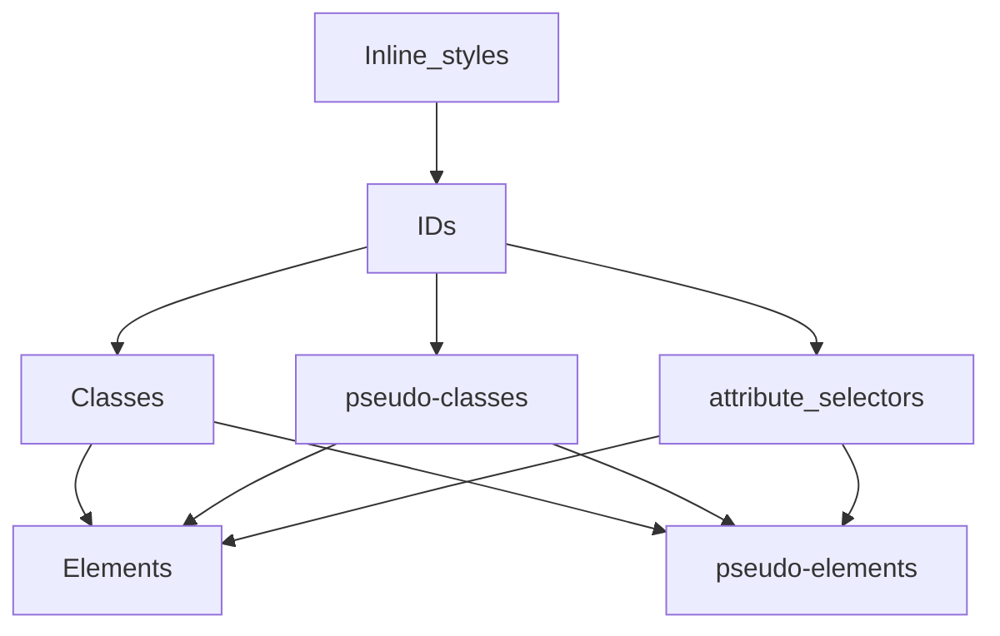
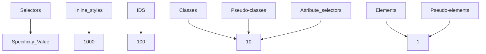
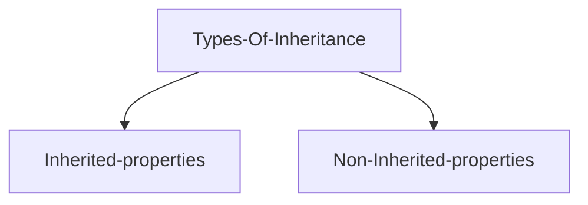

---
# try also 'default' to start simple
theme: seriph
# random image from a curated Unsplash collection by Anthony
# like them? see https://unsplash.com/collections/94734566/slidev
background: https://res.cloudinary.com/drnqdd87d/image/upload/f_auto/nmgakkzd3lmlibnfosps
# some information about your slides, markdown enabled
title: CSS Class Note
info: |
  ## AltSchool v4 CSS Class Notes
  making of world class developers

  join at [AltSchool Africa](https://altschoolafrica.com)
# apply any unocss classes to the current slide
class: text-center
# https://sli.dev/custom/highlighters.html
highlighter: shiki
# https://sli.dev/guide/drawing
drawings:
  persist: false
# slide transition: https://sli.dev/guide/animations#slide-transitions
transition: slide-left
# enable MDC Syntax: https://sli.dev/guide/syntax#mdc-syntax
mdc: true
hideInToc: true
---

# CSS Class Notes

CSS Class notes for the 1st Semester

<div class="pt-12">
  <span @click="$slidev.nav.next" class="px-2 py-1 rounded cursor-pointer" hover="bg-white bg-opacity-10">
    Are you ready to well designed UI with your HTML skills? Press <kbd>space</kbd> on your keyboard <carbon:arrow-right class="inline"/>
  </span>
</div>

<div class="abs-br m-6 flex gap-2">
  <button @click="$slidev.nav.openInEditor()" title="Open in Editor" class="text-xl slidev-icon-btn opacity-50 !border-none !hover:text-white">
    <carbon:edit />
  </button>
  <a href="https://github.com/oluwasetemi/css-note" target="_blank" alt="GitHub" title="Open in GitHub"
    class="text-xl slidev-icon-btn opacity-50 !border-none !hover:text-white">
    <carbon-logo-github />
  </a>
  <a href="https://github.com/Oluwasetemi/css-note/releases" target="_blank" alt="Download" title="Download PDF or PPTX version of the slide"
    class="text-xl slidev-icon-btn opacity-50 !border-none !hover:text-white">
    <carbon-download />
  </a>
</div>

<!--
The last comment block of each slide will be treated as slide notes. It will be visible and editable in Presenter Mode along with the slide. [Read more in the docs](https://sli.dev/guide/syntax.html#notes)
-->

---

## Table of contents

<Toc columns="2" minDepth="1" maxDepth="2"></Toc>

---

# Getting Started with CSS?

### CSS which stands in for Cascading Style Sheets is a stylesheet language used to describe the presentation of a document written in HTML or XML.

<br/>

### Just as HTML serves as the skeletal part of the web, CSS describes how the element should be rendered on the web.

### We use CSS to style our HTML elements and this is what you're going to learn throughout this module.

---

# Selectors

Before we move deeply into Selectors, let's dive into CSS rule which is a block of code, that has one or more selectors and one or more declarations.


---

<ins>Definition of selectors</ins>

Looking at the image in the previous slide we'll notice that CSS selector is the first part of a CSS rule. In order to choose or select HTML elements that's going to carry the CSS property values inside the rule we have to use CSS Selector. In summary, for us to add a style for a particular HTML element we need a selector.

Types of selectors

- Universal selector: This is also know as a wildcard, selects every single element in the document. It is represented by the asterisk character <kbd>\*</kbd>

<ins>Code Example</ins>:

```css
* {
  margin: 0;
  padding: 0;
  box-sizing: border-box;
}
```

This rule is saying that remove any default margin and padding from all the elements in this document and also change the box-sizing value to border-box.

---

- Type selector: The CSS type selector matches elements by node/HTML name.

<ins>Code Example</ins>:

```html
<p>I am taking color red and increasing my font size.</p>
```

```css
p {
  color: red;
  font-size: 36px;
}
```

This CSS rule is saying that apply color of red to every <kbd>p</kbd> element and also increase its font size to 36px.

---

- Class selector: There is a class attribute associated to all HTML elements, this allows us to target a specific HTML element for its class name. To style an element using the class name we make use of the dot notation <kbd>.</kbd> before the class name when writing our selector in the CSS rule <kbd>.paragraph</kbd>

<ins>Code Example</ins>:

```html
<p class="paragraph">You can style me using my class name.</p>
```

```css
.paragraph {
  color: red;
  font-size: 36px;
}
```

This CSS rule is saying that
apply color of red to the <kbd>p</kbd> element that has the class name of
paragraph and also increase its font size to 36px.

---

- ID selector: The id
  selector uses the id attribute of an HTML element to select a specific element.
  Id value of an element must be unique which means you can only have a specific
  id value to an HTML element, unlike class where you can give 10 HTML elements
  same class name. <br />
  To style an element using the id value we make use of the hash notation <kbd>#</kbd> before
  the id value when writing our selector in the CSS rule
  <kbd>#container-wrapper</kbd>

<ins>Code Example</ins>:

```html
<span id="container-wrapper">
  You can style me using my id value which is container-wrapper.
</span>
```

```css
#container-wrapper {
  color: red;
  font-size: 36px;
}
```

---

- Attribute selector: This gives you the power to select elements based on the presence of a certain HTML attribute or the value of an HTML attribute. To write the CSS rule for this you have to wrap the selector with square brackets.

<ins>Code Example</ins>:

```html
<a href="https://altschoolafrica.com">
  You can style me using my attribute which is href.
</a>
```

```css
[href] {
  color: red;
}
```

---

<ins>Code Example 2</ins>:

```html
<a href="https://altschoolafrica.com">
  You can style me using my attribute and its value which is
  href="https://altschoolafrica.com".
</a>
```

```css
[href="https://altschoolafrica.com"]
{
  color: red;
  font-size: 36px;
}
```

Note: This method give you the access to style any element that has an attribute of data-type but with a specific value of href.

---

- Pseudo-classes: Pseudo-classes are keywords added to selectors using a single colon sign <kbd>:</kbd> just to specify a special state of the selected elements. They allow you to style elements based on their state, position, or user interactions, which cannot be targeted by regular CSS selectors alone.
  Here are some common pseudo-classes:

```
1 :link
2 :visited
3 :hover
4 :active
5 :focus
6 :nth-child()

```

<ins>Code Example</ins>

```css
button:hover {
  background-color: orange;
}

li:nth-child(even) {
  text-transform: uppercase;
}

input:focus {
  border: 2px solid red;
}
```

---

- Pseudo-element: To style specific parts of an element we attached double colon to our selector <kbd>::</kbd> followed by keywords to select the portion we want to apply styling to. Unlike the pseudo-classes, which target the entire element, pseudo-elements target specific parts of an element using a conventional keywords.

Here are some common pseudo-elements:

```
1 ::before - Inserts content before the content of an element.
2 ::after - Inserts content after the content of an element.
3 ::first-letter - Styles the first letter of an element.
4 ::first-line - Styles the first line of an element.
5 ::selection - Styles the portion of an element that is selected by the user.

```

Note: Pseudo-elements are particularly useful for enhancing the design and readability of web content without the need for additional HTML elements.

---

<ins>Complex selectors</ins>

To have more power in accessing elements in the DOM we have some selectors which we will brief through but let's quickly look at parents and child elements using this code below:

```html
<p>
  AltSchool Africa is a tech school that offers varieties of tech courses like
  <span>Frontend engineering</span>, <span>Backend engineering</span> and newly
  added <span>Cybersecurity</span> online.
</p>
```

In the code above, the parent element is the <kbd>p</kbd>, inside which we have 3 span elements, since all these 3 span elements are inside the <kbd>p</kbd> we call them the child elements of <kbd>p</kbd>.

- Descendant Selector: This selects all elements that are descendants and we achieve this by giving space<kbd>( )</kbd> to instruct the browser to look for child elements.

<ins>Code Example</ins>:

```css
p span {
  color: red;
}
```

All the texts wrapped inside the span tag will take the CSS rule.

---

- Child selector (parent > child): This selects all elements that are direct children of a specified element.

<ins>Code Example</ins>:

```css
ul > li {
  list-style: none;
}
```

- Adjacent Sibling Selector (prev + next): This selects an element that is immediately preceded by a specified element.

<ins>Code Example</ins>:

```css
h1 + p {
  margin-top: 0;
}
```

---

- General Sibling Selector (prev ~ siblings): This selects all elements that are siblings of a specified element.

Code Example:

```css
h1 ~ p {
  color: blue;
}
```

- Grouping Selector: Applies the same styles to multiple selectors.

Code Example:

```css
h1,
h2,
h3 {
  margin-bottom: 10px;
}
```

---

# Specificity

Specificity is the key to understanding how CSS decides between competing rules. Let's take a brief at this code before we dive deep into specificity.

```html
<h1 class="title">Hi, Specificity</h1>
```

```css
h1 {
  color: blue;
}

.title {
  color: yellow;
}
```

In the code above, we are trying to style the h1 element but we have two CSS ruleset, so which stylesheet will override the other? This is where our knowledge on specificity algorithm comes in.
<br/>
<br/>
Specificity is a score given to selectors, and whenever we have two or more CSS rules pointing to the same element, the selector that has the highest specificity score will win, which means the CSS ruleset of this particular selector will be apllied on the element.

## <!-- We will come back to this at the end of this topic. -->

---

## Specificity Hierachy

CSS selectors are of different forms and each of them has its place in the specificity hierachy.

CSS Selectors decrease in specificity from top to bottom, meaning the selector at the top of the hierarchy has the highest specificity.

<div class="grid grid-col-2 gap-4    h-85 p-4 border border-gray-300 bg-blue overflow-auto ">
  <div class=" flex justify-center animate-slide-in-left">

</div>

<div class="bg-red animate-slide-in-right" >

</div>

Note:
The specificity of a CSS selector is typically represented as a four-part value like 0,0,0,0. <br/>
Looking up the tree if we are to calculate the specificity for IDs, it's going to be 0,1,0,0 <br/>
Also, a universal selector (\*) has no specificity and gets 0 points. This means that any rule with 1 or more points will override it.
<br/>

<p class="bg-white p-4 animate-slide-in-bottom">
Class Assessment: Calculate the specificity of these selectors:
<ul>
<li>#content .menu li:hover</li>
<li>div p .note
</li>
</ul>
</p>
</div>

---

## !impotant rule

In CSS, there is one rule that has the highest specificity score of 10,000. This rule is used to give a property-value pair the highest priority, allowing it to override any other declarations.

The only way to override inline styles which has specificity value of 1000 is by using this rule called !important, though this is considered as a bad practice and should be avoided.
<a class="bg-red color-black no-underline rounded-sm hover:font-bold hover:text-black" href="https://developer.mozilla.org/en-US/docs/Web/CSS/important" target="_blank">Read more</a>

Code Example

```css
selector {
  property: value !important;
}

.h1 {
  color: red !important;
}
```

---

# Box Model

---

# Inheritance

Inheritance, this is when a child element get a computed value which represents its parent's value. Inheritance cascade downwards and every property has a default value in CSS.

<div class=" flex justify-center p-10 border border-gray-300 bg-blue overflow-auto animate-slide-in-left">

</div>

- Inherited-properties: These are properties that by default passed down from a parent element to its children.

- Non-Inherited-properties: These are properties that by default can't be passed down from a parent element to its children.

---

Some inherited and non-inherited CSS properties:

<table class="  p-4 border border-black overflow-scroll">
<tr class="p-4 border border-black-400 bg-green">
<th>Inherited Properties</th>
<th>Non-Inherited Properties</th>
</tr>
<tr>
<td class="bg-black text-white">list-style</td>
<td class="bg-black text-white">border</td>
</tr>
<tr>
<td>color</td>
<td>margin</td>
</tr>
<tr>
<td class="bg-black text-white">cursor</td>
<td class="bg-black text-white">padding</td>
</tr>
<tr>
<td>font-family</td>
<td>width</td>
</tr>
<tr>
<td class="bg-black text-white">font-size</td>
<td class="bg-black text-white">height</td>
</tr>
<tr>
<td>font-style</td>
<td>position</td>
</tr>
<tr>
<td class="bg-black text-white">font-weight</td>
<td class="bg-black text-white">box-shadow</td>
</tr>
<tr>
<td>text-align</td>
<td>z-index</td>
</tr>
</table>
---

Inherited property

Code Example: The color property falls under the inherited properties, so the <kbd>em</kbd> element will inherit the color value from the parent element which is <kbd>p</kbd>

<div class="p-8 bg-green">

```html
<p>This paragraph has <em>emphasized text</em>in it.</p>
```

```css
p {
  color: green;
  font-weight-500;
}
```

 <p class="color-red-500 font-large">This paragraph has <em>emphasized text</em> in it.</p>
</div>

---

Non-inherited property

Code Example: The border property falls under the non-inherited properties so, the <kbd>em</kbd> element will not inherit the border value from the parent element which is <kbd>p</kbd>.

<div class="p-8 bg-red">

```html
<p>This paragraph has <em>emphasized text</em>in it.</p>
```

```css
p {
  border: 3px solid red;
}
```

 <p class="border-3 border-solid border-black-500">This paragraph has <em>emphasized text</em> in it.</p>

</div>

---

## Setting inheritance explicitly in CSS

Using the inherit keyword

To keep everything under the developer's control, we have the inherit keyword that can make any property inherit its parent's computed value.

Code Example:

<div class="p-8 bg-red animate-slide-in-right">

```html
<p>This paragraph has <em>emphasized text</em>in it.</p>
```

```css
p {
  border: 3px solid red;
}
em {
  border: inherit; //using the inherit keyword to make the em tag inherit the border style from its parent.
}
```

 <p class="border-3 border-solid border-black-500">This paragraph has <em class="border border-inherit">emphasized text</em> in it.</p>
</div>

---

## Controlling Inheritance

Note: Inheritance is always from the parent element in the document tree, even when the parent element is not the containing block.

There are 5 major keywords in inheritance:

<dl class="h-80 bg-yellow p-4 border border-rounded-4 overflow-y-scroll animate-slide-in-left">
<dt class="font-sans font-extrabold">
inherit:
</dt>
<dd>
The inherit keyword causes element to take the computed value of the propety from its parent element.

</dd>
<br/>
<dt class="font-sans font-extrabold">
initial: 
</dt>
<dd>
This keyword sets a property back to that initial, default value.
</dd>
<br/>
<dt class="font-sans font-extrabold"> unset: </dt><dd> This keyword resets a property to its inherited value if the property naturally inherits from its parent, and to its initial value if not. This is like shuffling between the inherit and the initial keyword because in its first case it behaves like the inherit keyword when the property is an inherited property and like the initial keyword in the second case when the property is a non-inherited property.
</dd>
<br/>
<dt class="font-sans font-extrabold">
revert:
</dt>
<dd>
This keyword reverts the cascaded value of the property from its current value to the value the property would have had if no changes had been made by the current style origin to the current element.
</dd>
<!-- </dl> -->
<br/>
<dt class="font-sans font-extrabold">
revert-layer:
</dt>
<dd>
This keyword rolls back the value of a property in a cascade layer to the value of a CSS rule matching the element in a previous cascade layer. 
</dd>
</dl>

---

The <kbd>all</kbd> CSS property

This shorthand resets all properties (except unicode-bidi and direction) of an element to their initial, inherited, or unset state. This property can be particularly useful when you want to ensure that an element does not inherit any styles from its parents or previous rules and instead starts with a clean slate.

```html
<div class="parent">
  Parent Text
  <div class="child-inherit">Child Text with all: inherit</div>
</div>
```

```css
.parent {
  color: red;
  font-size: 10px;
  background-color: lightgray;
}

.child-inherit {
  all: inherit;
}
```

<div class="text-red-500 text-xl bg-gray-300">Parent Text</div>
<div class="text-red-500 text-xl bg-gray-300">Child Text with all: inherit</div>
---

# Colors/Units/Gradients

---

# Debugging in browser

<h1 class="p-4 bg-green text-center">Debugging</h1>
Debugging is the process of finding and fixing errors or bug in the source code of any software.
When writing code, everything may appear normal during development, but errors can arise during runtime. These errors typically fall into two categories:

<ul>
<li class="animate-slide-in-left"> Syntax Error: Occurs when the code does not adhere to the language's rules or grammar, preventing it from being compiled or interpreted correctly.</li>

<li class="animate-slide-in-right"> Logic Error: Occurs when the code is syntactically correct but produces incorrect or unintended results due to flawed reasoning or incorrect algorithm implementation.</li>
</ul>

<p>You might wonder when you'd need to debug CSS. Let me explain: Sometimes, when writing CSS rules for an element, you may encounter situations where your styles aren't being applied as expected, or the element isn't behaving the way you intended.</p>
<p class="w-full bg-black text-white py-4">
Note: When in doubt in CSS put a border on the element.
</p>

---

<h1 class="p-4 bg-green text-center">Debugging in the browser</h1>

One of the fastest way to get your CSS debugged is to use the browser. Browser like Chrome, Firefox etc offer powerful developer tools for debugging and this is what we are referring to as debugging in the browser.

<h2 class="p-2 bg-green text-center">How to access browser DevTools</h2>

<p class="text font-700">This devtools live inside the browser and you can access it by:</p>
<ol>
<li>
Press-and-hold/right-click an item on a webpage and choose inspect from the context menu that appears. This will show all the code that made up the UI but highlighted the code of the element you right-clicked. Click on Elements to see how the HTML looks like on runtime and their respective CSS applied.
</li>
<li>
Keyboard: On WIndows <kbd>Ctrl</kbd> + <kbd>Shift</kbd> + <kbd>I</kbd>
On macOS:  <kbd>Command</kbd> + <kbd>Shift</kbd> + <kbd>I</kbd>
</li>
</ol>

---

<h1 class="p-4 bg-green text-center">DevTools</h1>
<p>
In the developer tools, you can immediately modify the HTML and CSS, with the changes reflected live in the browser. This feature is valuable for previewing your intended modifications before implementing them locally.</p>

<p>Also, you can toggle CSS rules by unchecking the corresponding checkboxes in the devTools, allowing you to experiment with different styles on the fly.</p>

<p>Additionally, we have talked about the Box Model in the previous lesson, the devTools layout view shows you the box model on a selected elements and gives you proper insight on the element box property like border, margin, padding, height and width.</p>

<div class="h-80 overflow-scroll  grid place-items-center animate-slide-in-left w-full ">


<small>How the DevTools look like</small>
</div>

---

 <h1 class="p-4 bg-green text-center">Inspecting the applied CSS</h1>

To examine the CSS that an element inherits or has applied to it, right-click on the element and choose "Inspect" to open the devTools. In the devTools, one section displays the HTML, while another shows the CSS inherited by the element as well as the styles directly applied to it. This is particularly helpful for identifying any unexpected CSS affecting the element.
<br/>
<br/>
In the image below the developer is trying to check the CSS on the body element.

<div class="h-80 overflow-scroll bg-grey">
 
</div>

---

---

# Inline, Internal and External CSS

---

# Flexible Box Layout Model(FlexBox)

<p>Flexbox is a one-dimensional layout method for arranging items vertically(columns) or horizontally(rows).<br/>
<small>To implement a flexbox layout in CSS, you need to set <kbd>display: flex;</kbd> in your CSS rules.</small></p>

<p>When elements are laid out as flex items, they are laid out along two axis:</p>

<div class="w-full grid grid-cols-2  justify-center">
  
  <div class= "h-70 overflow-scroll border rounded-lg border-gray-300 shadow-xl">
  <ul >
  <li>
  The main axis is the direction in which flex items are laid out, such as across the page in a row or down the page in a column. The start and end points of this axis are referred to as the main start and main end. The distance between the main start and main end is known as the main size.
  </li>
  <li>
The cross axis runs perpendicular to the direction in which flex items are laid out. The start and end points of this axis are called the cross start and cross end. The distance between the cross start and cross end is known as the cross size
  </li>
  <li>
  The parents element must have the <kbd>display:flex;</kbd> set on it, and this makes it the parent container
  </li>
  <li>
The items inside the parent container will be laid out as flexible boxes which makes them the flex items.
  </li>
  </ul>
  </div>
</div>

---

<h1 class="text-sm bg-orange p-4 text-center">Why Flexbox?</h1>
<ul>
<li>It allows you to display item(s) as a row, or a column</li>
<li>Vertically center a block of content inside its parent</li>
<li>They respect the writing mode of the document</li>
<li>Items in the layout can be visually reordered, away from their order in the DOM</li>
<li>Make all columns in a multiple-column layout adopt the same height even if they contain a different amount of content.</li>
<li>Space can be distributed inside the items, so they become bigger and smaller according to the space available in their parent.</li>
<li>Make all the children of a container take up an equal amount of the available width/height, regardless of how much width/height is available.</li>
</ul>

---

<h1 class="text-sm bg-orange p-4 text-center">Direction and Alignment</h1>
<p>To determine how flex items are arranged within a flex contaniner, direction and alignment are the key aspects.</p>

<p>Flex Direction:
The <kbd>flex-direction</kbd> property defines the direction in which the flex items are placed within the flex container. The direction can be either block (column) or inline (row).</p> <small>The following values can be assigned to it:</small>

```css
  .container {
    display: flex;
    flex-direction: row;
  }
  .container {
    display: flex;
    flex-direction: row-reverse; //row-reverse arranges items order from right to left
  }
  .container {
   display: flex;
   flex-direction: column;
  }
  .container {
   display: flex;
    flex-direction: column-reverse; //column-reverse arranges items order from bottom to top
  }
```

---

<h1 class="text-sm bg-orange p-4 text-center">Flex Direction Code Example:</h1>

<h2 class="text-xl font-bold mb-4">Flex Direction: Row (Default)</h2>
    <div class="flex flex-row border-2 border-gray-800 mb-8 w-fit">
        <div class="w-24 h-24 m-2 flex items-center justify-center bg-red-500 text-white font-bold">1</div>
        <div class="w-24 h-24 m-2 flex items-center justify-center bg-green-500 text-white font-bold">2</div>
        <div class="w-24 h-24 m-2 flex items-center justify-center bg-blue-500 text-white font-bold">3</div>
        <div class="w-24 h-24 m-2 flex items-center justify-center bg-orange-500 text-white font-bold">4</div>
    </div>

<section>
    <h2 class="text-xl font-bold mb-4">Flex Direction: Row-Reverse</h2>
    <div class="flex flex-row-reverse border-2 border-gray-800 mb-8 w-fit">
        <div class="w-24 h-24 m-2 flex items-center justify-center bg-red-500 text-white font-bold">1</div>
        <div class="w-24 h-24 m-2 flex items-center justify-center bg-green-500 text-white font-bold">2</div>
        <div class="w-24 h-24 m-2 flex items-center justify-center bg-blue-500 text-white font-bold">3</div>
        <div class="w-24 h-24 m-2 flex items-center justify-center bg-orange-500 text-white font-bold">4</div>
    </div>
</section>

---

<section class="grid grid-cols-2">
<div>
    <h3 class="text-xl font-bold mb-4">Flex Direction: Column</h3>
    <div class="flex flex-col border-2 border-gray-800 mb-8 w-fit">
        <div class="w-24 h-24 m-2 flex items-center justify-center bg-red-500 text-white font-bold">1</div>
        <div class="w-24 h-24 m-2 flex items-center justify-center bg-green-500 text-white font-bold">2</div>
        <div class="w-24 h-24 m-2 flex items-center justify-center bg-blue-500 text-white font-bold">3</div>
        <div class="w-24 h-24 m-2 flex items-center justify-center bg-orange-500 text-white font-bold">4</div>
    </div>
</div>
<div>
    <h3 class="text-xl font-bold mb-4">Flex Direction: Column-Reverse</h3>
    <div class="flex flex-col-reverse border-2 border-gray-800 w-fit">
        <div class="w-24 h-24 m-2 flex items-center justify-center bg-red-500 text-white font-bold">1</div>
        <div class="w-24 h-24 m-2 flex items-center justify-center bg-green-500 text-white font-bold">2</div>
        <div class="w-24 h-24 m-2 flex items-center justify-center bg-blue-500 text-white font-bold">3</div>
        <div class="w-24 h-24 m-2 flex items-center justify-center bg-orange-500 text-white font-bold">4</div>
    </div>
    </div>
</section>

---

<h1 class="text-sm bg-orange p-4 text-center">Alignment</h1>
<p>Absolutely! Flexbox is indeed powerful for aligning elements with precision. It excels in both horizontal and vertical alignment, making it easier to create responsive layouts that adapt to different screen sizes.</p>
<p>Let's take a look at the flexbox properties that controls alignment and spacing</p>
<ol>
<li>Justify Content(Main Axis Alignment)</li>
<li>Align Items(Cross Axis Alignment)</li>
<li>Align Content (Multi-line Cross Axis Alignment)</li>
<li>Align Self </li>
</ol>

---

<h1 class="text-sm bg-orange p-4 text-center">Justify Content(Main Axis Alignment)</h1>
   The main axis is the natural way the flex items are laid out across the page in a row. With the <kbd>justify-content</kbd> flex property you can control how you want your items to be laid out.
   Code Example:

<p class="text-xl mb-4"><strong><kbd>flex-start</kbd></strong> : Items are aligned to the start of the container.</p>

```css
.container {
  display: flex;
  justify-content: flex-start;
}
```

<section>
    <div class="pt-4">
       <!-- < -->
       <div class="flex justify-start border-2 border-gray-800 mb-8 w-full">
           <div class="w-24 h-24 m-2 flex items-center justify-center bg-red-500 text-white font-bold">1</div>
           <div class="w-24 h-24 m-2 flex items-center justify-center bg-green-500 text-white font-bold">2</div>
           <div class="w-24 h-24 m-2 flex items-center justify-center bg-blue-500 text-white font-bold">3</div>
           <div class="w-24 h-24 m-2 flex items-center justify-center bg-orange-500 text-white font-bold">4</div>
       </div>
    </div>
</section>
---
       
<p class="text-xl mb-4"><strong><kbd>flex-end:</kbd></strong> Items are aligned to the end of the container.</p>

```css
.container {
  display: flex;
  justify-content: flex-end;
}
```

<section>
    <div class="pt-4">
      <!-- <> -->
       <div class="flex justify-end border-2 border-gray-800 mb-8 w-full">
           <div class="w-24 h-24 m-2 flex items-center justify-center bg-red-500 text-white font-bold">1</div>
           <div class="w-24 h-24 m-2 flex items-center justify-center bg-green-500 text-white font-bold">2</div>
           <div class="w-24 h-24 m-2 flex items-center justify-center bg-blue-500 text-white font-bold">3</div>
           <div class="w-24 h-24 m-2 flex items-center justify-center bg-orange-500 text-white font-bold">4</div>
       </div>
    </div>
</section>

---

<p class="text-xl mb-4"><strong><kbd>center</kbd></strong> : Items are centered along the main axis.</p>

```css
.container {
  display: flex;
  justify-content: center;
}
```

<section>
    <div class="pt-4">
      <!-- <> -->
       <div class="flex justify-center border-2 border-gray-800 mb-8 w-full">
           <div class="w-24 h-24 m-2 flex items-center justify-center bg-red-500 text-white font-bold">1</div>
           <div class="w-24 h-24 m-2 flex items-center justify-center bg-green-500 text-white font-bold">2</div>
           <div class="w-24 h-24 m-2 flex items-center justify-center bg-blue-500 text-white font-bold">3</div>
           <div class="w-24 h-24 m-2 flex items-center justify-center bg-orange-500 text-white font-bold">4</div>
       </div>
    </div>
</section>

---

<p class="text-xl  mb-4"><strong><kbd>space-between</kbd></strong> : Items are evenly distributed in the line; the first item is on the start line and the last item is on the end line.</p>

```css
.container {
  display: flex;
  justify-content: space-between;
}
```

<section>
    <div class="pt-4">
       <!-- <> -->
       <div class="flex justify-between border-2 border-gray-800 mb-8 w-full">
           <div class="w-24 h-24 m-2 flex items-center justify-center bg-red-500 text-white font-bold">1</div>
           <div class="w-24 h-24 m-2 flex items-center justify-center bg-green-500 text-white font-bold">2</div>
           <div class="w-24 h-24 m-2 flex items-center justify-center bg-blue-500 text-white font-bold">3</div>
           <div class="w-24 h-24 m-2 flex items-center justify-center bg-orange-500 text-white font-bold">4</div>
       </div>
    </div>
</section>

---

<p class="text-xl mb-4"><strong><kbd>space- around</kbd></strong> : Items are evenly distributed in the line with equal space around them.</p>

```css
.container {
  display: flex;
  justify-content: space-around;
}
```

<section>
    <div class="pt-4">
      <!-- <> -->
       <div class="flex justify-around border-2 border-gray-800 mb-8 w-full">
           <div class="w-24 h-24 m-2 flex items-center justify-center bg-red-500 text-white font-bold">1</div>
           <div class="w-24 h-24 m-2 flex items-center justify-center bg-green-500 text-white font-bold">2</div>
           <div class="w-24 h-24 m-2 flex items-center justify-center bg-blue-500 text-white font-bold">3</div>
           <div class="w-24 h-24 m-2 flex items-center justify-center bg-orange-500 text-white font-bold">4</div>
       </div>
    </div>
</section>

---

<p class="text-xl mb-4"><strong><kbd>space-evenly</kbd></strong> : Items are evenly distributed with equal space between them.</p>

```css
.container {
  display: flex;
  justify-content: space-evenly;
}
```

<section>
    <div class="pt-4">
       <!-- <> -->
       <div class="flex justify-evenly border-2 border-gray-800 mb-8 w-full">
           <div class="w-24 h-24 m-2 flex items-center justify-center bg-red-500 text-white font-bold">1</div>
           <div class="w-24 h-24 m-2 flex items-center justify-center bg-green-500 text-white font-bold">2</div>
           <div class="w-24 h-24 m-2 flex items-center justify-center bg-blue-500 text-white font-bold">3</div>
           <div class="w-24 h-24 m-2 flex items-center justify-center bg-orange-500 text-white font-bold">4</div>
       </div>
    </div>
</section>

---

<h1 class="text-sm bg-orange p-4 text-center">Align Items (Cross Axis Alignment)</h1>  The cross axis runs perpendicular to the direction in which flex items are laid out.
    The <kbd>align-items</kbd> property aligns the flex items along the cross axis (perpendicular to the main axis).

<p class="text-xl mb-4"><strong><kbd>strech</kbd></strong> : Items stretch to fill the container (default).</p>

```css
.container {
  display: flex;
  align-items: stretch;
}
```

<section>
    <div class="pt-4">
       <!-- <> -->
       <div class="flex items-strech border-2 border-gray-800 mb-8 w-full">
           <div class="w-24 h-24 m-2 flex items-center justify-center bg-red-500 text-white font-bold">1</div>
           <div class="w-24 h-24 m-2 flex items-center justify-center bg-green-500 text-white font-bold">2</div>
           <div class="w-24 h-24 m-2 flex items-center justify-center bg-blue-500 text-white font-bold">3</div>
           <div class="w-24 h-24 m-2 flex items-center justify-center bg-orange-500 text-white font-bold">4</div>
       </div>
    </div>
</section>

---

<p class="text-xl  mb-4"><strong><kbd>flex-start</kbd></strong> : Items are aligned to the start of the cross axis.</p>

```css
.container {
  display: flex;
  align-items: flex-start;
}
```

<section>
    <div class="pt-4">
       <!-- <> -->
       <div class="flex items-start border-2 border-gray-800 mb-8 w-full h-70">
           <div class="w-24 h-24 m-2 flex items-center justify-center bg-red-500 text-white font-bold">1</div>
           <div class="w-24 h-24 m-2 flex items-center justify-center bg-green-500 text-white font-bold">2</div>
           <div class="w-24 h-24 m-2 flex items-center justify-center bg-blue-500 text-white font-bold">3</div>
           <div class="w-24 h-24 m-2 flex items-center justify-center bg-orange-500 text-white font-bold">4</div>
       </div>
    </div>
</section>

---

<p class="text-xl mb-4"><strong><kbd>flex-end</kbd></strong> : Items are aligned to the end of the cross axis.</p>

```css
.container {
  display: flex;
  align-items: flex-end;
}
```

<section>
    <div class="pt-4">
     <!-- <> -->
       <div class="flex items-end border-2 border-gray-800 mb-8 w-full h-70">
           <div class="w-24 h-24 m-2 flex items-center justify-center bg-red-500 text-white font-bold">1</div>
           <div class="w-24 h-24 m-2 flex items-center justify-center bg-green-500 text-white font-bold">2</div>
           <div class="w-24 h-24 m-2 flex items-center justify-center bg-blue-500 text-white font-bold">3</div>
           <div class="w-24 h-24 m-2 flex items-center justify-center bg-orange-500 text-white font-bold">4</div>
       </div>
    </div>
</section>

---

<p class="text-xl mb-4"><strong><kbd>center</kbd></strong>: Items are centered along the cross axis.</p>

```css
.container {
  display: flex;
  align-items: center;
}
```

<section>
    <div class="pt-4">
       <!-- <> -->
       <div class="flex items-center border-2 border-gray-800 mb-8 w-full h-70">
               <div class="w-24 h-28 m-2 bg-red-500 text-white font-bold "></div>
        <div class="w-24 h-32 m-2 bg-green-500 text-white font-bold "></div>
        <div class="w-24 h-36 m-2 bg-blue-500 text-white font-bold "></div>
        <div class="w-24 h-40 m-2 bg-orange-500 text-white font-bold "></div>
        <div class="w-24 h-36 m-2 bg-blue-500 text-white font-bold "></div>
         <div class="w-24 h-32 m-2 bg-green-500 text-white font-bold "></div>
          <div class="w-24 h-28 m-2 bg-red-500 text-white font-bold "></div>
       </div>
    </div>
</section>

---

<p class="text-xl mb-4"><strong><kbd>baseline</kbd></strong>: Items are aligned along their baseline. If you want to make sure the bottoms of each character are aligned, as they would be if they were written on a page then <kbd>align-items: baseline;</kbd> is used instead of <kbd>align-items: center;</kbd>.</p>

```css
.container {
  display: flex;
  align-items: baseline;
}
```

<section>
    <div class="pt-4">
      <!-- <? -->
      <div class="flex items-baseline border-2 border-gray-800 mb-8 p-10 w-full h-60">
        <div class="w-24 h-28 m-2 bg-red-500 text-white font-bold "></div>
        <div class="w-24 h-32 m-2 bg-green-500 text-white font-bold "></div>
        <div class="w-24 h-36 m-2 bg-blue-500 text-white font-bold "></div>
        <div class="w-24 h-40 m-2 bg-orange-500 text-white font-bold "></div>
        <div class="w-24 h-36 m-2 bg-blue-500 text-white font-bold "></div>
         <div class="w-24 h-32 m-2 bg-green-500 text-white font-bold "></div>
          <div class="w-24 h-28 m-2 bg-red-500 text-white font-bold "></div>
    </div>
</div>
 </section>

---

<h1 class="text-sm bg-orange p-4 text-center">Align Content (Multi-line Cross Axis Alignment)</h1>
   The <kbd>align-content</kbd> property is used to control the alignment of multiple lines of items along the cross axis (which is perpendicular to the main axis). This property is only relevant when the flex container has more than one line of items, typically when flex-wrap is set to wrap or wrap-reverse.

---

<p class="text-xl mb-4"><strong><kbd>flex-start</kbd></strong> : Rows are packed to the start of the container.</p>

```css
.container {
  display: flex;
  flex-wrap: wrap;
  align-content: flex-start;
}
```

<section>
    <div class="pt-4">
      <!-- <. -->
       <div class="flex flex-wrap items-start border-2 border-gray-800 mb-8 w-70 h-72">
           <div class="w-18 h-18 m-2 flex items-center justify-center bg-red-500 text-white font-bold">1</div>
           <div class="w-18 h-18 m-2 flex items-center justify-center bg-green-500 text-white font-bold">2</div>
           <div class="w-18 h-18 m-2 flex items-center justify-center bg-blue-500 text-white font-bold">3</div>
           <div class="w-18 h-18 m-2 flex items-center justify-center bg-orange-500 text-white font-bold">4</div>
       </div>
    </div>
</section>

---

<p class="text-xl mb-4"><strong><kbd>flex-end</kbd></strong> : Rows are packed to the end of the container.</p>

```css
.container {
  display: flex;
  flex-wrap: wrap;
  align-content: flex-end;
}
```

<section>
     <div class="pt-4">
       <!-- <> -->
       <div class="flex flex-wrap items-end border-2 border-gray-800 mb-8 w-70 h-70">
           <div class="w-18 h-18 m-2 flex items-center justify-center bg-red-500 text-white font-bold">1</div>
           <div class="w-18 h-18 m-2 flex items-center justify-center bg-green-500 text-white font-bold">2</div>
           <div class="w-18 h-18 m-2 flex items-center justify-center bg-blue-500 text-white font-bold">3</div>
           <div class="w-18 h-18 m-2 flex items-center justify-center bg-orange-500 text-white font-bold">4</div>
       </div>
    </div>
</section>
---

<h1 class="text-sm bg-orange p-4 text-center">Align Self</h1> In a case where you want a specific child(ren) to have specific alignments instead of aligning all the children, flexbox gives you the <kbd>align-self</kbd> property to achieve this.

```css
.container {
  display: flex;
  justify-content: flex-start;
}

.container:nth-child(odd) {
  align-self: flex-end;
}
```

<section>
    <div class="pt-4">
      <!-- <> -->
       <div class="flex justify-start border-2 border-gray-800 mb-8 w-full h-40">
           <div class="w-24 h-24 m-2 flex items-center justify-center bg-red-500 text-white font-bold self-end">1</div>
           <div class="w-24 h-24 m-2 flex items-center justify-center bg-green-500 text-white font-bold">2</div>
           <div class="w-24 h-24 m-2 flex items-center justify-center bg-blue-500 text-white font-bold self-end">3</div>
           <div class="w-24 h-24 m-2 flex items-center justify-center bg-orange-500 text-white font-bold">4</div>
            <div class="w-24 h-24 m-2 flex items-center justify-center bg-black text-white font-bold self-end">5</div>
           <div class="w-24 h-24 m-2 flex items-center justify-center bg-gray-500 text-white font-bold">6</div>
           <div class="w-24 h-24 m-2 flex items-center justify-center bg-yellow-500 text-white font-bold self-end">7</div>
           <div class="w-24 h-24 m-2 flex items-center justify-center bg-purple-500 text-white font-bold">8</div>
       </div>
    </div>
</section>

---

 <JustifyAlign/>

---

 <AlignContent/>

---

<h1 class="text-sm bg-orange p-4 text-center">Growing and Shrinking</h1>
  There are two important sizes when dealing with Flexbox: the minimum content size, and the hypothetical size.

- The minimum content size is the smallest an item can get without its contents overflowing.

- The hypothetical size refers to the size a flex item would take up if it were not subjected to the flex-grow, flex-shrink, or any other flex properties that might cause it to stretch or shrink. It’s the size that the item "wants" to be, based on its content and its initial settings like width, height, padding, and margin, before any flex-related adjustments are applied.

---

<h1 class="text-sm bg-orange p-4 text-center">Flex-Grow</h1>

<p>The <strong><kbd>flex-grow</kbd></strong> CSS property specifies how much a flex item will grow relative to the other flex items inside the same container when there is positive free space available.</p>
<p>The value of flex-grow is a unitless number that serves as a proportion, determining how much of the available space inside the flex container the item should take up compared to other items.</p>
<small>Flex grow is about consuming additional space and it only does something when items are above their hypothetical size</small>
<section class="pt-8">
 <FlexGrow/>
</section>
---

<h1 class="text-sm bg-orange p-4 text-center">Flex-Shrink</h1>

<p>The <strong><kbd>flex-shrink</kbd></strong> CSS property determines how much flex items will shrink relative to each other when the flex container is too small to accommodate their full size.
</p>
<p>Flex shrink only does something when the items are between their minimum size and hypothetical size <small>and you can disable the ability of an item to shrink by setting <kbd>flex-shrink: 0;</kbd>.</small></p>
<section class="pt-10">
 <FlexShrink/>
</section>
---

<h1 class="text-sm bg-orange p-4 text-center">Flex-Basis</h1>

<p>The <strong><kbd>flex-basis</kbd></strong> CSS property has the same effect as <kbd>width</kbd> in a flex row (height in a column). You can use them interchangeably, but flex-basis will win if there's a conflict.<kbd>flex-basis</kbd> can't scale an element below its minimum content size, but width can.
</p>

---

 <h1 class="text-sm bg-orange p-4 text-center">The "flex" Shorthand</h1>

<p>The <strong><kbd>flex</kbd></strong> CSS property takes 3 individual values:</p>
<ol>
<li><strong><kbd>flex-grow</kbd></strong></li>
<li><strong><kbd>flex-shrink</kbd></strong></li>
<li><strong><kbd>flex-basis</kbd></strong></li>
</ol>
<p><strong><kbd>flex</kbd></strong> sets how a flex item will grow or shrink to fit the space available in its flex container. It does the basic management automatically.
</p>

Note: It is recommended to use the <strong><kbd>flex</kbd></strong> shorthand instead of separate <strong><kbd>flex-grow</kbd></strong> <strong><kbd>flex-shrink</kbd></strong>
<strong><kbd>flex-basis</kbd></strong> declarations.

<div class ="overflow-scroll h-40">
```css
//intead of this
.container {
  flex-grow: 1;
  flex-shrink: 1;
  flex-basis: 0px;
}

//try this
.container {
flex: 1;
}

```
</div>


---

# Grid Layout

---

# Positioning

---

# Stacking Content/Z-index

---

# Overflow

---

# Responsiveness

---

# Animations

---

# CSS Frameworks

---

<CounterReact />

---

# Assignments

<ul>
  <li ><a @click="$slidev.nav.next()">Assignment 1</a></li>
  <li ><a @click="$slidev.nav.go(113)">Assignment 2</a></li>
</ul>

---

<!-- hideInToc: true -->

# Contributors

- [Ridwan Adebosin](https://github.com/RidwanAdebosin)
- [Olubebe Faith](https://github.com/Olubebe)

```

```

```

```

```

```

```

```

```

```

```

```

```

```

```

```

```

```

```

```

```
