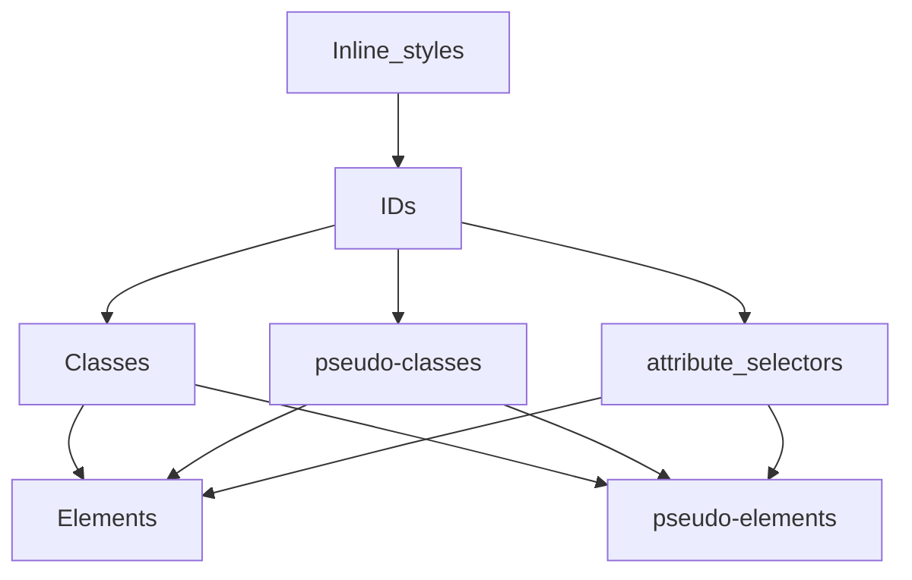
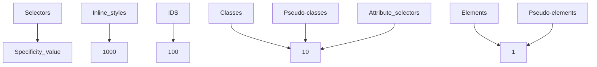
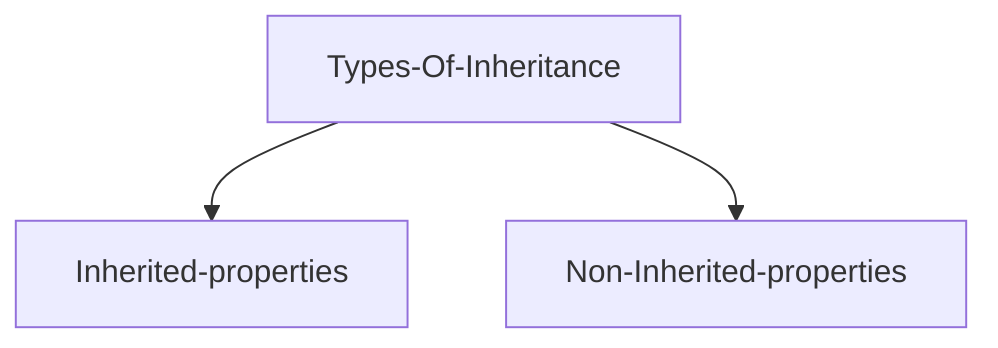

# CSS Class Notes

CSS Class notes for the 1st Semester

<div class="pt-12">
  <span @click="$slidev.nav.next" class="px-2 py-1 rounded cursor-pointer" hover="bg-white bg-opacity-10">
    Are you ready to well designed UI with your HTML skills? Press <kbd>space</kbd> on your keyboard <carbon:arrow-right class="inline"/>
  </span>
</div>

<div class="abs-br m-6 flex gap-2">
  <button @click="$slidev.nav.openInEditor()" title="Open in Editor" class="text-xl slidev-icon-btn opacity-50 !border-none !hover:text-white">
    <carbon:edit />
  </button>
  <a href="https://github.com/oluwasetemi/css-note" target="_blank" alt="GitHub" title="Open in GitHub"
    class="text-xl slidev-icon-btn opacity-50 !border-none !hover:text-white">
    <carbon-logo-github />
  </a>
  <a href="https://github.com/Oluwasetemi/css-note/releases" target="_blank" alt="Download" title="Download PDF or PPTX version of the slide"
    class="text-xl slidev-icon-btn opacity-50 !border-none !hover:text-white">
    <carbon-download />
  </a>
</div>

<!--
The last comment block of each slide will be treated as slide notes. It will be visible and editable in Presenter Mode along with the slide. [Read more in the docs](https://sli.dev/guide/syntax.html#notes)
-->

---

## Table of contents

<Toc columns="2" minDepth="1" maxDepth="2"></Toc>

---

# Getting Started with CSS?

### CSS which stands in for Cascading Style Sheets is a stylesheet language used to describe the presentation of a document written in HTML or XML.

<br/>

### Just as HTML serves as the skeletal part of the web, CSS describes how the element should be rendered on the web.

### We use CSS to style our HTML elements and this is what you're going to learn throughout this module.

---

# [Previous Class Recording](https://www.youtube.com/watch?v=cW3Xm4LZkj8&list=PLTTmsZetDiwysk9jdsMlRF4u6XGurJFef&index=15)

- [15](https://www.youtube.com/watch?v=cW3Xm4LZkj8&list=PLTTmsZetDiwysk9jdsMlRF4u6XGurJFef&index=15)
- [16](https://www.youtube.com/watch?v=lvhi_YZELzY&list=PLTTmsZetDiwysk9jdsMlRF4u6XGurJFef&index=16)
- [17](https://www.youtube.com/watch?v=x6rcMevUjEQ&list=PLTTmsZetDiwysk9jdsMlRF4u6XGurJFef&index=17)
- [18](https://www.youtube.com/watch?v=_jKvpwTZ-P0&list=PLTTmsZetDiwysk9jdsMlRF4u6XGurJFef&index=18)
- [19](https://www.youtube.com/watch?v=jsOBRT-GHq4&list=PLTTmsZetDiwysk9jdsMlRF4u6XGurJFef&index=19)
- [20](https://www.youtube.com/watch?v=lYOeltZUojI&list=PLTTmsZetDiwysk9jdsMlRF4u6XGurJFef&index=20)
- [21](https://www.youtube.com/watch?v=Eik3R556Xg8&list=PLTTmsZetDiwysk9jdsMlRF4u6XGurJFef&index=21)
- [22](https://www.youtube.com/watch?v=87-WHDYRSic&list=PLTTmsZetDiwysk9jdsMlRF4u6XGurJFef&index=22)

---

# Selectors

<div />
Before we move deeply into Selectors, let's dive into CSS rule which is a block of code, that has one or more selectors and one or more declarations.


---
hideInToc: true
---

# Definition of selectors

<div></div>
Looking at the image in the previous slide we'll notice that CSS selector is the first part of a CSS rule. In order to choose or select HTML elements that's going to carry the CSS property values inside the rule we have to use CSS Selector. In summary, for us to add a style for a particular HTML element we need a selector.

<h4 class="mt-3 font-bold underline">Types of selectors</h4>

- Universal selector: This is also know as a wildcard, selects every single element in the document. It is represented by the asterisk character <kbd>\*</kbd>

<ins>Code Example</ins>:

```css
* {
  margin: 0;
  padding: 0;
  box-sizing: border-box;
}
```

This rule is saying that remove any default margin and padding from all the elements in this document and also change the box-sizing value to border-box.

---
hideInToc: true
---

- Type selector: The CSS type selector matches elements by node/HTML name.

<ins>Code Example</ins>:

```html
<p>I am taking color red and increasing my font size.</p>
```

```css
p {
  color: red;
  font-size: 36px;
}
```

This CSS rule is saying that apply color of red to every <kbd>p</kbd> element and also increase its font size to 36px.

---

- Class selector: There is a class attribute associated to all HTML elements, this allows us to target a specific HTML element for its class name. To style an element using the class name we make use of the dot notation <kbd>.</kbd> before the class name when writing our selector in the CSS rule <kbd>.paragraph</kbd>

<ins>Code Example</ins>:

```html
<p class="paragraph">You can style me using my class name.</p>
```

```css
.paragraph {
  color: red;
  font-size: 36px;
}
```

This CSS rule is saying that
apply color of red to the <kbd>p</kbd> element that has the class name of
paragraph and also increase its font size to 36px.

---

- ID selector: The id
  selector uses the id attribute of an HTML element to select a specific element.
  Id value of an element must be unique which means you can only have a specific
  id value to an HTML element, unlike class where you can give 10 HTML elements
  same class name. <br />
  To style an element using the id value we make use of the hash notation <kbd>#</kbd> before
  the id value when writing our selector in the CSS rule
  <kbd>#container-wrapper</kbd>

<ins>Code Example</ins>:

```html
<span id="container-wrapper">
  You can style me using my id value which is container-wrapper.
</span>
```

```css
#container-wrapper {
  color: red;
  font-size: 36px;
}
```

---

- Attribute selector: This gives you the power to select elements based on the presence of a certain HTML attribute or the value of an HTML attribute. To write the CSS rule for this you have to wrap the selector with square brackets.

<ins>Code Example</ins>:

```html
<a href="https://altschoolafrica.com">
  You can style me using my attribute which is href.
</a>
```

```css
[href] {
  color: red;
}
```

---

<ins>Code Example 2</ins>:

```html
<a href="https://altschoolafrica.com">
  You can style me using my attribute and its value which is
  href="https://altschoolafrica.com".
</a>
```

```css
[href="https://altschoolafrica.com"]{
  color: red;
  font-size: 36px;
}
```

Note: This method give you the access to style any element that has an attribute of data-type but with a specific value of href.

---

- `Pseudo-classes`: Pseudo-classes are keywords added to selectors using a single colon sign <kbd>:</kbd> just to specify a special state of the selected elements. They allow you to style elements based on their state, position, or user interactions, which cannot be targeted by regular CSS selectors alone.
  Here are some common pseudo-classes:

```
1 :link
2 :visited
3 :hover
4 :active
5 :focus
6 :nth-child()

```

<ins>Code Example</ins>

```css
button:hover {
  background-color: orange;
}

li:nth-child(even) {
  text-transform: uppercase;
}

input:focus {
  border: 2px solid red;
}
```

---

- `Pseudo-element`: To style specific parts of an element we attached double colon to our selector <kbd>::</kbd> followed by keywords to select the portion we want to apply styling to. Unlike the pseudo-classes, which target the entire element, pseudo-elements target specific parts of an element using a conventional keywords.

Here are some common pseudo-elements:

```
1 ::before - Inserts content before the content of an element.
2 ::after - Inserts content after the content of an element.
3 ::first-letter - Styles the first letter of an element.
4 ::first-line - Styles the first line of an element.
5 ::selection - Styles the portion of an element that is selected by the user.

```

Note: Pseudo-elements are particularly useful for enhancing the design and readability of web content without the need for additional HTML elements.

---

<ins>Complex selectors</ins>

To have more power in accessing elements in the DOM we have some selectors which we will brief through but let's quickly look at parents and child elements using this code below:

```html
<p>
  AltSchool Africa is a tech school that offers varieties of tech courses like
  <span>Frontend engineering</span>, <span>Backend engineering</span> and newly
  added <span>Cybersecurity</span> online.
</p>
```

In the code above, the parent element is the <kbd>p</kbd>, inside which we have 3 span elements, since all these 3 span elements are inside the <kbd>p</kbd> we call them the child elements of <kbd>p</kbd>.

- Descendant Selector: This selects all elements that are descendants and we achieve this by giving space<kbd>( )</kbd> to instruct the browser to look for child elements.

<ins>Code Example</ins>:

```css
p span {
  color: red;
}
```

All the texts wrapped inside the span tag will take the CSS rule.

---

- Child selector (parent > child): This selects all elements that are direct children of a specified element.

<ins>Code Example</ins>:

```css
ul > li {
  list-style: none;
}
```

- Adjacent Sibling Selector (prev + next): This selects an element that is immediately preceded by a specified element.

<ins>Code Example</ins>:

```css
h1 + p {
  margin-top: 0;
}
```

---

- General Sibling Selector (prev ~ siblings): This selects all elements that are siblings of a specified element.

Code Example:

```css
h1 ~ p {
  color: blue;
}
```

- Grouping Selector: Applies the same styles to multiple selectors.

Code Example:

```css
h1,
h2,
h3 {
  margin-bottom: 10px;
}
```
---
hideInToc: true
---

- `Nesting Selectors &`: This is a way of writing CSS rules that are more specific and easier to read.They explicitly states the relationship between parent and child rules when using CSS nesting. It makes the nested child rule selectors relative to the parent element. Without the & nesting selector, the child rule selector selects child elements. The child rule selectors have the same specificity weight as if they were within `:is()`. Can be use with the Child Combinators.

<ins>Code Example</ins>:

```html
<div class="container">
  <h1 class="title">Hello, CSS</h1>
</div>
```

```css
.container {
  padding: 20px;
  .title {
    color: red;
  }
  &:hover {
    background-color: lightblue;
  }
}
```

## [Read more about CSS nesting](https://developer.mozilla.org/en-US/docs/Web/CSS/Nesting_selector)

# Specificity

<div></div>
Specificity is the key to understanding how CSS decides between competing rules. Let's take a brief at this code before we dive deep into specificity.

```html
<h1 class="title">Hi, Specificity</h1>
```

```css
h1 {
  color: blue;
}

.title {
  color: yellow;
}
```

In the code above, we are trying to style the h1 element but we have two CSS ruleset, so which stylesheet will override the other? This is where our knowledge on specificity algorithm comes in.
<br/>
<br/>
Specificity is a score given to selectors, and whenever we have two or more CSS rules pointing to the same element, the selector that has the highest specificity score will win, which means the CSS ruleset of this particular selector will be applied on the element.

## <!-- We will come back to this at the end of this topic. -->

---
hideInToc: true
---

## Specificity Hierarchy

CSS selectors are of different forms and each of them has its place in the specificity hierarchy.

CSS Selectors decrease in specificity from top to bottom, meaning the selector at the top of the hierarchy has the highest specificity.

<div class="grid grid-col-2 gap-4    h-85 p-4 border border-gray-300 bg-blue overflow-auto ">
  <div class=" flex justify-center animate-slide-in-left">

</div>

<div class="bg-red animate-slide-in-right">

</div>

Note:
The specificity of a CSS selector is typically represented as a four-part value like 0,0,0,0. <br/>
Looking up the tree if we are to calculate the specificity for IDs, it's going to be 0,1,0,0 <br/>
Also, a universal selector (\*) has no specificity and gets 0 points. This means that any rule with 1 or more points will override it.
<br/>

<p class="bg-white p-4 animate-slide-in-bottom">
Class Assessment: Calculate the specificity of these selectors:
<ul>
<li>#content .menu li:hover</li>
<li>div p .note
</li>
</ul>
</p>
</div>

---
hideInToc: true
---

# important rule
<div />
In CSS, there is one rule that has the highest specificity score of 10,000. This rule is used to give a property-value pair the highest priority, allowing it to override any other declarations.

The only way to override inline styles which has specificity value of 1000 is by using this rule called !important, though this is considered as a bad practice and should be avoided.
<a class="bg-red color-black no-underline rounded-sm hover:font-bold hover:text-black" href="https://developer.mozilla.org/en-US/docs/Web/CSS/important" target="_blank">Read more</a>

Code Example

```css
selector {
  property: value !important;
}

.h1 {
  color: red !important;
}
```

<div class="border-l-10 border-2 border-l-red">
  <p class="p-4">Importance should be used carefully and not always.</p>
</div>

---

# Box Model

<div></div>
The CSS Box Model is a core concept in web design and layout. It describes how every element on a web page is rendered as a rectangular box.
It’s basically a box that wraps around every HTML element. Understanding this model is crucial for creating precise layouts and solving common design challenges.


---
hideInToc: true
---

# Components Of Box Model

- a) Content:

  - This is the innermost layer.
  - It contains the actual content of the element (text, images, etc.).
  - Dimensions are set using 'width' and 'height' properties.

- b) Padding:

  - Surrounds the content area.
  - Creates space between the content and the border.
  - Can be set using 'padding' property (or padding-top, padding-right, etc.).
  - Is transparent, allowing the background of the element to show through.

---

- c) Border:

  - Encircles the padding (or content if no padding is set).
  - Can have different styles, colors, and widths.
  - Set using the 'border' property or individual properties like 'border-width'.

- d) Margin:

  - The outermost layer.
  - Creates space between the element and adjacent elements.
  - Is always transparent.
  - Set using the 'margin' property or individual properties (margin-top, etc.).

  Popular margin concepts are: Hungry margin(auto margin which only works for horizontal margins with explicit width), Collapsed margin, Negative margin.

---
hideInToc: true
---

<div grid place-content-center>
  
</div>

---
hideInToc: true
---

- 1. Calculating Total Element Size

One of the most important aspects of the Box Model is understanding how the total size of an element is calculated:

- Total Width = width + left padding + right padding + left border + right border
- Total Height = height + top padding + bottom padding + top border + bottom border

Note: Margins are not included in these calculations as they affect spacing between elements, not the element's size itself.

- 2. Box-Sizing Property

The default box model can sometimes lead to unexpected results. CSS3 introduced the 'box-sizing' property to address this:

'content-box' (default): Width and height apply to content area only.
'border-box': Width and height include content, padding, and border.

```css
* {
  box-sizing: border-box;
}
```

---
hideInToc: true
---

# Example

```css
div {
  box-sizing: border-box;
  width: 300px;
  padding: 20px;
  border: 10px solid black;
  margin: 25px;
}
```

### Understanding the Box Model is crucial for:

- Centering elements
- Creating consistent spacing
- Implementing responsive designs
- Debugging layout issues

---

# Using Block and Inline Axes in CSS

<div></div>
In CSS, the block and inline axes are used to determine how elements are laid out on a page. Understanding these axes is crucial for creating responsive layouts and designing web pages.

- Block Axis: The block axis is the vertical axis that runs from top to bottom. Block-level elements stack on top of each other in the block axis.

- Inline Axis: The inline axis is the horizontal axis that runs from left to right. Inline-level elements flow in the inline axis.

Possible css properties with block and inline axes are: `padding-block`, `margin-block`, `border-block`, `padding-inline`, `margin-inline`, `border-inline`, `block-size`, `inline-size`, `min-block-size`, `max-block-size`, `min-inline-size`, `max-inline-size`. Padding and margin can have the start, end variant like `padding-inline-start`, `padding-inline-end`, `margin-block-start`, `margin-block-end`.

The `block-size` and `inline-size` properties are used to set the width and height of an element, respectively. The `min-block-size` and `max-block-size` properties set the minimum and maximum width of an element, while the `min-inline-size` and `max-inline-size` properties set the minimum and maximum height of an element.

---
hideInToc: true
---

# Calculating Width and Height

## Width Calculation

- Width is calculated along the inline axis(left to right) and default is auto(using the content inside the element) but can be set using the `width` property. The `max-width` and `min-width` properties set the maximum and minimum width of an element. `max-width` is used to prevent an element from exceeding a certain width, while `min-width` ensures that an element is at least a certain width. `max-width` is useful for creating responsive designs that adapt to different screen sizes and should be used for containers/wrappers that need to be flexible. `min-width` is useful for ensuring that an element is at least a certain width, which can be helpful for maintaining the layout of a page and preventing elements from becoming too narrow. Width considers the parent element's width and the content inside the element. Avoid using fixed width and percentage width if you do not have a parent with an explicit width.

---
hideInToc: true
---

# Height Calculation

- Height is calculated along the block axis(top to bottom) and default is auto(using the content inside the element) but can be set using the `height` property. The `max-height` and `min-height` properties set the maximum and minimum height of an element. `max-height` is used to prevent an element from exceeding a certain height, while `min-height` ensures that an element is at least a certain height. `min-height` is useful for creating responsive designs that adapt to different screen sizes and adjustable height. `max-height` is useful for ensuring that an element is at least a certain height, which can be helpful for maintaining the layout of a page and preventing elements from becoming too short. Height considers the content inside the element first before the parent element's height.

---
hideInToc: true
---

<div grid place-content-center>
  
</div>

---

# CSS Reset and Normalize

## CSS Reset

A CSS reset is a set of CSS rules that reset the styling of all HTML elements to a consistent baseline. This ensures that all browsers start with the same default styles, making it easier to create a consistent design across different browsers.

[Link to Josh Comeau CSS Reset](https://www.joshwcomeau.com/css/custom-css-reset/)

## Normalize.css

Normalize.css is a modern, HTML5-ready alternative to CSS resets. It makes browsers render all elements more consistently and in line with modern standards. It precisely targets only the styles that need normalizing.

---

# Inheritance

<div></div>
Inheritance, this is when a child element get a computed value which represents its parent's value. Inheritance cascade downwards and every property has a default value in CSS.

<div class="mt-5 flex justify-center p-10 border border-gray-300 bg-blue overflow-auto animate-slide-in-left">

</div>

- Inherited-properties: These are properties that by default passed down from a parent element to its children.

- Non-Inherited-properties: These are properties that by default can't be passed down from a parent element to its children.

---

Some inherited and non-inherited CSS properties:

<table class="p-4 border border-black overflow-scroll">
  <tr class="p-4 border border-black-400 bg-green">
    <th>Inherited Properties</th>
    <th>Non-Inherited Properties</th>
  </tr>
  <tr>
    <td class="bg-black text-white">list-style</td>
    <td class="bg-black text-white">border</td>
  </tr>
  <tr>
    <td>color</td>
    <td>margin</td>
  </tr>
  <tr>
    <td class="bg-black text-white">cursor</td>
    <td class="bg-black text-white">padding</td>
  </tr>
  <tr>
    <td>font-family</td>
    <td>width</td>
  </tr>
  <tr>
    <td class="bg-black text-white">font-size</td>
    <td class="bg-black text-white">height</td>
  </tr>
  <tr>
    <td>font-style</td>
    <td>position</td>
  </tr>
  <tr>
    <td class="bg-black text-white">font-weight</td>
    <td class="bg-black text-white">box-shadow</td>
  </tr>
  <tr>
    <td>text-align</td>
    <td>z-index</td>
  </tr>
</table>
---

Inherited property

Code Example: The color property falls under the inherited properties, so the <kbd>em</kbd> element will inherit the color value from the parent element which is <kbd>p</kbd>

<div class="p-8 text-green bg-white light:bg-black">

```html
<p>This paragraph has <em>emphasized text</em>in it.</p>
```

```css
p {
  color: green;
  font-weight-500;
}
```

<p class="color-green-500 font-large">This paragraph has <em>emphasized text</em> in it.</p>
</div>

---
hideInToc: true
---

Non-inherited property

Code Example: The border property falls under the non-inherited properties so, the <kbd>em</kbd> element will not inherit the border value from the parent element which is <kbd>p</kbd>.

<div class="p-8 text-red bg-white light:bg-black">

```html
<p>This paragraph has <em>emphasized text</em>in it.</p>
```

```css
p {
  border: 3px solid red;
}
```

<p class="p-2 b-3 border-solid border-red-500">This paragraph has <em>emphasized text</em> in it.</p>

</div>

---
hideInToc: true
---

## Setting inheritance explicitly in CSS

Using the `inherit` keyword

To keep everything under the developer's control, we have the inherit keyword that can make any property inherit its parent's computed value.

Code Example:

<div class="p-8 text-red bg-white light:bg-black animate-slide-in-right">

```html
<p>This paragraph has <em>emphasized text</em>in it.</p>
```

```css
p {
  border: 3px solid red;
}
em {
  border: inherit; //using the inherit keyword to make the em tag inherit the border style from its parent.
}
```

<p class="p-2 b-3 border-solid border-red-500">This paragraph has <em p-2 style="border: inherit">emphasized text</em> in it.</p>
</div>

---
hideInToc: true
---

## Controlling Inheritance

Note: Inheritance is always from the parent element in the document tree, even when the parent element is not the containing block.

There are 5 major keywords in inheritance:

<dl class="h-80 light:bg-yellow dark:bg-yellow-600 p-4 border border-rounded-4 overflow-y-scroll animate-slide-in-left">
<dt class="font-sans font-extrabold">
inherit:
</dt>
<dd>
The inherit keyword causes element to take the computed value of the property from its parent element.

</dd>
<br/>
<dt class="font-sans font-extrabold">
initial: 
</dt>
<dd>
This keyword sets a property back to that initial, default value.
</dd>
<br/>
<dt class="font-sans font-extrabold"> unset: </dt><dd> This keyword resets a property to its inherited value if the property naturally inherits from its parent, and to its initial value if not. This is like shuffling between the inherit and the initial keyword because in its first case it behaves like the inherit keyword when the property is an inherited property and like the initial keyword in the second case when the property is a non-inherited property.
</dd>
<br/>
<dt class="font-sans font-extrabold">
revert:
</dt>
<dd>
This keyword reverts the cascaded value of the property from its current value to the value the property would have had if no changes had been made by the current style origin to the current element.
</dd>
<!-- </dl> -->
<br/>
<dt class="font-sans font-extrabold">
revert-layer:
</dt>
<dd>
This keyword rolls back the value of a property in a cascade layer to the value of a CSS rule matching the element in a previous cascade layer. 
</dd>
</dl>

---
hideInToc: true
layout: iframe
url: https://codepen.io/setemiojo/embed/JjxNJVm?default-tab=html%2Cresult
---

<iframe class="b-2" height="400" style="width: 100%;" scrolling="no" title="breadcrumbs and skip-navigation" src="https://codepen.io/setemiojo/embed/JjxNJVm?default-tab=html%2Cresult" frameborder="no" loading="lazy" allowtransparency="true" allowfullscreen="true">
  See the Pen <a href="https://codepen.io/setemiojo/pen/JjxNJVm">
  breadcrumbs and skip-navigation</a> by Ojo Oluwasetemi Stephen (<a href="https://codepen.io/setemiojo">@setemiojo</a>)
  on <a href="https://codepen.io">CodePen</a>.
</iframe>

---

The <kbd>all</kbd> CSS property

This shorthand resets all properties (except unicode-bidi and direction) of an element to their initial, inherited, or unset state. This property can be particularly useful when you want to ensure that an element does not inherit any styles from its parents or previous rules and instead starts with a clean slate.

```html
<div class="parent">
  Parent Text
  <div class="child-inherit">Child Text with all: inherit</div>
</div>
```

```css
.parent {
  color: red;
  font-size: 10px;
  background-color: lightgray;
}

.child-inherit {
  all: inherit;
}
```

<div class="text-red-500 text-xl bg-gray-300">Parent Text</div>
<div class="text-red-500 text-xl bg-gray-300">Child Text with all: inherit</div>
---

# Colors/Units/Gradients

## CSS Color

Colors in CSS can be defined in various ways, such as using color names, hexadecimal values, RGB, RGBA, HSL, HSLA, LCH, OKLCH, LAB, OKLAB, light-dark, color(), color-mix() and display-p3.

keywords: currentColor and transparent are also used in CSS to define colors.

## Color Names

Definition: These are predefined color names in CSS, such as red, blue, green, black, white, etc. There are 140 named colors in CSS.

Named colors are convenient for quick, common colors but lack precision for more specific color needs.

```css
p {
  color: red;
  background-color: lightblue;
}
```

---
hideInToc: true
---

## Hexadecimal Colors

Hexadecimal colors are defined using a six-digit code consisting of letters and numbers, preceded by a "#".The first two digits represent the red component, the next two represent the green, and the last two represent the blue

You can also use a three-digit shorthand (e.g., #f00 for #ff0000), which is equivalent to doubling each digit.

```css
p {
  color: #ff5733; /* Bright orange */
  color: #f53; /* Equivalent shorthand for #ff5533 */
  color: #ff0000; /* Red */
  color: #f00; /* Shorthand for Red*/
  background-color: #c0c0c0; /* Silver */
}
```

---
hideInToc: true
---

## RGB and RGBA Colors

RGB stands for Red, Green, Blue, with values ranging from 0 to 255. RGBA adds an alpha channel for transparency, with a value between 0 (completely transparent) and 1 (completely opaque).

RGBA is particularly useful for overlay effects and blending colors.

```css
color: rgb(255, 87, 51); /* Bright orange */
color: rgba(255, 87, 51, 0.5); /* 50% transparent */
```

<div class="p-5 border border-gray-300 bg-gray-100 font-sans text-base">
  <p class="text-[rgb(255,87,51)]">This text is bright orange.</p>
  <p class="text-[rgba(255,87,51,0.5)]">This text is 50% transparent orange.</p>
</div>

---
hideInToc: true
---

## HSL & HSLA Colors

HSL stands for Hue (0-360), Saturation (0%-100%), and Lightness (0%-100%). HSLA adds an alpha channel for transparency.

HSL is intuitive for adjusting colors based on human perception, making it easier to create shades and tints.

```css
color: hsl(9, 100%, 60%); /* Bright orange */
color: hsla(9, 100%, 60%, 0.5); /* 50% transparent */
```

## Opacity and Transparency

Transparency: Besides RGBA and HSLA, you can control an element’s transparency using the opacity property, which affects the entire element, including its content.

```css
opacity: 0.5; /* Makes the element 50% transparent */
```

---
hideInToc: true
---

# The Future of Colors

## LCH, OKLCH, LAB, OKLAB, Light-Dark, Color(), Color-Mix(), Display-P3

- LCH: Lightness, Chroma, Hue
- OKLCH: Lightness, Chroma, Hue with an alpha channel
- LAB: Lightness, A (green-red), B (blue-yellow)
- OKLAB: Lightness, A (green-red), B (blue-yellow) with an alpha channel
- Light-Dark: Adjusts the lightness of a color
- Color(): Creates a color from a string
- Color-Mix(): Mixes two colors
- Display-P3: Wide-gamut color space for digital displays

```css
color: lch(60% 50 90); /* Lightness 60%, Chroma 50, Hue 90 */
color: lab(60% 50 90); /* Lightness 60%, A 50, B 90 */
color: light-dark(50%); /* Adjusts lightness to 50% */
color: color(display-p3 0.7 0.5 0); /* Display-P3 color */
color: color-mix(red blue 50%); /* Mixes red and blue 50% */
```

---

hideInToc: true
layout: two-cols

---

```html
<p style="color: var(--red)">This text is red.</p>
<p style="color: var(--dark-red)">This text is darker.</p>
<p style="color: var(--transparent-red)">This text is transparent.</p>
<p style="color: var(--soft-red)">This text is softer.</p>
```

::right::

```css
html {
  --red-hue: 0deg;
  --red-sat: 100%;
  --red-lit: 50%;

  --red: hsl(
    var(--red-hue)
    var(--red-sat)
    var(--red-lit)
  );
  --dark-red: hsl(
    var(--red-hue)
    var(--red-sat)
    calc(var(--red-lit) - 20%)
  );
  --transparent-red: hsl(
    var(--red-hue)
    var(--red-sat)
    var(--red-lit) / 0.5
  );
  --soft-red: hsl(
    var(--red-hue)
    calc(var(--red-sat) - 30%)
    calc(var(--red-lit) + 10%)
  );
}
```

---
hideInToc: true
---

# CSS Units

CSS units are vital for defining the size, spacing, and layout of elements. Here’s a more in-depth look at the types of units:

1. Absolute Units

- Fixed Units: These do not scale based on the viewport or parent elements.

- Pixels (px): Most common; ideal for precise control.

```css
font-size: 14px; /* Fixed size */
```

2. Relative Units

- Flexible Units: These scale based on the parent element or viewport, making designs more responsive.
- em: Relative to the font size of the parent element. Useful for scalable spacing and typography.

```css
padding: 1em; /* Equal to the current font size */
```

---
hideInToc: true
---

<div grid place-content-center>
  
</div>

---
hideInToc: true
---

## Contd (Relative Units)

- <kbd>rem</kbd>: Relative to the root element's font size (<kbd>html</kbd>), offering consistency across the page.

```css
font-size: 1.2rem; /* 1.2 times the root font size */
```

- <kbd>%</kbd>: Relative to the parent element's size, commonly used in responsive design.

```css
width: 80%; /* 80% of the parent element's width */
```

- <kbd>vw</kbd>, <kbd>vh</kbd>: Relative to the viewport's width or height. Ideal for full-screen layouts and responsive elements.

```css
width: 100vw; /* Full width of the viewport */
height: 100vh; /* Full height of the viewport */
```

---
hideInToc: true
---

<div grid place-content-center>
  
</div>

---
hideInToc: true
---

3. Viewport Units

- Viewport-based units: Perfect for responsive design.

- vw: 1% of the viewport width.
- vh: 1% of the viewport height.
- vmin and vmax: Relative to the smaller or larger of vw and vh.
- lvh and lvw
- ch: Relative to the width of the "0" (zero) character.
- svh and svw
- dvh and dvw

```css
font-size: 5vw; /* Font size based on viewport width */
```

---
hideInToc: true
---

<div grid place-content-center>
  
</div>

---
hideInToc: true
---

# CSS Gradients

Gradients are used to create smooth transitions between colors, adding depth and visual interest to designs. Here’s a deeper look:

1. Linear Gradients
   A gradient that transitions along a straight line. You can control the direction and color stops.

`linear-gradient(direction, color-stop1, color-stop2, ...)`.

Direction: Can be specified with angles (e.g., 45deg) or keywords (to right, to bottom).

```css
background: linear-gradient(45deg, red, yellow);
```

<div class="h-48 w-full" style="background: linear-gradient(45deg, red, yellow);">
</div>

---
hideInToc: true
---

2. Radial Gradients
   Radiates from a central point outward, either circular or elliptical.

`radial-gradient(shape size at position, start-color, ..., end-color)`.

Shapes and Sizes: You can control the shape (circle or ellipse) and size (closest-side, farthest-corner, etc.).

```css
background: radial-gradient(circle, red, yellow, green);
```

<div class="flex gap-3">
  <div class="h-64 w-full" style="background: radial-gradient(circle, red, yellow, green);">
  </div>
  <div class="h-64 w-full" style="background: radial-gradient(ellipse, red, yellow, green);">
  </div>
</div>

---
hideInToc: true
---

3. Conic Gradients

- A gradient that rotates around a central point, similar to slices of a pie.
- Often used for visualizations like pie charts.

`conic-gradient(from direction, color-stop1, color-stop2, ...)`

```css
background: conic-gradient(from 90deg, red, yellow, green);
```

<div class="h-64 w-full" style="background: conic-gradient(from 90deg, red, yellow, green);">
</div>

---
hideInToc: true
---

4. Repeating Gradients

- Repeats the linear gradient pattern indefinitely.

```css
background: repeating-linear-gradient(45deg, red, yellow 10%);
```

- Repeating Radial Gradients: Repeats the radial gradient pattern.

```css
background: repeating-radial-gradient(circle, red, yellow 10%);
```

<div class="flex text-black gap-3">
<div class="h-64 w-full  text-center" style="background: repeating-linear-gradient(45deg, red, yellow 10%);">
<p>Repeating Linear Gradient</p>
</div>
<div class="h-64 w-full text-center" style="background: repeating-radial-gradient(circle, red, yellow 10%);">
<p>Repeating Radial Gradient</p>
  </div>
</div>

---
hideInToc: true
---

Practical Tips

- Combine Units: Use relative units (em, rem) for typography to maintain scalability and consistent spacing.
- Gradients with Transparency: Combine gradients with RGBA or HSLA colors for layered effects with transparency.
- Viewport Units for Responsiveness: Use vw and vh for elements that need to adapt to screen size changes, such as full-screen sections or responsive text sizes.


---
hideInToc: true
layout: two-cols
---

# CSS Functions

<div></div>
Functions in CSS are used to manipulate values, perform calculations, and apply effects. Here are some common functions:

- calc(): Performs calculations on property values.
- var(): Defines custom properties (variables).
- rgb(), rgba(), hsl(), hsla(): Define colors using RGB, RGBA, HSL, and HSLA values.
- url(): Specifies the location of an external resource.
- linear-gradient(), radial-gradient(), conic-gradient(): Create gradients with smooth color transitions.
- clamp(): Restricts a value to a specified range.

```css
p {
  font-size: calc(1rem + 1vw);
  color: var(--primary-color);
  background: linear-gradient(to right, red, blue);
}
```

::right::

### CSS @Rules

@Rules are used to define special rules in CSS that control how styles are applied. Here are some common @Rules:

- @media: Defines media queries for responsive design.
- @keyframes: Creates animations with multiple keyframes.
- @font-face: Embeds custom fonts in a web page.
- @import: Imports external CSS files.
- @supports: Checks if a browser supports a particular CSS feature.
- @page: Defines the layout of printed pages.
- @layer: Specifies the layering order of elements.
- @counter-style: Defines custom counter styles for lists.
- @property: Registers custom CSS properties.

---
hideInToc: true
---

# CSS Variables or Custom Properties

<div></div>
CSS variables (also known as custom properties) are used to store reusable values in CSS. They are defined using the `--` prefix and can be used throughout the stylesheet.

```css
:root {
  --primary-color: #ff5733;
  --secondary-color: #f0f0f0;
}

p {
  color: var(--primary-color);
  background-color: var(--secondary-color);
}
```

Can be used to store colors, font sizes, spacing, and other values that are reused across the stylesheet. They are particularly useful for maintaining consistency and making global changes easier. The new `@property` rule in CSS allows you to define custom properties with specific types and values.

```css
@property --primary-color {
  syntax: "<color>";
  inherits: false;
  initial-value: black;
}
```

---
hideInToc: true
---

<PopOver />

---
hideInToc: true
layout: two-cols
---
# Typography in CSS

<div></div>
Typography is a crucial aspect of web design, as it affects readability, accessibility, and overall user experience. Here are some key CSS properties for typography: `font-style`, `font-weight`, `font-size`, `line-height`, `font-family`, `text-align`, `text-transform`, `text-decoration`, `letter-spacing`, `word-spacing`, `text-shadow`, `white-space`, `overflow-wrap`, `word-break`, `hyphens`, `text-overflow`, `vertical-align`, `text-orientation`,  `font-variant`.

```css
p {
  font-family: "Arial", sans-serif;
  font-size: 16px;
  line-height: 1.5;
  font-weight: 400;
  text-align: center;
  text-transform: uppercase;
  text-decoration: underline;
  letter-spacing: 1px;
  word-spacing: 2px;
  text-shadow: 1px 1px 1px rgba(0, 0, 0, 0.5);
}
```

::right::

We can use Google Fonts(any other font hosting service) or custom fonts in CSS to enhance the typography of a web page. Google Fonts offers a wide range of free, open-source fonts that can be easily integrated into a website.

```css
@import url("https://fonts.googleapis.com/css2?family=Roboto:wght@400;700&display=swap");
body {
  font-family: "Roboto", sans-serif;
}
```

The @font-face rule can be used embed custom fonts in a web page, allowing the use of font file format (e.g., .woff, .woff2, .ttf) and define font properties like font-weight and font-style.

```css
@font-face {
  font-family: "CustomFont";
  src: url("custom-font.woff2") format("woff2");
  font-weight: 400;
  font-style: normal;
}
body {font-family: "CustomFont", sans-serif;}
```

---

# Debugging in browser

<h1 class="p-4 bg-green text-center">Debugging</h1>
Debugging is the process of finding and fixing errors or bug in the source code of any software.
When writing code, everything may appear normal during development, but errors can arise during runtime. These errors typically fall into two categories:

<ul>
<li class="animate-slide-in-left"> Syntax Error: Occurs when the code does not adhere to the language's rules or grammar, preventing it from being compiled or interpreted correctly.</li>

<li class="animate-slide-in-right"> Logic Error: Occurs when the code is syntactically correct but produces incorrect or unintended results due to flawed reasoning or incorrect algorithm implementation.</li>
</ul>

<p>You might wonder when you'd need to debug CSS. Let me explain: Sometimes, when writing CSS rules for an element, you may encounter situations where your styles aren't being applied as expected, or the element isn't behaving the way you intended.</p>
<p class="w-full bg-black text-white py-4">
Note: When in doubt in CSS put a border on the element.
</p>

---

<h1 class="p-4 bg-green text-center">Debugging in the browser</h1>
<div></div>
One of the fastest way to get your CSS debugged is to use the browser. Browser like Chrome, Firefox etc offer powerful developer tools for debugging and this is what we are referring to as debugging in the browser.

<h2 class="mt-2 p-2 bg-green text-center">How to access browser DevTools</h2>

<p class="text font-700">This devtools live inside the browser and you can access it by:</p>
<ol>
<li>
Press-and-hold/right-click an item on a webpage and choose inspect from the context menu that appears. This will show all the code that made up the UI but highlighted the code of the element you right-clicked. Click on Elements to see how the HTML looks like on runtime and their respective CSS applied.
</li>
<li>
Keyboard: On WIndows <kbd>Ctrl</kbd> + <kbd>Shift</kbd> + <kbd>I</kbd>
On macOS:  <kbd>Command</kbd> + <kbd>Shift</kbd> + <kbd>I</kbd>
</li>
</ol>

```css
* { border: 1px solid red; }
```
<div mt-2></div>

> When in doubt in CSS put a border on all the elements to understand what is going on. 

---

<h1 class="p-4 bg-green text-center">DevTools</h1>
<div></div>
<p>
In the developer tools, you can immediately modify the HTML and CSS, with the changes reflected live in the browser. This feature is valuable for previewing your intended modifications before implementing them locally.</p>

<p>Also, you can toggle CSS rules by unchecking the corresponding checkboxes in the devTools, allowing you to experiment with different styles on the fly.</p>

<p>Additionally, we have talked about the Box Model in the previous lesson, the devTools layout view shows you the box model on a selected elements and gives you proper insight on the element box property like border, margin, padding, height and width.</p>

<div class="h-80 overflow-scroll  grid place-items-center animate-slide-in-left w-full ">


<small>How the DevTools look like</small>
</div>

---

<h1 class="p-4 bg-green text-center">Inspecting the applied CSS</h1>
<div></div>
To examine the CSS that an element inherits or has applied to it, right-click on the element and choose "Inspect" to open the devTools. In the devTools, one section displays the HTML, while another shows the CSS inherited by the element as well as the styles directly applied to it. This is particularly helpful for identifying any unexpected CSS affecting the element.In the image below the developer is trying to check the CSS on the body element.

<div class="h-100 overflow-scroll bg-grey">
 
</div>

---

# Inline, Internal and External CSS

Inline CSS is used to apply a unique style to a single HTML element. It is done using the style attribute directly within the HTML tag

```html
<p style="color: blue; font-size: 20px;">
  This is a paragraph with inline CSS.
</p>
```

Advantages:

- Quick and easy for small, specific changes.
- Good for overriding styles in a pinch.

Disadvantages:

- Makes the HTML code harder to read and maintain.
- Not suitable for styling multiple elements.

---
hideInToc: true
---

## Internal CSS

Internal CSS is used to define styles for an entire HTML document. It is placed within the <kbd>style</kbd> tag in the <kbd>head</kbd> section of the HTML file.

```html
<head>
  <style>
    p {
      color: red;
      font-size: 18px;
    }
  </style>
</head>
<body>
  <p>This is a paragraph with internal CSS.</p>
</body>
```

<div class="flex justify-between">

<ul>
<h3>Advantages</h3>
<li>Keeps styles in one place within the document.</li>
<li>Useful for applying styles to a single page.</li>
<li>Easier to manage and maintain than inline CSS.</li>
</ul>
<ul>
<h3>Disadvantages</h3>
<li>Not efficient for styling across multiple pages.</li>
</ul>
</div>

---
hideInToc: true
---

## External CSS

External CSS involves linking an external .css file to your HTML document. This file contains all the styles, which can be applied to multiple HTML documents.

Syntax

```html
<head>
  <link rel="stylesheet" href="styles.css" />
</head>
```

```css
/* In styles.css */
p {
  color: green;
  font-size: 16px;
}
```

```html
<head>
  <link rel="stylesheet" href="styles.css" />
</head>
<body>
  <p>This is a paragraph with external CSS.</p>
</body>
```

---
hideInToc: true
---

## External CSS

<div class="flex justify-between">

<ul>
<h3>Advantages</h3>
<li>Keeps HTML files clean and separates content from design..</li>
<li>Efficient for applying the same styles across multiple pages.</li>
<li>Easier to maintain and update, as changes in the external CSS file are reflected across all linked pages.</li>
</ul>
<ul>
<h3>Disadvantages</h3>
<li>Requires an additional HTTP request to load the CSS file.</li>
<li>No styles will be visible if the CSS file fails to load.</li>
</ul>
</div>
<div mt-5></div>

## Summary

- Inline CSS: Best for quick, single-use styles but not ideal for maintainability.
- Internal CSS: Good for single-page styling, better than inline but still not ideal for multiple pages.
- External CSS: Preferred method for styling, offering maintainability and scalability across multiple documents.

---

# FlexBox

<div></div>
<p>Flexbox is a one-dimensional layout method for arranging items vertically(columns) or horizontally(rows).<br/>
<small>To implement a flexbox layout in CSS, you need to set <kbd>display: flex;</kbd> in your CSS rules.</small></p>

<p>When elements are laid out as flex items, they are laid out along two axis:</p>

<div class="w-full grid grid-cols-2  justify-center">
  
  <div class= "h-70 overflow-scroll border rounded-lg border-gray-300 shadow-xl">
  <ul >
  <li>
  The main axis is the direction in which flex items are laid out, such as across the page in a row or down the page in a column. The start and end points of this axis are referred to as the main start and main end. The distance between the main start and main end is known as the main size.
  </li>
  <li>
The cross axis runs perpendicular to the direction in which flex items are laid out. The start and end points of this axis are called the cross start and cross end. The distance between the cross start and cross end is known as the cross size
  </li>
  <li>
  The parents element must have the <kbd>display:flex;</kbd> set on it, and this makes it the parent container
  </li>
  <li>
The items inside the parent container will be laid out as flexible boxes which makes them the flex items.
  </li>
  </ul>
  </div>
</div>

---
hideInToc: true
---

<h1 class="text-sm bg-orange p-4 text-center">Why Flexbox?</h1>
<ul>
<li>It allows you to display item(s) as a row, or a column</li>
<li>Vertically center a block of content inside its parent</li>
<li>They respect the writing mode of the document</li>
<li>Items in the layout can be visually reordered, away from their order in the DOM</li>
<li>Make all columns in a multiple-column layout adopt the same height even if they contain a different amount of content.</li>
<li>Space can be distributed inside the items, so they become bigger and smaller according to the space available in their parent.</li>
<li>Make all the children of a container take up an equal amount of the available width/height, regardless of how much width/height is available.</li>
</ul>

---
hideInToc: true
---

<h1 class="text-sm bg-orange p-4 text-center">Direction and Alignment</h1>
<div></div>
<p>To determine how flex items are arranged within a flex contaniner, direction and alignment are the key aspects.</p>

<p>Flex Direction:
The <kbd>flex-direction</kbd> property defines the direction in which the flex items are placed within the flex container. The direction can be either block (column) or inline (row).</p> <small>The following values can be assigned to it:</small>

```css
  .container {
    display: flex;
    flex-direction: row;
  }
  .container {
    display: flex;
    flex-direction: row-reverse; //row-reverse arranges items order from right to left
  }
  .container {
   display: flex;
   flex-direction: column;
  }
  .container {
   display: flex;
    flex-direction: column-reverse; //column-reverse arranges items order from bottom to top
  }
```

---
hideInToc: true
---

<h1 class="text-sm bg-orange p-4 text-center">Flex Direction Code Example:</h1>

<h2 class="text-xl font-bold mb-4">Flex Direction: Row (Default)</h2>
<div class="flex flex-row border-2 border-gray-800 mb-8 w-fit">
  <div class="w-24 h-24 m-2 flex items-center justify-center bg-red-500 text-white font-bold">1</div>
  <div class="w-24 h-24 m-2 flex items-center justify-center bg-green-500 text-white font-bold">2</div>
  <div class="w-24 h-24 m-2 flex items-center justify-center bg-blue-500 text-white font-bold">3</div>
  <div class="w-24 h-24 m-2 flex items-center justify-center bg-orange-500 text-white font-bold">4</div>
</div>

<section>
    <h2 class="text-xl font-bold mb-4">Flex Direction: Row-Reverse</h2>
    <div class="flex flex-row-reverse border-2 border-gray-800 mb-8 w-fit">
        <div class="w-24 h-24 m-2 flex items-center justify-center bg-red-500 text-white font-bold">1</div>
        <div class="w-24 h-24 m-2 flex items-center justify-center bg-green-500 text-white font-bold">2</div>
        <div class="w-24 h-24 m-2 flex items-center justify-center bg-blue-500 text-white font-bold">3</div>
        <div class="w-24 h-24 m-2 flex items-center justify-center bg-orange-500 text-white font-bold">4</div>
    </div>
</section>

---

<section class="grid grid-cols-2">
<div>
    <h3 class="text-xl font-bold mb-4">Flex Direction: Column</h3>
    <div class="flex flex-col border-2 border-gray-800 mb-8 w-fit">
        <div class="w-24 h-24 m-2 flex items-center justify-center bg-red-500 text-white font-bold">1</div>
        <div class="w-24 h-24 m-2 flex items-center justify-center bg-green-500 text-white font-bold">2</div>
        <div class="w-24 h-24 m-2 flex items-center justify-center bg-blue-500 text-white font-bold">3</div>
        <div class="w-24 h-24 m-2 flex items-center justify-center bg-orange-500 text-white font-bold">4</div>
    </div>
</div>
<div>
    <h3 class="text-xl font-bold mb-4">Flex Direction: Column-Reverse</h3>
    <div class="flex flex-col-reverse border-2 border-gray-800 w-fit">
        <div class="w-24 h-24 m-2 flex items-center justify-center bg-red-500 text-white font-bold">1</div>
        <div class="w-24 h-24 m-2 flex items-center justify-center bg-green-500 text-white font-bold">2</div>
        <div class="w-24 h-24 m-2 flex items-center justify-center bg-blue-500 text-white font-bold">3</div>
        <div class="w-24 h-24 m-2 flex items-center justify-center bg-orange-500 text-white font-bold">4</div>
    </div>
    </div>
</section>

---
hideInToc: true
---

<h1 class="text-sm bg-orange p-4 text-center">Alignment</h1>
<div></div>
<p>Absolutely! Flexbox is indeed powerful for aligning elements with precision. It excels in both horizontal and vertical alignment, making it easier to create responsive layouts that adapt to different screen sizes.</p>
<p>Let's take a look at the flexbox properties that controls alignment and spacing</p>
<ol>
<li>Justify Content(Main Axis Alignment)</li>
<li>Align Items(Cross Axis Alignment)</li>
<li>Align Content (Multi-line Cross Axis Alignment)</li>
<li>Align Self </li>
</ol>

---
hideInToc: true
---

<h1 class="text-sm bg-orange p-4 text-center">Justify Content(Main Axis Alignment)</h1>
<div></div>
The main axis is the natural way the flex items are laid out across the page in a row. With the <kbd>justify-content</kbd> flex property you can control how you want your items to be laid out.
Code Example:

<p class="text-xl mb-4"><strong><kbd>flex-start</kbd></strong> : Items are aligned to the start of the container.</p>

```css
.container {
  display: flex;
  justify-content: flex-start;
}
```

<section>
    <div class="pt-4">
       <!-- < -->
       <div class="flex justify-start border-2 border-gray-800 mb-8 w-full">
           <div class="w-24 h-24 m-2 flex items-center justify-center bg-red-500 text-white font-bold">1</div>
           <div class="w-24 h-24 m-2 flex items-center justify-center bg-green-500 text-white font-bold">2</div>
           <div class="w-24 h-24 m-2 flex items-center justify-center bg-blue-500 text-white font-bold">3</div>
           <div class="w-24 h-24 m-2 flex items-center justify-center bg-orange-500 text-white font-bold">4</div>
       </div>
    </div>
</section>
---
hideInToc: true
---
       
<p class="text-xl mb-4"><strong><kbd>flex-end:</kbd></strong> Items are aligned to the end of the container.</p>

```css
.container {
  display: flex;
  justify-content: flex-end;
}
```

<section>
    <div class="pt-4">
      <!-- <> -->
       <div class="flex justify-end border-2 border-gray-800 mb-8 w-full">
           <div class="w-24 h-24 m-2 flex items-center justify-center bg-red-500 text-white font-bold">1</div>
           <div class="w-24 h-24 m-2 flex items-center justify-center bg-green-500 text-white font-bold">2</div>
           <div class="w-24 h-24 m-2 flex items-center justify-center bg-blue-500 text-white font-bold">3</div>
           <div class="w-24 h-24 m-2 flex items-center justify-center bg-orange-500 text-white font-bold">4</div>
       </div>
    </div>
</section>

---
hideInToc: true
---

<p class="text-xl mb-4"><strong><kbd>center</kbd></strong> : Items are centered along the main axis.</p>

```css
.container {
  display: flex;
  justify-content: center;
}
```

<section>
    <div class="pt-4">
      <!-- <> -->
       <div class="flex justify-center border-2 border-gray-800 mb-8 w-full">
           <div class="w-24 h-24 m-2 flex items-center justify-center bg-red-500 text-white font-bold">1</div>
           <div class="w-24 h-24 m-2 flex items-center justify-center bg-green-500 text-white font-bold">2</div>
           <div class="w-24 h-24 m-2 flex items-center justify-center bg-blue-500 text-white font-bold">3</div>
           <div class="w-24 h-24 m-2 flex items-center justify-center bg-orange-500 text-white font-bold">4</div>
       </div>
    </div>
</section>

---
hideInToc: true
---

<p class="text-xl  mb-4"><strong><kbd>space-between</kbd></strong> : Items are evenly distributed in the line; the first item is on the start line and the last item is on the end line.</p>

```css
.container {
  display: flex;
  justify-content: space-between;
}
```

<section>
    <div class="pt-4">
       <!-- <> -->
       <div class="flex justify-between border-2 border-gray-800 mb-8 w-full">
           <div class="w-24 h-24 m-2 flex items-center justify-center bg-red-500 text-white font-bold">1</div>
           <div class="w-24 h-24 m-2 flex items-center justify-center bg-green-500 text-white font-bold">2</div>
           <div class="w-24 h-24 m-2 flex items-center justify-center bg-blue-500 text-white font-bold">3</div>
           <div class="w-24 h-24 m-2 flex items-center justify-center bg-orange-500 text-white font-bold">4</div>
       </div>
    </div>
</section>

---
hideInToc: true
---

<p class="text-xl mb-4"><strong><kbd>space- around</kbd></strong> : Items are evenly distributed in the line with equal space around them.</p>

```css
.container {
  display: flex;
  justify-content: space-around;
}
```

<section>
    <div class="pt-4">
      <!-- <> -->
       <div class="flex justify-around border-2 border-gray-800 mb-8 w-full">
           <div class="w-24 h-24 m-2 flex items-center justify-center bg-red-500 text-white font-bold">1</div>
           <div class="w-24 h-24 m-2 flex items-center justify-center bg-green-500 text-white font-bold">2</div>
           <div class="w-24 h-24 m-2 flex items-center justify-center bg-blue-500 text-white font-bold">3</div>
           <div class="w-24 h-24 m-2 flex items-center justify-center bg-orange-500 text-white font-bold">4</div>
       </div>
    </div>
</section>

---
hideInToc: true
---

<p class="text-xl mb-4"><strong><kbd>space-evenly</kbd></strong> : Items are evenly distributed with equal space between them.</p>

```css
.container {
  display: flex;
  justify-content: space-evenly;
}
```

<section>
    <div class="pt-4">
       <!-- <> -->
       <div class="flex justify-evenly border-2 border-gray-800 mb-8 w-full">
           <div class="w-24 h-24 m-2 flex items-center justify-center bg-red-500 text-white font-bold">1</div>
           <div class="w-24 h-24 m-2 flex items-center justify-center bg-green-500 text-white font-bold">2</div>
           <div class="w-24 h-24 m-2 flex items-center justify-center bg-blue-500 text-white font-bold">3</div>
           <div class="w-24 h-24 m-2 flex items-center justify-center bg-orange-500 text-white font-bold">4</div>
       </div>
    </div>
</section>

---
hideInToc: true
---

<h1 class="text-sm bg-orange p-4 text-center">Align Items (Cross Axis Alignment)</h1>  
The cross axis runs perpendicular to the direction in which flex items are laid out.
The <kbd>align-items</kbd> property aligns the flex items along the cross axis (perpendicular to the main axis).

<p class="text-xl mb-4"><strong><kbd>stretch</kbd></strong> : Items stretch to fill the container (default).</p>

```css
.container {
  display: flex;
  align-items: stretch;
}
```

<section>
    <div class="pt-4">
       <!-- <> -->
       <div class="flex items-stretch border-2 border-gray-800 mb-8 w-full">
           <div class="w-[25%] h-24 m-2 flex items-center justify-center bg-red-500 text-white font-bold">1</div>
           <div class="w-[25%] h-24 m-2 flex items-center justify-center bg-green-500 text-white font-bold">2</div>
           <div class="w-[25%] h-24 m-2 flex items-center justify-center bg-blue-500 text-white font-bold">3</div>
           <div class="w-[25%] h-24 m-2 flex items-center justify-center bg-orange-500 text-white font-bold">4</div>
       </div>
    </div>
</section>

---

<p class="text-xl  mb-4"><strong><kbd>flex-start</kbd></strong> : Items are aligned to the start of the cross axis.</p>

```css
.container {
  display: flex;
  align-items: flex-start;
}
```

<section>
    <div class="pt-4">
       <!-- <> -->
       <div class="flex items-start border-2 border-gray-800 mb-8 w-full h-70">
           <div class="w-24 h-24 m-2 flex items-center justify-center bg-red-500 text-white font-bold">1</div>
           <div class="w-24 h-24 m-2 flex items-center justify-center bg-green-500 text-white font-bold">2</div>
           <div class="w-24 h-24 m-2 flex items-center justify-center bg-blue-500 text-white font-bold">3</div>
           <div class="w-24 h-24 m-2 flex items-center justify-center bg-orange-500 text-white font-bold">4</div>
       </div>
    </div>
</section>

---
hideInToc: true
---

<p class="text-xl mb-4"><strong><kbd>flex-end</kbd></strong> : Items are aligned to the end of the cross axis.</p>

```css
.container {
  display: flex;
  align-items: flex-end;
}
```

<section>
    <div class="pt-4">
     <!-- <> -->
       <div class="flex items-end border-2 border-gray-800 mb-8 w-full h-70">
           <div class="w-24 h-24 m-2 flex items-center justify-center bg-red-500 text-white font-bold">1</div>
           <div class="w-24 h-24 m-2 flex items-center justify-center bg-green-500 text-white font-bold">2</div>
           <div class="w-24 h-24 m-2 flex items-center justify-center bg-blue-500 text-white font-bold">3</div>
           <div class="w-24 h-24 m-2 flex items-center justify-center bg-orange-500 text-white font-bold">4</div>
       </div>
    </div>
</section>

---
hideInToc: true
---

<p class="text-xl mb-4"><strong><kbd>center</kbd></strong>: Items are centered along the cross axis.</p>

```css
.container {
  display: flex;
  align-items: center;
}
```

<section>
    <div class="pt-4">
       <!-- <> -->
       <div class="flex items-center border-2 border-gray-800 mb-8 w-full h-70">
               <div class="w-24 h-28 m-2 bg-red-500 text-white font-bold "></div>
        <div class="w-24 h-32 m-2 bg-green-500 text-white font-bold "></div>
        <div class="w-24 h-36 m-2 bg-blue-500 text-white font-bold "></div>
        <div class="w-24 h-40 m-2 bg-orange-500 text-white font-bold "></div>
        <div class="w-24 h-36 m-2 bg-blue-500 text-white font-bold "></div>
         <div class="w-24 h-32 m-2 bg-green-500 text-white font-bold "></div>
          <div class="w-24 h-28 m-2 bg-red-500 text-white font-bold "></div>
       </div>
    </div>
</section>

---
hideInToc: true
---

<p class="text-xl mb-4"><strong><kbd>baseline</kbd></strong>: Items are aligned along their baseline. If you want to make sure the bottoms of each character are aligned, as they would be if they were written on a page then <kbd>align-items: baseline;</kbd> is used instead of <kbd>align-items: center;</kbd>.</p>

```css
.container {
  display: flex;
  align-items: baseline;
}
```

<section>
    <div class="pt-4">
      <!-- <? -->
      <div class="flex items-baseline border-2 border-gray-800 mb-8 p-10 w-full h-60">
        <div class="w-24 h-28 m-2 bg-red-500 text-white font-bold "></div>
        <div class="w-24 h-32 m-2 bg-green-500 text-white font-bold "></div>
        <div class="w-24 h-36 m-2 bg-blue-500 text-white font-bold "></div>
        <div class="w-24 h-40 m-2 bg-orange-500 text-white font-bold "></div>
        <div class="w-24 h-36 m-2 bg-blue-500 text-white font-bold "></div>
        <div class="w-24 h-32 m-2 bg-green-500 text-white font-bold "></div>
        <div class="w-24 h-28 m-2 bg-red-500 text-white font-bold "></div>
    </div>
</div>
 </section>

---
hideInToc: true
---

<h1 class="text-sm bg-orange p-4 text-center">Align Content (Multi-line Cross Axis Alignment)</h1>
  The <kbd>align-content</kbd> property is used to control the alignment of multiple lines of items along the cross axis (which is perpendicular to the main axis). This property is only relevant when the flex container has more than one line of items, typically when flex-wrap is set to wrap or wrap-reverse.

---
hideInToc: true
---

<p class="text-xl mb-4"><strong><kbd>flex-start</kbd></strong> : Rows are packed to the start of the container.</p>

```css
.container {
  display: flex;
  flex-wrap: wrap;
  align-content: flex-start;
}
```

<section>
    <div class="pt-4">
      <!-- <. -->
       <div class="flex flex-wrap items-start border-2 border-gray-800 dark:border-white mb-8 w-70 h-72">
           <div class="w-18 h-18 m-2 flex items-center justify-center bg-red-500 text-white font-bold">1</div>
           <div class="w-18 h-18 m-2 flex items-center justify-center bg-green-500 text-white font-bold">2</div>
           <div class="w-18 h-18 m-2 flex items-center justify-center bg-blue-500 text-white font-bold">3</div>
           <div class="w-18 h-18 m-2 flex items-center justify-center bg-orange-500 text-white font-bold">4</div>
       </div>
    </div>
</section>

---
hideInToc: true
---

<p class="text-xl mb-4"><strong><kbd>flex-end</kbd></strong> : Rows are packed to the end of the container.</p>

```css
.container {
  display: flex;
  flex-wrap: wrap;
  align-content: flex-end;
}
```

<section>
     <div class="pt-4">
       <!-- <> -->
       <div class="flex flex-wrap items-end border-2 border-gray-800 dark:border-white mb-8 w-70 h-70">
           <div class="w-18 h-18 m-2 flex items-center justify-center bg-red-500 text-white font-bold">1</div>
           <div class="w-18 h-18 m-2 flex items-center justify-center bg-green-500 text-white font-bold">2</div>
           <div class="w-18 h-18 m-2 flex items-center justify-center bg-blue-500 text-white font-bold">3</div>
           <div class="w-18 h-18 m-2 flex items-center justify-center bg-orange-500 text-white font-bold">4</div>
       </div>
    </div>
</section>
---
hideInToc: true
---

<h1 class="text-sm bg-orange p-4 text-center">Align Self</h1> In a case where you want a specific child(ren) to have specific alignments instead of aligning all the children, flexbox gives you the <kbd>align-self</kbd> property to achieve this.

```css
.container {
  display: flex;
  justify-content: flex-start;
}

.container:nth-child(odd) {
  align-self: flex-end;
}
```

<section>
    <div class="pt-4">
      <!-- <> -->
       <div class="flex justify-start border-2 border-gray-800 mb-8 w-full h-40">
           <div class="w-24 h-24 m-2 flex items-center justify-center bg-red-500 text-white font-bold self-end">1</div>
           <div class="w-24 h-24 m-2 flex items-center justify-center bg-green-500 text-white font-bold">2</div>
           <div class="w-24 h-24 m-2 flex items-center justify-center bg-blue-500 text-white font-bold self-end">3</div>
           <div class="w-24 h-24 m-2 flex items-center justify-center bg-orange-500 text-white font-bold">4</div>
            <div class="w-24 h-24 m-2 flex items-center justify-center bg-black text-white font-bold self-end">5</div>
           <div class="w-24 h-24 m-2 flex items-center justify-center bg-gray-500 text-white font-bold">6</div>
           <div class="w-24 h-24 m-2 flex items-center justify-center bg-yellow-500 text-white font-bold self-end">7</div>
           <div class="w-24 h-24 m-2 flex items-center justify-center bg-purple-500 text-white font-bold">8</div>
       </div>
    </div>
</section>

---
hideInToc: true
---

<JustifyAlign/>

---
hideInToc: true
---

<AlignContent/>

---
hideInToc: true
---

<h1 class="text-sm bg-orange p-4 text-center">Growing and Shrinking</h1>
<p></p>
<p>There are two important sizes when dealing with Flexbox: the minimum content size, and the hypothetical size.</p>

- The minimum content size is the smallest an item can get without its contents overflowing.

- The hypothetical size refers to the size a flex item would take up if it were not subjected to the flex-grow, flex-shrink, or any other flex properties that might cause it to stretch or shrink. It’s the size that the item "wants" to be, based on its content and its initial settings like width, height, padding, and margin, before any flex-related adjustments are applied.

---
hideInToc: true
---

<h1 class="text-sm bg-orange p-4 text-center">Flex-Grow</h1>
<div></div>
<p>The <strong><kbd>flex-grow</kbd></strong> CSS property specifies how much a flex item will grow relative to the other flex items inside the same container when there is positive free space available.</p>
<p>The value of flex-grow is a unitless number that serves as a proportion, determining how much of the available space inside the flex container the item should take up compared to other items.</p>
<small>Flex grow is about consuming additional space and it only does something when items are above their hypothetical size</small>
<section class="pt-8">
  <FlexGrow/>
</section>
---
hideInToc: true
---

<h1 class="text-sm bg-orange p-4 text-center">Flex-Shrink</h1>
<div></div>
<p>The <strong><kbd>flex-shrink</kbd></strong> CSS property determines how much flex items will shrink relative to each other when the flex container is too small to accommodate their full size.
</p>
<p>Flex shrink only does something when the items are between their minimum size and hypothetical size <small>and you can disable the ability of an item to shrink by setting <kbd>flex-shrink: 0;</kbd>.</small></p>
<section class="pt-10">
 <FlexShrink/>
</section>
---
hideInToc: true
---

<h1 class="text-sm bg-orange p-4 text-center">Flex-Basis</h1>
<div></div>
<p>The <strong><kbd>flex-basis</kbd></strong> CSS property has the same effect as <kbd>width</kbd> in a flex row (height in a column). You can use them interchangeably, but flex-basis will win if there's a conflict.<kbd>flex-basis</kbd> can't scale an element below its minimum content size, but width can.
</p>

---

<h1 class="text-sm bg-orange p-4 text-center">The "flex" Shorthand</h1>
<div></div>
<p>The <strong><kbd>flex</kbd></strong> CSS property takes 3 individual values:</p>
<ol>
<li><strong><kbd>flex-grow</kbd></strong></li>
<li><strong><kbd>flex-shrink</kbd></strong></li>
<li><strong><kbd>flex-basis</kbd></strong></li>
</ol>
<p><strong><kbd>flex</kbd></strong> sets how a flex item will grow or shrink to fit the space available in its flex container. It does the basic management automatically.
</p>

It is recommended to use the <strong><kbd>flex</kbd></strong> shorthand instead of separate <strong><kbd>flex-grow</kbd></strong> <strong><kbd>flex-shrink</kbd></strong>
<strong><kbd>flex-basis</kbd></strong> declarations.

<div class="grid grid-cols-2">


```css
/*instead of this */
.container {
  flex-grow: 1;
  flex-shrink: 1;
  flex-basis: 0px;
}
```

```css
/*try this */
.container {
  flex: 1;
}
```


</div>

---


# Grid Layout

<div></div>
Grid Layout is a two-dimensional layout system that allows you to create complex web designs with minimal code. It enables you to align elements into rows and columns, making it easier to design web pages that are responsive and adaptable to different screen sizes.

---
hideInToc: true
---

## Grid Container

The grid container is the parent element that contains the grid items (child elements). To create a grid container, you set the display property of the parent element to grid or inline-grid.

```html
<div class="grid-container">
  <div class="grid-item">Item 1</div>
  <div class="grid-item">Item 2</div>
  <div class="grid-item">Item 3</div>
</div>
```

```css
.grid-container {
  display: grid;
}
```

<div class="grid">
  <div class="grid-item text-red-500">Item 1</div>
  <div class="grid-item text-blue-500">Item 2</div>
  <div class="grid-item ">Item 3</div>
</div>

---
hideInToc: true
---

# Defining Rows and Columns

<div></div>
You can define the structure of the grid using the <b> grid-template-rows</b> and <b>grid-template-columns</b> properties. These properties determine the number of rows and columns in the grid and their respective sizes.

```css
.grid-container {
  display: grid;
  grid-template-columns: 200px 1fr 100px;
  grid-template-rows: 100px 200px;
  grid-gap: 4;
}
```

<div class="grid  text-center grid-cols-[200px_1fr_100px] grid-rows-[100px_200px] gap-4">
 <div class="bg-blue-200">Item 1</div>
 <div class="bg-green-200">Item 2</div>
 <div class="bg-red-200">Item 3</div>
 <div class="bg-yellow-200">Item 4</div>
 <div class="bg-purple-200">Item 5</div>
 <div class="bg-pink-200">Item 6</div>
</div>

---
hideInToc: true
---

## Example

```css
.grid-container {
  display: grid;
  grid-template-columns: 200px 1fr 100px;
  grid-template-rows: 100px 200px;
  grid-gap: 4;
}
```

In this example:

- <b> grid-template-columns: 200px 1fr 100px;</b> creates three columns. The first column is 200px wide, the second column takes up the remaining space (<b>1fr</b>), and the third column is 100px wide.
- <b> grid-template-rows: 100px 200px;</b> creates two rows, the first row being 100px tall, and the second row being 200px tall.

---
hideInToc: true
---

## Placing Grid Items

By default, grid items are placed in the grid based on the order they appear in the HTML. However, you can control their placement using the grid-column and grid-row properties.

```css
.grid-item:nth-child(1) {
  grid-column: 1 / 3; /* Spans across the first and second columns */
  grid-row: 1; /* Placed in the first row */
}

.grid-item:nth-child(2) {
  grid-column: 3; /* Placed in the third column */
  grid-row: 1 / 3; /* Spans across the first and second rows */
}
```

<div class="grid grid-cols-3 grid-rows-2 gap-4">
 <div class="col-span-2 row-start-1 bg-blue-200">Item 1</div>
 <div class="col-start-3 row-span-2 bg-green-200">Item 2</div>
 <div class="bg-red-200">Item 3</div>
 <div class="bg-yellow-200">Item 4</div>
</div>

---
hideInToc: true
---

## Grid Gaps

To create space between grid items, you can use the <b>grid-gap</b>, <b>row-gap</b>, and <b>column-gap</b> properties.

```css
.grid-container {
  display: grid;
  grid-template-columns: repeat(3, 1fr);
  grid-gap: 20px; /* 20px space between all grid items */
}
```

<div class="grid grid-cols-3 gap-5">
  <div class="bg-blue-500 text-white p-5">Item 1</div>
  <div class="bg-green-500 text-white p-5">Item 2</div>
  <div class="bg-red-500 text-white p-5">Item 3</div>
  <div class="bg-yellow-500 text-white p-5">Item 4</div>
  <div class="bg-purple-500 text-white p-5">Item 5</div>
  <div class="bg-pink-500 text-white p-5">Item 6</div>
</div>

---
hideInToc: true
---

## Grid Areas

Grid areas allow you to name specific sections of the grid, making it easier to define complex layouts. You can use grid-template-areas to define areas and grid-area to place grid items within those areas.

```css
.grid-container {
  display: grid;
  grid-template-areas:
    "header header header"
    "sidebar main main"
    "footer footer footer";
  grid-template-rows: auto 1fr auto;
  grid-template-columns: 150px 1fr 1fr;
}

.header { grid-area: header; }

.sidebar { grid-area: sidebar; }

.main { grid-area: main; }

.footer {grid-area: footer;}
```

---
hideInToc: true
---

## Responsive Design with Grid

CSS Grid makes it easy to create responsive designs. You can use functions like repeat() and minmax() to create grids that adjust based on the available space.

```css
.grid-container {
  display: grid;
  grid-template-columns: repeat(auto-fit, minmax(100px, 1fr));
  grid-gap: 10px;
}
```

<div class="grid grid-cols-[repeat(auto-fit,minmax(100px,1fr))] gap-2">
 <div class="bg-blue-200 p-4">Item 1</div>
 <div class="bg-green-200 p-4">Item 2</div>
 <div class="bg-red-200 p-4">Item 3</div>
 <div class="bg-yellow-200 p-4">Item 4</div>
</div>

- repeat(auto-fit, minmax(100px, 1fr)); automatically creates as many columns as will fit into the container, with each column being at least 100px wide and taking up a fraction of the remaining space.
- This ensures that the grid adjusts dynamically as the viewport size changes.


---
hideInToc: true
---

## Example(CONTD)

 <div class="grid grid-rows-[auto_1fr_auto] grid-cols-[150px_1fr_1fr] gap-5 h-100">
   <!-- Header -->
   <div class="bg-blue-500 text-white p-5 col-span-3">
     Header
   </div>
   <div class="bg-green-500 text-white p-5">
     Sidebar
   </div>
   <div class="bg-red-500 text-white p-5 col-span-2">
     Main Content
   </div>
   <div class="bg-yellow-500 text-white p-5 col-span-3">
     Footer
   </div>
 </div>

---

# SubGrid

<iframe height="400" style="width: 100%;" scrolling="no" title="Subgrid Cards" src="https://codepen.io/setemiojo/embed/MWMXVjq?default-tab=html%2Cresult" frameborder="no" loading="lazy" allowtransparency="true" allowfullscreen="true">
  See the Pen <a href="https://codepen.io/setemiojo/pen/MWMXVjq">
  Subgrid Cards</a> by Ojo Oluwasetemi Stephen (<a href="https://codepen.io/setemiojo">@setemiojo</a>)
  on <a href="https://codepen.io">CodePen</a>.
</iframe>

---

# Positioned Layout

<div></div>
Positioned Layout is another layout mode we'll explore in this section. Unlike the flow layout algorithm, which ensures that multiple elements never occupy the same pixels, positioned layout allows items to overlap and break out of the box.

To style your layout, use the <strong><kbd>position</kbd></strong> property with one of the following values: <strong><kbd>relative</kbd></strong>, <strong><kbd>absolute</kbd></strong>, <strong><kbd>fixed</kbd></strong>, or <strong><kbd>sticky</kbd></strong>. Each of these positioning values works uniquely to place the element. Combine it with the <strong><kbd>top</kbd></strong>, <strong><kbd>right</kbd></strong>, <strong><kbd>bottom</kbd></strong>, and <strong><kbd>left</kbd></strong> properties to specify the exact location of the element within its containing block.

---

<h1 class="text-sm bg-orange p-4 text-center">Relative Positioning</h1>

The element is positioned <kbd>position: relative;</kbd> based on the normal document flow and then adjusted relative to its original position using the top, right, bottom, and left values. This adjustment does not impact the layout or positioning of surrounding elements, so the space allocated for the element remains the same as if it were using static positioning.

---

<h1 class="text-sm bg-orange p-4 text-center">Absolute Positioning</h1>

Every element is contained by a block which is referred to containing block. When you absolutety positioned an element, it ignore their parents block to cause an overflow unless the parent use positioned layout.

Absolutely-positioned elements act just like static-positioned elements when it comes to overflow. If the parent sets <kbd>overflow: auto;</kbd>, as long as that parent is the containing block, it will allow that child to be scrolled into view:

```css
.wrapper {
  overflow: auto;
  position: relative;
  /* other styles here */
}
.box {
  position: absolute;
  /* other styles here */
}
```

<div class="flex items-center justify-center ">
<div class="relative w-150px h-100px border-3 border-red-500 overflow-auto">
<div class="absolute top-24px left-24px w-150 h-200 bg-black"></div>
</div>
</div>

---

```css
.wrapper {
  overflow: hidden;
  width: 100px;
  height: 100px;
  border: 3px solid red;
}

.box {
  position: absolute;
  top: 24px;
  left: 24px;
  background: black;
  width: 150px;
  height: 200px;
}
```

<div class="relative">
<div class="w-120px h-120px border-3 border-red-500 overflow-hidden">
<div class="absolute top-24px left-24px w-100px h-100px bg-black"></div>
</div>
</div>
<br/>
<kbd>.box</kbd> is not been contained by wrapper even with the <kbd>overflow: hidden;</kbd> passed into the <kbd>wrapper</kbd> CSS rule because the parent which is <kbd>wrapper</kbd> is not using positioned layout.

---

Error fixed by adding <kbd>position: relative;</kbd> to the parent.

```css
.wrapper {
  overflow: hidden;
  position: relative;
  width: 100px;
  height: 100px;
  border: 3px solid red;
}

.box {
  position: absolute;
  top: 24px;
  left: 24px;
  background: black;
  width: 150px;
  height: 200px;
}
```

<div class="relative w-120px h-120px border-3 border-red-500 overflow-hidden">
<div class="absolute top-24px left-24px w-150 h-200 bg-black"></div>
</div>

---

<h1 class="text-sm bg-orange p-4 text-center">Fixed Positioning</h1>

To create a "floating" element that stays in the same position regardless of scrolling, you should use <kbd>position: fixed;</kbd> This is similar to absolute positioning, but there are key differences:

Fixed Positioning: A fixed element is positioned relative to the viewport, meaning it stays in the same place on the screen even when you scroll. The element is contained by the "initial containing block," which is essentially the entire browser window or viewport.
With position: fixed, the element will not move when the user scrolls the page.

Absolute Positioning: An absolutely positioned element is positioned relative to its nearest positioned ancestor (an ancestor with position set to relative, absolute, or fixed). If no such ancestor exists, it will be positioned relative to the initial containing block, just like a fixed element.
With <kbd>position: absolute;</kbd>, the element will move with its parent element if the parent is scrolled.

---

```css
.scroll-container {
  width: 100%;
  height: 35px;
  overflow: scroll;
  border: 3px solid red;
}

.fixed-box {
  position: fixed;
  bottom: 30px;
  left: 80px;
  width: 80px;
  height: 80px;
  background: orange;
}

.scroll-content-box {
  padding-left: 120px;
}
```

<div class=" w-full h-35 overflow-scroll  border-3 border-red-500">
<div class="fixed bottom-30px left-80px w-20 h-20 bg-orange ">Fixed</div>
<div class= "pl-120px">
  <p>Lorem ipsum dolor sit amet, consectetur adipiscing elit, sed do eiusmod tempor incididunt ut labore et dolore magna aliqua. Ut enim ad minim veniam, quis nostrud exercitation ullamco laboris nisi ut aliquip ex ea commodo consequat. Duis aute irure dolor in reprehenderit in voluptate velit esse cillum dolore eu fugiat nulla pariatur. Excepteur sint occaecat cupidatat non proident, sunt in culpa qui officia deserunt mollit anim id est laborum.</p>
  <p>
  Sed ut perspiciatis unde omnis iste natus error sit voluptatem accusantium doloremque laudantium, totam rem aperiam, eaque ipsa quae ab illo inventore veritatis et quasi architecto beatae vitae dicta sunt explicabo. Nemo enim ipsam voluptatem quia voluptas sit aspernatur aut odit aut fugit, sed quia consequuntur magni dolores eos qui ratione voluptatem sequi nesciunt. Neque porro quisquam est, qui dolorem ipsum quia dolor sit amet, consectetur, adipisci velit, sed quia non numquam eius modi tempora incidunt ut labore et dolore magnam aliquam quaerat voluptatem.</p>
</div>
</div>

---

<h1 class="text-sm bg-orange p-4 text-center">Sticky Positioning</h1>
<div>
  In this form of positioning <kbd>position: sticky;</kbd>, an element transitions from being relatively-positioned to being fixed-positioned and this happens when you scroll, the element get stuck to the edge. To pass <kbd>position: sticky;</kbd> to an element and work effectively, you must specify a threshold with at least one of to top, right, bottom, or left.

  While using <kbd>position: sticky;</kbd> note that the element will never follow the scroll outside of its parent container. The sticky elements only stick while their container is in view.
</div>

---

<h1>Code Example</h1>

```css
dt {
  position: sticky;
  top: -1px;
  /* other styles */
}

dd {
  margin: 0;
  /* other styles */
}
```

<dl class="space-y-6 overflow-scroll h-50 mt-10">
  <div>
    <dt class="bg-[#b8c1c8] border-t border-[#717d85] border-b border-[#989ea4] text-white font-bold text-[18px] leading-[21px] px-3 py-2 sticky top-[-1px]">
      A
    </dt>
    <dd class="font-bold text-[20px] leading-[45px] pl-3 whitespace-nowrap border-t border-[#ccc]">
      Andrew W.K.
    </dd>
    <dd class="font-bold text-[20px] leading-[45px] pl-3 whitespace-nowrap border-t border-[#ccc]">
      Apparat
    </dd>
    <dd class="font-bold text-[20px] leading-[45px] pl-3 whitespace-nowrap border-t border-[#ccc]">
      Arcade Fire
    </dd>
  </div>
  <div>
    <dt class="bg-[#b8c1c8] border-t border-[#717d85] border-b border-[#989ea4] text-white font-bold text-[18px] leading-[21px] px-3 py-2 sticky top-[-1px]">
      C
    </dt>
    <dd class="font-bold text-[20px] leading-[45px] pl-3 whitespace-nowrap border-t border-[#ccc]">
      Chromeo
    </dd>
    <dd class="font-bold text-[20px] leading-[45px] pl-3 whitespace-nowrap border-t border-[#ccc]">
      Common
    </dd>
  </div>
  <div>
    <dt class="bg-[#b8c1c8] border-t border-[#717d85] border-b border-[#989ea4] text-white font-bold text-[18px] leading-[21px] px-3 py-2 sticky top-[-1px]">
      E
    </dt>
    <dd class="font-bold text-[20px] leading-[45px] pl-3 whitespace-nowrap border-t border-[#ccc]">
      Explosions In The Sky
    </dd>
  </div>
  <div>
    <dt class="bg-[#b8c1c8] border-t border-[#717d85] border-b border-[#989ea4] text-white font-bold text-[18px] leading-[21px] px-3 py-2 sticky top-[-1px]">
      T
    </dt>
    <dd class="font-bold text-[20px] leading-[45px] pl-3 whitespace-nowrap border-t border-[#ccc]">
      Ted Leo &amp; The Pharmacists
    </dd>
    <dd class="font-bold text-[20px] leading-[45px] pl-3 whitespace-nowrap border-t border-[#ccc]">
      T-Pain
    </dd>
    <dd class="font-bold text-[20px] leading-[45px] pl-3 whitespace-nowrap border-t border-[#ccc]">
      Thrice
    </dd>
  </div>
</dl>

---

# Stacking Context/Z-index
<div />
In CSS, the stacking order of elements is a crucial aspect of layout and design. Two key concepts that control how elements stack on top of each other are stacking contexts and the z-index property. 
Alright, imagine you're stacking a bunch of transparent sheets on top of each other. That's basically what's happening when you're building a webpage with CSS. But sometimes, you want to control which sheet goes on top, right? That's where z-index and stacking contexts come in. Let's break it down!


Natural Stacking Order
First things first. When you're writing your HTML, the browser stacks elements in the order they appear. It's like if you're laying down those transparent sheets one by one. The last one you put down ends up on top. Check this out:

<svg xmlns="http://www.w3.org/2000/svg" viewBox="0 0 300 200" width="150" height="100">
  <rect x="10" y="10" width="100" height="100" fill="red" />
  <rect x="60" y="60" width="100" height="100" fill="blue" />
  <text x="20" y="40" fill="white">First</text>
  <text x="70" y="90" fill="white">Second</text>
  <text x="10" y="190" fill="black">Natural Stacking Order</text>
</svg>

```html
<div style="background: red; width: 100px; height: 100px;"></div>
<div style="background: blue; width: 100px; height: 100px; margin-top: -50px; margin-left: 50px;"></div>
```

See how the blue box is on top of the red one? That's because in our HTML, it came after the red box. Simple, right?


--- 
hideInToc: true
---

# Z-index
<div />
The z-index property only works on positioned elements. If applied to a non-positioned element, it has no effect. However, there's an exception: flex children can use z-index even if they are non-positioned.

Now, what if you want to flip that order? That's where z-index comes in. It's like giving each element a number, and the higher the number, the closer it gets to you (and the further it gets from the screen).
Here's what it looks like:

<svg xmlns="http://www.w3.org/2000/svg" viewBox="0 0 300 200" width="150" height="100">
  <rect x="10" y="10" width="100" height="100" fill="red" />
  <rect x="60" y="60" width="100" height="100" fill="blue" />
  <text x="20" y="40" fill="white">z-index: 2</text>
  <text x="70" y="90" fill="white">z-index: 1</text>
  <text x="10" y="190" fill="black">Z-Index Stacking</text>
</svg>

```html
<div style="position: relative; z-index: 2; background: red; width: 100px; height: 100px;"></div>
<div style="position: relative; z-index: 1; background: blue; width: 100px; height: 100px; margin-top: -50px; margin-left: 50px;"></div>
```

Look at that! Now the red box is on top, even though it came first in our HTML. That's the power of z-index.
But here's the catch: z-index only works on positioned elements. That means you need to set position to something other than static (like relative, absolute, or fixed) for z-index to do its thing.

---
hideInToc: true
---

# Stacking Context
<div />
Okay, now here's where it gets a bit tricky. Sometimes, elements form what we call a "stacking context". It's like creating a new stack of transparent sheets that all move together.

A stacking context is a three-dimensional conceptualization of HTML elements along an imaginary z-axis relative to the user. Within a stacking context, child elements are stacked according to the same rules, but the context as a whole is considered a unit in the parent stacking context.


<ul class="flex justfiy-center">
<div>


<svg xmlns="http://www.w3.org/2000/svg" viewBox="0 0 300 250" width="350" height="300">
  <rect x="10" y="10" width="280" height="230" fill="#eee" stroke="#333" />
  <text x="20" y="30" fill="black">Root Stacking Context</text>
  
  <rect x="30" y="50" width="120" height="160" fill="#fdd" stroke="#933" />
  <text x="40" y="80" fill="#933">
    <tspan x="40" dy="0">Context 1</tspan>
    <tspan x="40" dy="15">(z-index: 1)</tspan>
  </text>
  <rect x="50" y="120" width="80" height="40" fill="#faa" />
  <text class="mt-4" x="60" y="140" fill="white" font-size="3">z-index: 999</text>
  
  <rect x="150" y="50" width="120" height="160" fill="#dfd" stroke="#393" />
  <text x="160" y="80" fill="#393">
    <tspan x="160" dy="0">Context 2</tspan> 
    <tspan x="160" dy="15">(z-index: 2)</tspan>
  </text>
  <rect x="170" y="150" width="80" height="40" fill="#afa" />
  <text x="180" y="170" fill="black" font-size="3">z-index: 1</text>
</svg>
</div>
<div>

See those two big boxes? They're each a stacking context. And here's the kicker: z-index values only compete within the same context.

Look at that red box inside the first context. It has a super high z-index of 999! But it's still behind the green box in the second context. Why? Because its whole context (the pink box) is behind the second context (the green box).

It's like if you had two stacks of papers. No matter how you arrange the papers within each stack, if you put one whole stack on top of the other, all of its papers will be on top.
</div>
</ul>


---
hideInToc: true
---

# Creating Stacking Contexts
<div />
So, how do you create these stacking contexts? There are a bunch of ways, but here are the most common:

- Give an element a z-index and any position value except static.
- Set opacity to less than 1.
- Use transforms, filters, or clip-path.
- Use isolation: isolate (this one's handy if you don't want to mess with the element's position or appearance).

<ul class="flex justify-center ">
<div mt-2>
```html
<div id="parent1" style="position: relative; z-index: 1;">
  Parent 1
  <div id="child1" style="position: absolute; z-index: 999999;">Child 1</div>
</div>
<div id="parent2" style="position: relative; z-index: 2;">
  Parent 2
  <div id="child2" style="position: absolute; z-index: 1;">Child 2</div>
</div>
```
</div>
<div ml-2>
In this example:

Both parent divs create their own stacking contexts due to having position: relative and a z-index.
Child1 has a much higher z-index than Child2.
However, Child1 will appear behind Parent2 and Child2, because its parent (Parent1) has a lower z-index than Parent2.

This demonstrates that z-index values are only compared within the same stacking context. The z-index of Child1 is only relevant within the context of Parent1.
</div>
</ul>


---
hideInToc: true
---

# Flex and Grid Exception
<div />
An interesting exception to the positioning rule for z-index is that children of flex and grid containers can use z-index without needing to be positioned:

```html
<div style="display: flex;">
  <div style="background: red; z-index: 1;">First</div>
  <div style="background: blue; z-index: 2; margin-left: -20px;">Second</div>
</div>
```
In this example, the blue div will appear on top of the red div due to its higher z-index, even though neither has a position set.
---
hideInToc: true
---

# Isolation
<div />
The isolation property provides a way to create a new stacking context without changing the element's position or z-index

```css
.new-context {
  isolation: isolate;
}
This is particularly useful for creating self-contained components that don't 
interfere with the stacking order of other elements on the page.
```

---
hideInToc: true
---

# Debugging Stacking Contexts
<div />
Debugging stacking context issues can be challenging. Here are some tools and techniques:

- Browser Dev Tools: Some browsers (like Microsoft Edge) offer 3D views of the stacking contexts.
- offsetParent: This JavaScript property can sometimes help identify the nearest positioned ancestor.
- VSCode extensions: Some extensions highlight when stacking contexts are created in CSS files.
- Browser extensions: There are extensions available for Chrome and Firefox that add information about z-index and stacking contexts to the developer tools.

---
hideInToc: true
---

# Key Takeways
<div />
Understanding stacking contexts and z-index is crucial for creating complex layouts and resolving layout issues in CSS. Remember these key points:

- By default, elements stack in the order they appear in your HTML.
- z-index lets you control the stacking order, but only for positioned elements.
- Stacking contexts group elements together in the stacking order.
- z-index values only compete within the same stacking context.

---


# Overflow
<div />
The <strong><kbd>overflow</kbd></strong> CSS property allows you to control how content is handled when it exceeds the boundaries of an element. It has a default value of <strong><kbd>visible</kbd></strong>.

<p>This property is a shorthand for:</p>
<ul>
<li>
<strong><kbd>overflow-x</kbd></strong>
</li>
<li>
<strong><kbd>overflow-y</kbd></strong>
</li>
</ul>

<h1 class="text-sm bg-black p-4 text-center">overflow keyword values</h1>
<ul>
<li>
<strong><kbd>overflow: auto;</kbd></strong>
</li>
<li>
<strong><kbd>overflow: hidden;</kbd></strong>
</li>
<li>
<strong><kbd>overflow: scroll;</kbd></strong>
</li>
<li>
<strong><kbd>overflow: visible;</kbd></strong>
</li>
<li>
<strong><kbd>overflow: clip;</kbd></strong>
</li>
</ul>

---

<h1 class="text-sm bg-black p-4 text-center">overflow: auto;</h1>
<div />
<strong><kbd>overflow: auto;</kbd></strong> property makes an element scrollable when its content exceeds its bounds. Although the overflow content is clipped at the element's padding box, it can still be scrolled into view.

```html
<div class="content">
  <strong><kbd>overflow: auto;</kbd></strong> property makes an element
  scrollable when its content exceeds its bounds. Although the overflow content
  is clipped at the element's padding box, it can still be scrolled into view.
</div>
```

```css
.content {
  overflow: auto;
  border: 3px solid black;
  max-height: 100px;
  width: 100px;
}
```

<div class="flex justify-center items-center">
<div class="overflow-auto border-3 border-black max-h-24 p-2 w-100 mt-4">
  <strong>overflow: auto;</strong> property makes an element scrollable when its content exceeds its bounds. Although the overflow content is clipped at the element's padding box, it can still be scrolled into view.
</div>
</div>
---

<h1 class="text-sm bg-black p-4 text-center">overflow: hidden;</h1>
<div />
The <strong><kbd>overflow: hidden;</kbd></strong> property makes an element truncate its content when it overflows its boundaries. It behaves similarly to <strong><kbd>overflow: scroll;</kbd></strong>, but without displaying scrollbars. When <strong><kbd>overflow: hidden;</kbd></strong> is applied to an element, a scroll container is created without visible scrollbars.

```css
.content {
  overflow: hidden;
  /* other styles */
}
```

<div class="flex justify-center items-center">
<div class="overflow-hidden border-3 border-black max-h-57 p-2 w-60 mt-4">
  <strong>overflow: hidden;</strong> property causes an element truncate its content  when it exceeds its boundaries, but the scroll container is still active so use the tab key to confirm.
   <ul tabindex>
    <li tabindex="1">Track 1</li>
    <li tabindex="2">Track 2</li>
    <li tabindex="3">Track 3</li>
    <li tabindex="4">Track 4</li>
    <li tabindex="5">Track 5</li>
    <li tabindex="6">Track 6</li>
  </ul>
</div>
</div>
---

<h1 class="text-sm bg-black p-4 text-center">overflow: scroll;</h1>
<div />
<strong><kbd>overflow: scroll;</kbd></strong> property causes an element overflow content to be scrolled into view using scroll bars. The scroll bars shows whether the content is going to overflow or not.

```html
<div class="content">
  <strong><kbd>overflow: scroll;</kbd></strong> property causes an element
  overflow content to be scrolled into view using scroll bars.
</div>
```

```css
.content {
  overflow: scroll;
  border: 3px solid black;
  max-height: 30px;
  width: 50px;
}
```

<div class="flex justify-center items-center">
<div class="overflow-scroll border-3 border-black max-h-30 p-2 w-50 mt-4">
  <strong>overflow: scroll;</strong> property causes an element overflow content to be scrolled into view using scroll bars. The scroll bars shows whether the content is going to overflow or not.
</div>
</div>
---

 <h1 class="text-sm bg-black p-4 text-center">overflow: visible;</h1>
<div />
<strong><kbd>overflow: visible;</kbd></strong> property is the default setting for the <strong><kbd>overflow</kbd></strong> property. When overflow occurs outside the element's padding box, it will be displayed.

```html
<div class="content">
  <strong><kbd>overflow: visible;</kbd></strong> property is the default setting
  for the <strong><kbd>overflow</kbd></strong> property. When overflow occurs
  outside the element's padding box, it will be displayed.
</div>
```

```css
.content {
  overflow: visible;
  border: 3px solid black;
  max-height: 23px;
  width: 50px;
}
```

<div class="flex justify-center items-center">
<div class="overflow-visible border-3 border-black max-h-23 p-2 w-50 mt-4">
  <strong>overflow: visible;</strong> property causes an element overflow content to be scrolled into view using scroll bars. The scroll bars shows whether the content is going to overflow or not.
</div>
</div>

---

Before we move into the last value which is <strong><kbd>overflow: clip;</kbd></strong> let's learn about: <h1 class="mt-6 text-sm bg-black p-4 text-center">Scroll Containers</h1>
Whenever we set <strong><kbd>overflow</kbd></strong> property to <strong><kbd>scroll</kbd></strong>, <strong><kbd>hidden</kbd></strong>, or <strong><kbd>auto</kbd></strong> we automatically create what we referred to as a scroll container which manages overflow in both directions(<strong><kbd>overflow-x</kbd></strong> <strong><kbd>overflow-y</kbd></strong>).

A scroll container acts like a portal to a confined space. Any element within a scroll container is effectively trapped inside, ensuring it won't overflow beyond the boundaries of the container's four corners.

You can think of a scroll container as a "magical big box" that is confined within a specific height. While the "box" itself has defined boundaries, the content inside it can move around (scroll) without ever spilling out beyond those boundaries.

This metaphor helps illustrate how the scroll container behaves — it allows you to see different parts of its content by scrolling, but it keeps everything neatly contained within its fixed dimensions.

---

 <h1 class="text-sm bg-black p-4 text-center">overflow: clip;</h1>
<div />
<strong><kbd>overflow: clip;</kbd></strong> property causes element's content to clipped at the element's overflow clip edge. The content outside the clipped region is not visible, and also no addition of scroll container. This work exactly the way most developers think <strong><kbd>overflow: hidden;</kbd></strong> should work.

```css
.content {
  overflow: clip;
  /* other styles */
}
```

<div class="flex justify-center items-center">
<div class="overflow-clip border-3 border-black max-h-50 p-2 w-60 mt-4">
  The content outside the clipped region is not visible, and also no addition of scroll container. 
   <ul tabindex>
    <li tabindex="1">Track 1</li>
    <li tabindex="2">Track 2</li>
    <li tabindex="3">Track 3</li>
    <li tabindex="4">Track 4</li>
    <li tabindex="5">Track 5</li>
    <li tabindex="6">Track 6</li>
  </ul>
</div>
</div>

---

<h1 class="text-sm bg-black p-4 text-center">Horizontal Overflow</h1>
<div />
When you have inline elements that automatically wrap to the next line when they can't all fit within the container's width, and you want them to scroll horizontally instead, simply using the <strong><kbd>overflow: auto;</kbd></strong> property won't be sufficient. This is where the <strong><kbd>white-space: nowrap;</kbd></strong> property becomes useful.

<strong><kbd>white-space</kbd></strong> is a CSS property that allows developers to control how words and other inline or inline-block elements wrap.

```css
.img-wrapper {
  overflow: auto;
  white-space: nowrap;
  /* other styles */
}
```

<div class="flex items-center justify-center ">
<div class="overflow-auto whitespace-nowrap flex  gap-4 p-4 border-4 w-60%">
  
  
  
  
   
  
</div>
</div>

---


# Responsiveness

## What is CSS Responsiveness?
 CSS responsiveness is a web design approach that allows a website to adapt to different screen sizes and resolutions, providing a good user experience across various devices like phones, tablets, laptops, and desktops.Imagine you have a favorite t-shirt. When you wear it, it fits just right. Now imagine if that t-shirt could magically adjust its size to fit your little brother or your big sister perfectly too. That's kind of what CSS responsiveness does for websites!, Responsive design ensures that the website automatically adjusts to fit the screen, making it easy to navigate and read.

## The Problem It Solves
Imagine you design a website that looks perfect on your computer screen. But when you open it on your phone, everything's tiny, and you have to zoom and scroll around to read anything. Not fun, right? That's the problem responsive design solves.

---
hideInToc: true
---

## Flexible Layout

Instead of using fixed pixel widths, we use relative units like percentages or ems. This allows our layout to flex and adapt.
This means elements on your site will resize proportionally as the screen size changes.

<iframe height="300" style="width: 100%;" scrolling="no" title="Fluid Grid" src="https://codepen.io/OluFaith/embed/WNqYORQ?default-tab=html%2Cresult" frameborder="no" loading="lazy" allowtransparency="true" allowfullscreen="true">
  See the Pen <a href="https://codepen.io/OluFaith/pen/WNqYORQ">
  Fluid Grid</a> by Oluwibe Faith (<a href="https://codepen.io/OluFaith">@OluFaith</a>)
  on <a href="https://codepen.io">CodePen</a>.
</iframe>

The .container takes 80% of the screen width and centers itself with margin: auto.
As the screen size changes, the container's width adjusts proportionally.

---
hideInToc: true
---

## Media Queries  
Media queries allow you to apply different styles depending on the screen size or device type.
Media queries are like magical glasses that let your CSS see what kind of device is being used. Based on that, you can apply different styles.
<br/>
How Media Queries Work: Media queries are like <b> “if statements” </b> in CSS. They check the conditions (like screen width) and apply the appropriate styles if the conditions are met.
<br/>
 <b>Mobile-First Approach:</b> Start with styles for small screens, then add media queries for larger screens.

<iframe height="300" style="width: 100%;" scrolling="no" title="Untitled" src="https://codepen.io/OluFaith/embed/XWLygez?default-tab=html%2Cresult" frameborder="no" loading="lazy" allowtransparency="true" allowfullscreen="true">
  See the Pen <a href="https://codepen.io/OluFaith/pen/XWLygez">
  Untitled</a> by Oluwibe Faith (<a href="https://codepen.io/OluFaith">@OluFaith</a>)
  on <a href="https://codepen.io">CodePen</a>.
</iframe>


---
hideInToc: true
---

## Flexible Images
Flexible images ensure that pictures and videos resize to fit their container without overflowing or getting distorted.
<iframe height="300" style="width: 100%;" scrolling="no" title="Untitled" src="https://codepen.io/OluFaith/embed/mdZQwQb?default-tab=html%2Cresult" frameborder="no" loading="lazy" allowtransparency="true" allowfullscreen="true">
  See the Pen <a href="https://codepen.io/OluFaith/pen/mdZQwQb">
  Untitled</a> by Oluwibe Faith (<a href="https://codepen.io/OluFaith">@OluFaith</a>)
  on <a href="https://codepen.io">CodePen</a>.
</iframe>
<br/>
The image scales to fit the width of its container without overflowing, maintaining its aspect ratio.

---
hideInToc: true
---

Responsive Typography
<br/>

Text should be readable on all devices. We can adjust font sizes based on screen width.

```css
body {
  font-size: 16px;
}

@media screen and (min-width: 1200px) {
  body {
    font-size: 18px;
  }
}
```

---
hideInToc: true
---


## Responsive Layout Techniques

1. Flexbox:

Flexbox is a CSS layout model that allows elements to align and distribute space within a container.

<iframe height="300" style="width: 100%;" scrolling="no" title="Untitled" src="https://codepen.io/OluFaith/embed/BagGZEK?default-tab=html%2Cresult" frameborder="no" loading="lazy" allowtransparency="true" allowfullscreen="true">
  See the Pen <a href="https://codepen.io/OluFaith/pen/BagGZEK">
  Untitled</a> by Oluwibe Faith (<a href="https://codepen.io/OluFaith">@OluFaith</a>)
  on <a href="https://codepen.io">CodePen</a>.
</iframe>
The .container is a flex container, and .item elements adjust their size to fill available space.
On smaller screens, the items will stack or wrap as needed.

---
hideInToc: true
---

2.  Grid

CSS Grid is a layout system that divides a page into rows and columns, making it easy to create complex designs.
<iframe height="300" style="width: 100%;" scrolling="no" title="Untitled" src="https://codepen.io/OluFaith/embed/xxoQrNQ?default-tab=html%2Cresult" frameborder="no" loading="lazy" allowtransparency="true" allowfullscreen="true">
  See the Pen <a href="https://codepen.io/OluFaith/pen/xxoQrNQ">
  Untitled</a> by Oluwibe Faith (<a href="https://codepen.io/OluFaith">@OluFaith</a>)
  on <a href="https://codepen.io">CodePen</a>.
</iframe>
<br/>
The .container creates a three-column grid.
Each .item occupies a column, with the layout automatically adjusting based on screen size.

---
hideInToc: true
layout: iframe
url: https://codepen.io/OluFaith/embed/JjQeyoz?default-tab=html%2Cresult
---

Let's Create a Responsive Post Layout

<iframe height="300" style="width: 100%;" scrolling="no" title="Untitled" src="https://codepen.io/OluFaith/embed/JjQeyoz?default-tab=html%2Cresult" frameborder="no" loading="lazy" allowtransparency="true" allowfullscreen="true">
  See the Pen <a href="https://codepen.io/OluFaith/pen/JjQeyoz">
  Untitled</a> by Oluwibe Faith (<a href="https://codepen.io/OluFaith">@OluFaith</a>)
  on <a href="https://codepen.io">CodePen</a>.
</iframe>

---
hideInToc: true
---

Tips for Responsive Design
<br/>

- Start with mobile: Design for small screens first, then expand.
- Use flexible units: Prefer %, em, rem over fixed px.
- Test on real devices: Simulators are good, but real devices are better!
- Consider content: Make sure your content works well at all sizes.

---
hideInToc: true
---

# Container Queries
<div />
Container queries are a new CSS feature that allows you to apply styles based on the size of a container, rather than the viewport. This enables more granular control over responsive layouts and components.

```css
.container {
  display: grid;
  grid-template-columns: repeat(auto-fill, minmax(200px, 1fr));
}

@media (min-width: 600px) {
  .container {
    grid-template-columns: repeat(auto-fill, minmax(300px, 1fr));
  }
}
```

Container queries are similar to media queries but apply to the container's size rather than the viewport. They allow you to create responsive designs that adapt to the size of the container they are in, making it easier to create reusable components and layouts.

```css
.calendar-wrap {
  container: Calendar / inline-size;
}
```
---
hideInToc: true
---

# Syntax
<div />

```css
@container (min-width: 600px) {
  .container {
    grid-template-columns: repeat(auto-fill, minmax(300px, 1fr));
  }
}

@container (max-width: 600px) {
  .container {
    grid-template-columns: repeat(auto-fill, minmax(200px, 1fr));
  }
}
```

---
hideInToc: true
layout: iframe
url: https://codepen.io/setemiojo/embed/oNrypbw?default-tab=html%2Cresult
---


---
hide: true
---

# Animations

---
src: ./pages/css-frameworks.md
---

---


# Assignments

<ul>
  <li><a @click="$slidev.nav.next()">Assignment 1</a></li>
  <li><a @click="$slidev.nav.go($nav.currentPage + 2)">Assignment 2</a></li>
  <li><a @click="$slidev.nav.go($nav.currentPage + 3)">Assignment 3</a></li>
  <li><a @click="$slidev.nav.go($nav.currentPage + 4)">Assignment 4</a></li>
  <li><a @click="$slidev.nav.go($nav.currentPage + 5)">Assignment 5</a></li>
  <li><a @click="$slidev.nav.go($nav.currentPage + 6)">Assignment 6</a></li>
</ul>

---
hideInToc: true
---

# Assignment 1 

<div></div>

Convert the design in the image (without the arrow and heading peeks out) to HTML and CSS.

<div grid place-content-center>
  
</div>

---
hideInToc: true
---

# Assignment 2 (Huckleberry)

<div></div>

Convert the design in the image to HTML and CSS. [Check this figma file for pixel perfect design.](https://www.figma.com/file/asii3DqgmbEkAkEQDUPI6C/huckleberry?type=design&node-id=0%3A1&mode=design&t=VpzxbA50b3ezDqVk-1)

<div grid place-content-center>
  
</div>
---
hideInToc: true
---

# Assignment 3 (Novus Watch)

<div></div>

Convert the design in the image to HTML and CSS.

<div grid place-content-center>
  
</div>

---
hideInToc: true
---

# Assignment 4 (Web Development training)

<div></div>

Convert the design in the figma to HTML and CSS. [Check this figma file for pixel perfect design.](https://www.figma.com/file/URkPhPHkkWREdiIB21uvfE/Web-Development-Training?type=design&node-id=0%3A1&mode=design&t=KXSthmp0easnvUhR-1)

<div grid place-content-center>
  <iframe class="w-120 h-80" src="https://www.figma.com/embed?embed_host=share&url=https://www.figma.com/file/URkPhPHkkWREdiIB21uvfE/Web-Development-Training?type=design&node-id=0%3A1&mode=design&t=KXSthmp0easnvUhR-1" allowfullscreen></iframe>
</div>
---
hideInToc: true
---

# Assignment 5 (WP Pusher)

<div></div>

Convert the design in the figma to HTML and CSS. [Check this figma file for pixel perfect design.](https://www.figma.com/file/OJMDeEi2fWlPBFrlJFEgFx/wp-pusher-checkout?type=design&mode=design&t=KXSthmp0easnvUhR-1)

<div grid place-content-center>
  <iframe class="w-90 h-80" src="https://www.figma.com/embed?embed_host=share&url=https://www.figma.com/file/OJMDeEi2fWlPBFrlJFEgFx/wp-pusher-checkout%3Fnode-id%3D0%253A1" allowfullscreen></iframe>
</div>
---
hideInToc: true
---

# Assignment 6 (Scissors)

<div></div>

Convert the design in the figma to HTML and CSS. [Check this figma file for pixel perfect design.](https://www.figma.com/file/Ug5dFpdPeyOy1NNAmZxfov/AltSchoolV2-Exam?type=design&mode=design&t=KXSthmp0easnvUhR-1)

<div grid place-content-center>
  <iframe class="w-150 h-80" src="https://www.figma.com/embed?embed_host=share&url=https://www.figma.com/file/Ug5dFpdPeyOy1NNAmZxfov/AltSchoolV2-Exam?type=design&mode=design&t=KXSthmp0easnvUhR-1" allowfullscreen></iframe>
</div>

---

# Important Links

- [CSS Tricks](https://css-tricks.com/)
- [MDN Web Docs](https://developer.mozilla.org/en-US/docs/Web/CSS)
- [Selector Game](https://flukeout.github.io/)
- [Selectors Explained](https://kittygiraudel.github.io/selectors-explained/)
- [Variable Fonts](https://web.dev/articles/variable-fonts)
- [CSS Cascade](https://2019.wattenberger.com/blog/css-cascade)
- [Understanding % unit](https://2019.wattenberger.com/blog/css-percents)
- [interactive guide to CSS Grid](https://www.joshwcomeau.com/css/interactive-guide-to-grid/)

---
hideInToc: true
---

# Contributors

- [Ridwan Adebosin](https://github.com/RidwanAdebosin)
- [Oluwibe Faith](https://github.com/Olubebe)
