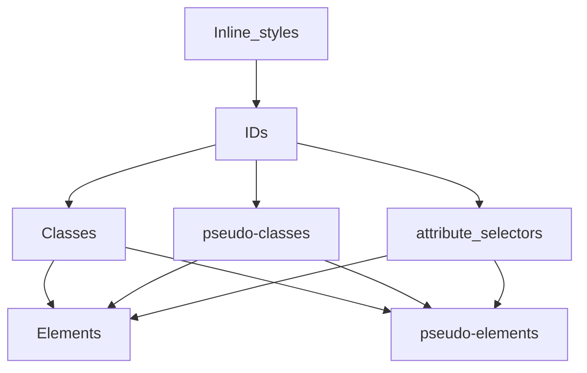
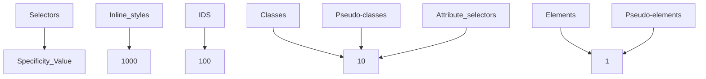

---
# try also 'default' to start simple
theme: seriph
# random image from a curated Unsplash collection by Anthony
# like them? see https://unsplash.com/collections/94734566/slidev
background: https://res.cloudinary.com/drnqdd87d/image/upload/f_auto/nmgakkzd3lmlibnfosps
# some information about your slides, markdown enabled
title: CSS Class Note
info: |
  ## AltSchool v4 CSS Class Notes
  making of world class developers

  join at [AltSchool Africa](https://altschoolafrica.com)
# apply any unocss classes to the current slide
class: text-center
# https://sli.dev/custom/highlighters.html
highlighter: shiki
# https://sli.dev/guide/drawing
drawings:
  persist: false
# slide transition: https://sli.dev/guide/animations#slide-transitions
transition: slide-left
# enable MDC Syntax: https://sli.dev/guide/syntax#mdc-syntax
mdc: true
hideInToc: true
---

# CSS Class Notes

CSS Class notes for the 1st Semester

<div class="pt-12">
  <span @click="$slidev.nav.next" class="px-2 py-1 rounded cursor-pointer" hover="bg-white bg-opacity-10">
    Are you ready to well designed UI with your HTML skills? Press <kbd>space</kbd> on your keyboard <carbon:arrow-right class="inline"/>
  </span>
</div>

<div class="abs-br m-6 flex gap-2">
  <button @click="$slidev.nav.openInEditor()" title="Open in Editor" class="text-xl slidev-icon-btn opacity-50 !border-none !hover:text-white">
    <carbon:edit />
  </button>
  <a href="https://github.com/oluwasetemi/repo" target="_blank" alt="GitHub" title="Open in GitHub"
    class="text-xl slidev-icon-btn opacity-50 !border-none !hover:text-white">
    <carbon-logo-github />
  </a>
  <a href="https://github.com/Oluwasetemi/repo/releases" target="_blank" alt="Download" title="Download PDF or PPTX version of the slide"
    class="text-xl slidev-icon-btn opacity-50 !border-none !hover:text-white">
    <carbon-download />
  </a>
</div>

<!--
The last comment block of each slide will be treated as slide notes. It will be visible and editable in Presenter Mode along with the slide. [Read more in the docs](https://sli.dev/guide/syntax.html#notes)
-->

---

## Table of contents

<Toc columns="2" minDepth="1" maxDepth="2"></Toc>

---

# Getting Started with CSS?

### CSS which stands in for Cascading Style Sheets is a stylesheet language used to describe the presentation of a document written in HTML or XML.

<br/>

### Just as HTML serves as the skeletal part of the web, CSS describes how the element should be rendered on the web.

### We use CSS to style our HTML elements and this is what you're going to learn througout this module.

---

# Selectors

Before we move deeply into Selectors, let's dive into CSS rule which is a block of code, that has one or more selectors and one or more declarations.


---

<ins>Definition of selectors</ins>

Looking at the image in the previous slide we'll notice that CSS selector is the first part of a CSS rule. In order to choose or select HTML elements that's going to carry the CSS property values inside the rule we have to use CSS Selector. In summary, for us to add a style for a particular HTML element we need a selector.

Types of selectors

- Universal selector: This is also know as a wildcard, selects every single element in the document. It is represented by the asterisk character <kbd>\*</kbd>

<ins>Code Example</ins>:

```
 * {
margin: 0;
padding: 0;
box-sizing:
}
```

This rule is saying that remove any default margin and padding from all the elements in this document and also change the box-sizing value to border-box.

---

- Type selector: The CSS type selector matches elements by node/HTML name.

<ins>Code Example</ins>:

```
  <p>I am taking color red and increasing my font size.</p>
```

```
p {
color: red;
font-size: 36px;
}
```

This CSS rule is saying that apply color of red to every <kbd>p</kbd> element and also increase its font size to 36px.

---

- Class selector: There is a class attribute associated to all HTML elements, this allows us to target a specific HTML element for its class name. To style an element using the class name we make use of the dot notation <kbd>.</kbd> before the class name when writing our selector in the CSS rule <kbd>.paragraph</kbd>

<ins>Code Example</ins>:

```html
<p class="paragraph">You can style me using my class name.</p>
```

```
.paragraph {
  color: red;
  font-size: 36px;
  }
```

This CSS rule is saying that
apply color of red to the <kbd>p</kbd> element that has the class name of
paragraph and also increase its font size to 36px.

---

- ID selector: The id
  selector uses the id attribute of an HTML element to select a specific element.
  Id value of an element must be unique which means you can only have a specific
  id value to an HTML element, unlike class where you can give 10 HTML elements
  same class name. <br />
  To style an element using the id value we make use of the hash notation <kbd>#</kbd> before
  the id value when writing our selector in the CSS rule
  <kbd>#container-wrapper</kbd>

<ins>Code Example</ins>:

```html
<span id="container-wrapper">
  You can style me using my id value which is container-wrapper.
</span>
```

```
#container-wrapper {
  color: red;
  font-size: 36px;
  }
```

---

- Attribute selector: This gives you the power to select elements based on the presence of a certain HTML attribute or the value of an HTML attribute. To write the CSS rule for this you have to wrap the selector with square brackets.

<ins>Code Example</ins>:

```html
<a href="https://altschoolafrica.com">
  You can style me using my attribute which is href.
</a>
```

```
[href] {
  color: red;
}
```

---

<ins>Code Example 2</ins>:

```html
<a href="https://altschoolafrica.com">
  You can style me using my attribute and its value which is
  href="https://altschoolafrica.com".
</a>
```

```
[href="https://altschoolafrica.com"] {
color: red;
font-size: 36px;
}

```

Note: This method give you the access to style any element that has an attribute of data-type but with a specific value of href.

---

- Pseudo-classes: Pseudo-classes are keywords added to selectors using a single colon sign <kbd>:</kbd> just to specify a special state of the selected elements. They allow you to style elements based on their state, position, or user interactions, which cannot be targeted by regular CSS selectors alone.
  Here are some common pseudo-classes:

```
1 :link
2 :visited
3 :hover
4 :active
5 :focus
6 :nth-child()

```

<ins>Code Example</ins>

```
button:hover{
background-color: orange;
};

li:nth-child(even){
text-transform: uppercase;
};

input:focus{
border: 2px solid red;
};

```

---

- Pseudo-element: To style specific parts of an element we attached double colon to our selector <kbd>::</kbd> followed by keywords to select the portion we want to apply styling to. Unlike the pseudo-classes, which target the entire element, pseudo-elements target specific parts of an element using a conventional keywords.

Here are some common pseudo-elements:

```
1 ::before - Inserts content before the content of an element.
2 ::after - Inserts content after the content of an element.
3 ::first-letter - Styles the first letter of an element.
4 ::first-line - Styles the first line of an element.
5 ::selection - Styles the portion of an element that is selected by the user.

```

`Note: Pseudo-elements are particularly useful for enhancing the design and readability of web content without the need for additional HTML elements.
`

---

<ins>Complex selectors</ins>

To have more power in accessing elements in the DOM we have some selectors which we will brief through but let's quickly look at parents and child elements using this code below:

```

<p>AltSchool Africa is a tech school that offers varieties of tech courses like <span>Frontend engineering</span>, <span>Backend engineering</span> and newly added <span>Cybersecurity</span> online.</p>

```

In the code above, the parent element is the <kbd>p</kbd>, inside which we have 3 span elements, since all these 3 span elements are inside the <kbd>p</kbd> we call them the child elements of <kbd>p</kbd>.

- Descendant Selector: This selects all elements that are descendants and we achieve this by giving space<kbd>( )</kbd> to instruct the browser to look for child elements.

<ins>Code Example</ins>:

```
p span {
color: red;
}

```

All the texts wrapped inside the span tag will take the CSS rule.

---

- Child selector (parent > child): This selects all elements that are direct children of a specified element.

<ins>Code Example</ins>:

```
ul > li {
list-style:none;
};

```

- Adjacent Sibling Selector (prev + next): This selects an element that is immediately preceded by a specified element.

<ins>Code Example</ins>:

```
h1 + p {
margin-top: 0;
};

```

---

- General Sibling Selector (prev ~ siblings): This selects all elements that are siblings of a specified element.

Code Example:

```
h1 ~ p {
color: blue;
}

```

- Grouping Selector: Applies the same styles to multiple selectors.

Code Example:

```
h1, h2, h3 {
margin-bottom: 10px;
}

```

---

# Specificity

Specificity is the key to understanding how CSS decides between competing rules. Let's take a brief at this code before we dive deep into specificity.

```

<h1 class="title">Hi, Specificity</h1>

h1 {
  color: blue;
}

.title {
  color: yellow;
}

```

In the code above, we are trying to style the h1 element but we have two CSS ruleset, so which stylesheet will override the other? This is where our knowledge on specificity algorithm comes in.
<br/>
<br/>
Specificity is a score given to selectors, and whenever we have two or more CSS rules pointing to the same element, the selector that has the highest specificity score will win, which means the CSS ruleset of this particular selector will be apllied on the element.

## <!-- We will come back to this at the end of this topic. -->

---

## Specificity Hierachy

CSS selectors are of different forms and each of them has its place in the specificity hierachy.

CSS Selectors decrease in specificity from top to bottom, meaning the selector at the top of the hierarchy has the highest specificity.

<div class="grid grid-col-2 gap-4    h-85 p-4 border border-gray-300 bg-blue overflow-auto ">
  <div class=" flex justify-center animate-slide-in-left">

</div>

<div class="bg-red animate-slide-in-right" >

</div>

Note:
The specificity of a CSS selector is typically represented as a four-part value like 0,0,0,0. <br/>
Looking up the tree if we are to calculate the specificity for IDs, it's going to be 0,1,0,0 <br/>
Also, a universal selector (\*) has no specificity and gets 0 points. This means that any rule with 1 or more points will override it.
<br/>

<p class="bg-white p-4 animate-slide-in-bottom">
Class Assessment: Calculate the specificity of these selectors:
<ul>
<li>#content .menu li:hover</li>
<li>div p .note
</li>
</ul>
</p>
</div>

---

## !impotant rule

In CSS, there is one rule that has the highest specificity score of 10,000. This rule is used to give a property-value pair the highest priority, allowing it to override any other declarations.

The only way to override inline styles which has specificity value of 1000 is by using this rule called !important, though this is considered as a bad practice and should be avoided.
<a class="bg-red color-black no-underline rounded-sm hover:font-bold hover:text-black" href="https://developer.mozilla.org/en-US/docs/Web/CSS/important" target="_blank">Read more</a>

Code Example

```
selector {
  property: value !important;
}

.h1 {
  color: red !important;
}

```

---

# Box Model

---

# Inheritance

---

# Colors/Units/Gradients

---

# Debugging in browser

---

# Inline, Internal and External CSS

---

# FlexBox

---

# Grid Layout

---

# Positioning

---

# Stacking Content/Z-index

---

# Overflow

---

# Responsiveness

---

# Animations

---

# CSS Frameworks

---

<CounterReact />

---

# Assignments

<ul>
  <li ><a @click="$slidev.nav.next()">Assignment 1</a></li>
  <li ><a @click="$slidev.nav.go(113)">Assignment 2</a></li>
</ul>

---

<!-- hideInToc: true -->

# Contributors

- [Ridwan Adebosin](https://github.com/RidwanAdebosin)
- [Olubebe Faith](https://github.com/Olubebe)

```

```

```

```

```

```

```

```

```

```

```

```
