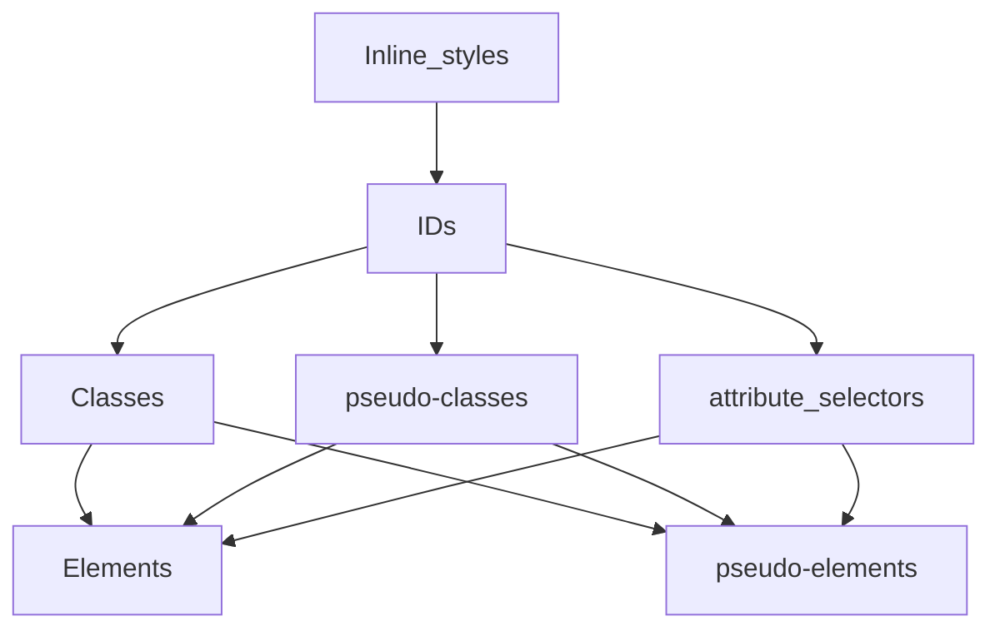
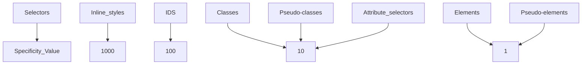
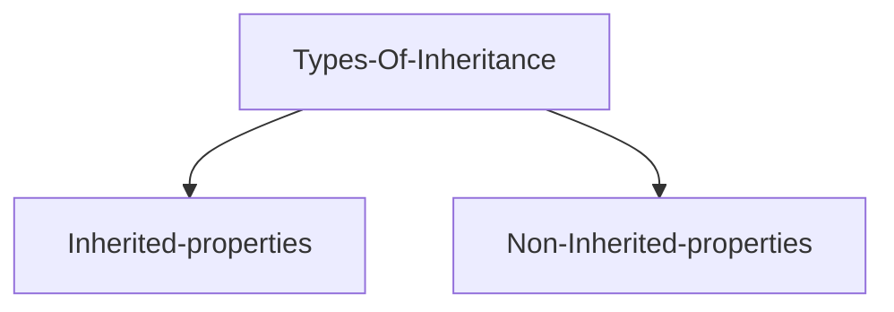

# CSS Class Notes

CSS Class notes for the 1st Semester

<div class="pt-12">
  <span @click="$slidev.nav.next" class="px-2 py-1 rounded cursor-pointer" hover="bg-white bg-opacity-10">
    Are you ready to well designed UI with your HTML skills? Press <kbd>space</kbd> on your keyboard <carbon:arrow-right class="inline"/>
  </span>
</div>

<div class="abs-br m-6 flex gap-2">
  <button @click="$slidev.nav.openInEditor()" title="Open in Editor" class="text-xl slidev-icon-btn opacity-50 !border-none !hover:text-white">
    <carbon:edit />
  </button>
  <a href="https://github.com/oluwasetemi/css-note" target="_blank" alt="GitHub" title="Open in GitHub"
    class="text-xl slidev-icon-btn opacity-50 !border-none !hover:text-white">
    <carbon-logo-github />
  </a>
  <a href="https://github.com/Oluwasetemi/css-note/releases" target="_blank" alt="Download" title="Download PDF or PPTX version of the slide"
    class="text-xl slidev-icon-btn opacity-50 !border-none !hover:text-white">
    <carbon-download />
  </a>
</div>

<!--
The last comment block of each slide will be treated as slide notes. It will be visible and editable in Presenter Mode along with the slide. [Read more in the docs](https://sli.dev/guide/syntax.html#notes)
-->

---

## Table of contents

<Toc columns="2" minDepth="1" maxDepth="2"></Toc>

<div class="flex gap-3 mt-6">
  <button @click="$router.push('/routes')" class="px-4 py-2 rounded-lg bg-blue-500/10 border border-blue-500/30 text-blue-400 text-sm cursor-pointer hover:bg-blue-500/20 transition-colors flex items-center gap-1.5"><span class="i-mdi-format-list-bulleted inline-block" /> All Sections</button>
  <button @click="$router.push('/html-playground')" class="px-4 py-2 rounded-lg bg-orange-500/10 border border-orange-500/30 text-orange-400 text-sm cursor-pointer hover:bg-orange-500/20 transition-colors flex items-center gap-1.5"><span class="i-mdi-web inline-block" /> HTML Playground</button>
  <button @click="$router.push('/playground')" class="px-4 py-2 rounded-lg bg-green-500/10 border border-green-500/30 text-green-400 text-sm cursor-pointer hover:bg-green-500/20 transition-colors flex items-center gap-1.5"><span class="i-mdi-code-braces inline-block" /> JS/TS Playground</button>
  <button @click="$router.push('/changelog')" class="px-4 py-2 rounded-lg bg-purple-500/10 border border-purple-500/30 text-purple-400 text-sm cursor-pointer hover:bg-purple-500/20 transition-colors flex items-center gap-1.5"><span class="i-mdi-history inline-block" /> Changelog</button>
</div>

---

# Getting Started with CSS?

### CSS which stands in for Cascading Style Sheets is a stylesheet language used to describe the presentation of a document written in HTML or XML.

<br/>

### Just as HTML serves as the skeletal part of the web, CSS describes how the element should be rendered on the web.

### We use CSS to style our HTML elements and this is what you're going to learn throughout this module.

---

# [Previous Class Recording](https://www.youtube.com/watch?v=cW3Xm4LZkj8&list=PLTTmsZetDiwysk9jdsMlRF4u6XGurJFef&index=15)

- [15](https://www.youtube.com/watch?v=cW3Xm4LZkj8&list=PLTTmsZetDiwysk9jdsMlRF4u6XGurJFef&index=15)
- [16](https://www.youtube.com/watch?v=lvhi_YZELzY&list=PLTTmsZetDiwysk9jdsMlRF4u6XGurJFef&index=16)
- [17](https://www.youtube.com/watch?v=x6rcMevUjEQ&list=PLTTmsZetDiwysk9jdsMlRF4u6XGurJFef&index=17)
- [18](https://www.youtube.com/watch?v=_jKvpwTZ-P0&list=PLTTmsZetDiwysk9jdsMlRF4u6XGurJFef&index=18)
- [19](https://www.youtube.com/watch?v=jsOBRT-GHq4&list=PLTTmsZetDiwysk9jdsMlRF4u6XGurJFef&index=19)
- [20](https://www.youtube.com/watch?v=lYOeltZUojI&list=PLTTmsZetDiwysk9jdsMlRF4u6XGurJFef&index=20)
- [21](https://www.youtube.com/watch?v=Eik3R556Xg8&list=PLTTmsZetDiwysk9jdsMlRF4u6XGurJFef&index=21)
- [22](https://www.youtube.com/watch?v=87-WHDYRSic&list=PLTTmsZetDiwysk9jdsMlRF4u6XGurJFef&index=22)

---

# Selectors

<div />
Before we move deeply into Selectors, let's dive into CSS rule which is a block of code, that has one or more selectors and one or more declarations.


---
hideInToc: true
---

# Definition of selectors

<div></div>
Looking at the image in the previous slide we'll notice that CSS selector is the first part of a CSS rule. In order to choose or select HTML elements that's going to carry the CSS property values inside the rule we have to use CSS Selector. In summary, for us to add a style for a particular HTML element we need a selector.

<h4 class="mt-3 font-bold underline">Types of selectors</h4>

- Universal selector: This is also know as a wildcard, selects every single element in the document. It is represented by the asterisk character <kbd>\*</kbd>

<ins>Code Example</ins>:

```css
* {
  margin: 0;
  padding: 0;
  box-sizing: border-box;
}
```

This rule is saying that remove any default margin and padding from all the elements in this document and also change the box-sizing value to border-box.

---
hideInToc: true
---

- Type selector: The CSS type selector matches elements by node/HTML name.

<ins>Code Example</ins>:

```html {monaco-run}
<style>
p {
  color: red;
  font-size: 36px;
}
</style>
<p>I am taking color red and increasing my font size.</p>
```

This CSS rule is saying that apply color of red to every <kbd>p</kbd> element and also increase its font size to 36px.

---

- Class selector: There is a class attribute associated to all HTML elements, this allows us to target a specific HTML element for its class name. To style an element using the class name we make use of the dot notation <kbd>.</kbd> before the class name when writing our selector in the CSS rule <kbd>.paragraph</kbd>

<ins>Code Example</ins>:

```html {monaco-run}
<style>
.paragraph {
  color: red;
  font-size: 36px;
}
</style>
<p class="paragraph">You can style me using my class name.</p>
```

This CSS rule is saying that
apply color of red to the <kbd>p</kbd> element that has the class name of
paragraph and also increase its font size to 36px.

---

- ID selector: The id
  selector uses the id attribute of an HTML element to select a specific element.
  Id value of an element must be unique which means you can only have a specific
  id value to an HTML element, unlike class where you can give 10 HTML elements
  same class name. <br />
  To style an element using the id value we make use of the hash notation <kbd>#</kbd> before
  the id value when writing our selector in the CSS rule
  <kbd>#container-wrapper</kbd>

<ins>Code Example</ins>:

```html {monaco-run}
<style>
#container-wrapper {
  color: red;
  font-size: 36px;
}
</style>
<span id="container-wrapper">
  You can style me using my id value which is container-wrapper.
</span>
```

---

- Attribute selector: This gives you the power to select elements based on the presence of a certain HTML attribute or the value of an HTML attribute. To write the CSS rule for this you have to wrap the selector with square brackets.

<ins>Code Example</ins>:

```html {monaco-run}
<style>
[href] {
  color: red;
}
</style>
<a href="https://altschoolafrica.com">
  You can style me using my attribute which is href.
</a>
```

---

<ins>Code Example 2</ins>:

```html {monaco-run}
<style>
[href="https://altschoolafrica.com"]{
  color: red;
  font-size: 36px;
}
</style>
<a href="https://altschoolafrica.com">
  You can style me using my attribute and its value which is
  href="https://altschoolafrica.com".
</a>
```

Note: This method give you the access to style any element that has an attribute of data-type but with a specific value of href.

---

- [`Pseudo-classes`](https://developer.mozilla.org/en-US/docs/Web/CSS/Pseudo-classes): Pseudo-classes are keywords added to selectors using a single colon sign <kbd>:</kbd> just to specify a special state of the selected elements. They allow you to style elements based on their state, position, or user interactions, which cannot be targeted by regular CSS selectors alone.
  Here are some common pseudo-classes:

<div grid="~ cols-8">

```
:active
:popover-open
:auto-fill
:blank
:checked
```

```
:current
:default
:defined
:dir
:disabled
```

```
:empty
:enabled
:first
:first-child
:first-of-type
```

```
:focus
:required
:root
:fullscreen
:valid
```

```
:has
:host
:playing
:hover
:where
```

```
:in-range
:invalid
:is
:lang
:last-child
```

```
:left
:link
:modal
:not
:nth-child()
```


```
:link
:visited
:hover
:active
:target
```

</div>

<ins>Code Example</ins>

```html {monaco-run}
<style>
button:hover {
  background-color: orange;
  cursor: pointer;
}

li:nth-child(even) {
  text-transform: uppercase;
}

input:focus {
  border: 2px solid red;
  outline: none;
}
</style>
<button>Hover me</button>
<ul>
  <li>Item one</li>
  <li>Item two (even)</li>
  <li>Item three</li>
  <li>Item four (even)</li>
</ul>
<input type="text" placeholder="Click to focus" style="border: 1px solid #ccc; padding: 4px;" />
```

---

- `Pseudo-element`: To style specific parts of an element we attached double colon to our selector <kbd>::</kbd> followed by keywords to select the portion we want to apply styling to. Unlike the pseudo-classes, which target the entire element, pseudo-elements target specific parts of an element using a conventional keywords.

Here are some common pseudo-elements:

```
1 ::before - Inserts content before the content of an element.
2 ::after - Inserts content after the content of an element.
3 ::first-letter - Styles the first letter of an element.
4 ::first-line - Styles the first line of an element.
5 ::selection - Styles the portion of an element that is selected by the user.
```

Note: Pseudo-elements are particularly useful for enhancing the design and readability of web content without the need for additional HTML elements.

---

<ins>Complex selectors</ins>

To have more power in accessing elements in the DOM we have some selectors which we will brief through but let's quickly look at parents and child elements using this code below:

```html
<p>
  AltSchool Africa is a tech school that offers varieties of tech courses like
  <span>Frontend engineering</span>, <span>Backend engineering</span> and newly
  added <span>Cybersecurity</span> online.
</p>
```

In the code above, the parent element is the <kbd>p</kbd>, inside which we have 3 span elements, since all these 3 span elements are inside the <kbd>p</kbd> we call them the child elements of <kbd>p</kbd>.

- Descendant Selector: This selects all elements that are descendants and we achieve this by giving space<kbd>( )</kbd> to instruct the browser to look for child elements.

<ins>Code Example</ins>:

```html {monaco-run}
<style>
p span {
  color: red;
}
</style>
<p>
  AltSchool Africa offers courses like
  <span>Frontend engineering</span>, <span>Backend engineering</span> and
  <span>Cybersecurity</span> online.
</p>
```

All the texts wrapped inside the span tag will take the CSS rule.

<style>
p {
 --uno: text-sm; 
  font-size: 12px;
  margin: 0;
}

li {
  margin: 0;
  font-size: 12px
}
</style>

---

- Child selector (parent > child): This selects all elements that are direct children of a specified element.

<ins>Code Example</ins>:

```html {monaco-run}
<style>
ul > li {
  list-style: none;
  color: #3b82f6;
  font-weight: bold;
}
</style>
<ul>
  <li>Direct child li — styled</li>
  <li>Another direct child — styled</li>
  <ol><li>Nested li — NOT a direct child of ul, not styled</li></ol>
</ul>
```

- Adjacent Sibling Selector (prev + next): This selects an element that is immediately preceded by a specified element.

<ins>Code Example</ins>:

```html {monaco-run}
<style>
h1 + p {
  margin-top: 0;
  color: #ef4444;
  font-weight: bold;
}
</style>
<h1>Heading</h1>
<p>Immediately after h1 — red and no top margin.</p>
<p>Second paragraph — not adjacent to h1, default style.</p>
```

---

- General Sibling Selector (prev ~ siblings): This selects all elements that are siblings of a specified element.

Code Example:

```html {monaco-run}
<style>
h1 ~ p {
  color: blue;
}
</style>
<h1>Heading</h1>
<p>Sibling paragraph — blue.</p>
<p>Another sibling paragraph — also blue.</p>
<div>A div — not a p, not styled.</div>
<p>Still a sibling p — blue.</p>
```

- Grouping Selector: Applies the same styles to multiple selectors.

Code Example:

```html {monaco-run}
<style>
h1, h2, h3 {
  margin-bottom: 10px;
  color: #8b5cf6;
  border-left: 4px solid #8b5cf6;
  padding-left: 8px;
}
</style>
<h1>Heading 1</h1>
<h2>Heading 2</h2>
<h3>Heading 3</h3>
<p>Paragraph — not in the group, default style.</p>
```

---
hideInToc: true
---

- `Nesting Selectors &`: This is a way of writing CSS rules that are more specific and easier to read.They explicitly states the relationship between parent and child rules when using CSS nesting. It makes the nested child rule selectors relative to the parent element. Without the & nesting selector, the child rule selector selects child elements. The child rule selectors have the same specificity weight as if they were within `:is()`. Can be use with the Child Combinators.

<ins>Code Example</ins>:

```html {monaco-run}
<style>
.container {
  padding: 20px;
  .title {
    color: red;
  }
  &:hover {
    background-color: lightblue;
  }
}
</style>
<div class="container">
  <h1 class="title">Hello, CSS</h1>
</div>
```

## [Read more about CSS nesting](https://developer.mozilla.org/en-US/docs/Web/CSS/Nesting_selector)

---
hideInToc: true
---

# `:HAS()` PSEUDO SELECTOR

The :has() selector allows you to conditionally select an element when elements deeper in the DOM tree of the original element match the selector you put inside `:has()`.

```html {monaco-run}
<style>
figure:has(figcaption) {
  border: 1px solid black;
  padding: 0.5rem;
  display: inline-block;
}
</style>
<figure>
  
  <figcaption>This figure has a caption — border appears.</figcaption>
</figure>
<figure>
  
</figure>
```

# `:IS()` PSEUDO SELECTOR

The :is() pseudo-class function takes a selector list as its argument and selects any element that can be selected by one of the selectors in that list.

```html {monaco-run}
<style>
:is(h1, h2, h3) {
  color: red;
}
</style>
<h1>Heading 1 — red via :is()</h1>
<h2>Heading 2 — also red</h2>
<h3>Heading 3 — also red</h3>
<p>Paragraph — not matched, stays default</p>
```

---

# Specificity

<div></div>
Specificity is the key to understanding how CSS decides between competing rules. Let's take a brief at this code before we dive deep into specificity.

```html {monaco-run}
<style>
h1 {
  color: blue;
}

.title {
  color: yellow;
}
</style>
<h1 class="title">Hi, Specificity</h1>
```

In the code above, we are trying to style the h1 element but we have two CSS ruleset, so which stylesheet will override the other? This is where our knowledge on specificity algorithm comes in.
<br/>
<br/>
Specificity is a score given to selectors, and whenever we have two or more CSS rules pointing to the same element, the selector that has the highest specificity score will win, which means the CSS ruleset of this particular selector will be applied on the element.

## <!-- We will come back to this at the end of this topic. -->

---
hideInToc: true
---

## Specificity Hierarchy

CSS selectors are of different forms and each of them has its place in the specificity hierarchy.

CSS Selectors decrease in specificity from top to bottom, meaning the selector at the top of the hierarchy has the highest specificity.

<div class="grid grid-col-2 gap-4    h-85 p-4 border border-gray-300 bg-blue overflow-auto ">
  <div class=" flex justify-center animate-slide-in-left">


```mermaid
graph TD;
    Inline_styles-->IDs;
    IDs-->Classes;
    IDs-->pseudo-classes;
    IDs-->attribute_selectors;
    Classes-->Elements;
    Classes-->pseudo-elements;
    pseudo-classes-->Elements;
    attribute_selectors-->Elements;
    pseudo-classes-->pseudo-elements;
    attribute_selectors-->pseudo-elements;
```

</div>

<div class="bg-red animate-slide-in-right">


```mermaid
    graph TD;
    Selectors-->Specificity_Value;
    Inline_styles-->1000;
    IDS-->100;
    Classes-->10;
    Pseudo-classes-->10;
    Attribute_selectors-->10;
    Elements-->1;
    Pseudo-elements-->1;
```

</div>

Note:
The specificity of a CSS selector is typically represented as a four-part value like 0,0,0,0. <br/>
Looking up the tree if we are to calculate the specificity for IDs, it's going to be 0,1,0,0 <br/>
Also, a universal selector (\*) has no specificity and gets 0 points. This means that any rule with 1 or more points will override it.
<br/>

<div class="bg-white p-4 animate-slide-in-bottom">
Class Assessment: Calculate the specificity of these selectors:
<ul>
<li>#content .menu li:hover</li>
<li>div p .note
</li>
</ul>
</div>
</div>

---
hideInToc: true
---

# important rule

<div />

In CSS, there is one rule that has the highest specificity score of 10,000. This rule is used to give a property-value pair the highest priority, allowing it to override any other declarations.

The only way to override inline styles which has specificity value of 1000 is by using this rule called !important, though this is considered as a bad practice and should be avoided.
<a class="bg-red color-black no-underline rounded-sm hover:font-bold hover:text-black" href="https://developer.mozilla.org/en-US/docs/Web/CSS/important" target="_blank">Read more</a>

Code Example

```html {monaco-run}
<style>
h1 {
  color: blue;           /* normal rule */
}
.override {
  color: green;          /* higher specificity, but loses to !important */
}
.important-wins {
  color: red !important; /* wins over everything */
}
</style>
<h1 class="override important-wins">
  Should be red — !important beats class + type selector
</h1>
<h1 class="override">
  Should be green — class beats type selector
</h1>
<h1>Should be blue — type selector only</h1>
```

<Tips type="danger" full-width>Importance should be used carefully and not always.</Tips>


---

# Box Model

<div></div>
The CSS Box Model is a core concept in web design and layout. It describes how every element on a web page is rendered as a rectangular box.
It’s basically a box that wraps around every HTML element. Understanding this model is crucial for creating precise layouts and solving common design challenges.


---
hideInToc: true
class: text-sm
---

# Components Of Box Model

<div grid="~ cols-2" gap="2">

<div>

(a) Content:

- This is the innermost layer.
- It contains the actual content of the element (text, images, etc.).
- Dimensions are set using 'width' and 'height' properties.

</div>

<div>

(b) Padding:

- Surrounds the content area.
- Creates space between the content and the border.
- Can be set using 'padding' property (or padding-top, padding-right, etc.).
- Is transparent, allowing the background of the element to show through.

</div>

<div mt--5>

\(c\) Margin:

- The outermost layer.
- Creates space between the element and adjacent elements.
- Is always transparent.
- Set using the 'margin' property or individual properties (margin-top, etc.).

Popular margin concepts are: Hungry margin(auto margin which only works for horizontal margins with explicit width), Collapsed margin, Negative margin.


</div>

<div>

(d) Border:

- Encircles the padding (or content if no padding is set).
- Can have different styles, colors, and widths.
- Set using the 'border' property or individual properties like 'border-width'.

</div>

</div>


---
hideInToc: true
---

<div grid place-content-center>
  
</div>

---
hideInToc: true
transition: slide-up
layout: iframe
url: https://codepen.io/chriscoyier/embed/gONzpYb?default-tab=html%2Cresult
---

---
hideInToc: true
---

- 1. Calculating Total Element Size

One of the most important aspects of the Box Model is understanding how the total size of an element is calculated:

- Total Width = width + left padding + right padding + left border + right border
- Total Height = height + top padding + bottom padding + top border + bottom border

Note: Margins are not included in these calculations as they affect spacing between elements, not the element's size itself.

- 2. Box-Sizing Property

The default box model can sometimes lead to unexpected results. CSS3 introduced the 'box-sizing' property to address this:

'content-box' (default): Width and height apply to content area only.
'border-box': Width and height include content, padding, and border.

```css
* {
  box-sizing: border-box;
}
```

---
hideInToc: true
---

# Example

```html {monaco-run}
<style>
.content-box {
  box-sizing: content-box; /* default */
  width: 200px;
  padding: 20px;
  border: 10px solid blue;
  background: #bfdbfe;
  margin-bottom: 12px;
}
.border-box {
  box-sizing: border-box;
  width: 200px;
  padding: 20px;
  border: 10px solid black;
  background: #bbf7d0;
}
</style>
<p style="font-size:13px"><strong>content-box</strong> (total width = 200 + 40 + 20 = 260px):</p>
<div class="content-box">I am 200px wide (content only)</div>
<p style="font-size:13px"><strong>border-box</strong> (total width = 200px including padding & border):</p>
<div class="border-box">I am 200px wide (includes padding & border)</div>
```

### Understanding the Box Model is crucial for:

- Centering elements
- Creating consistent spacing
- Implementing responsive designs
- Debugging layout issues

---

# Using Block and Inline Axes in CSS

<div></div>
In CSS, the block and inline axes are used to determine how elements are laid out on a page. Understanding these axes is crucial for creating modern responsive websites with i18n(Internationalization) and localization.

- Block Axis: The block axis is the horizontal or vertical axes of an element's block depending on the writing-mode. Block-level elements stack on top of each other in the block axis and can corresponding to width or height depending on the writing-mode.

- Inline Axis: The inline axis is the horizontal or vertical axes of an element's block depending on the writing-mode. Inline-level elements flow in the inline axis and it corresponds to height or width based on the writing-mode.

Possible css properties with block and inline axes are: `padding-block`, `margin-block`, `border-block`, `padding-inline`, `margin-inline`, `border-inline`. Padding and margin can have the start, end variant like `padding-inline-start`, `margin-block-end`.

The `block-size` and `inline-size` properties are used to set the height and width of an element, respectively. The `min-block-size` and `max-block-size` properties set the minimum and maximum height of an element, while the `min-inline-size` and `max-inline-size` properties set the minimum and maximum width of an element. For positioning of elements, `inset-block` or `inset-inline` and can be a start or end variant.

---
hideInToc: true
---

# Calculating Width and Height

## Width Calculation

- Width is calculated along the inline axis(left to right) and default is auto(using the content inside the element) but can be set using the `width` property. The `max-width` and `min-width` properties set the maximum and minimum width of an element. `max-width` is used to prevent an element from exceeding a certain width, while `min-width` ensures that an element is at least a certain width. `max-width` is useful for creating responsive designs that adapt to different screen sizes and should be used for containers/wrappers that need to be flexible. `min-width` is useful for ensuring that an element is at least a certain width, which can be helpful for maintaining the layout of a page and preventing elements from becoming too narrow. Width considers the parent element's width and the content inside the element. Avoid using fixed width and percentage width if you do not have a parent with an explicit width.

---
hideInToc: true
---

# Height Calculation

- Height is calculated along the block axis(top to bottom) and default is auto(using the content inside the element) but can be set using the `height` property. The `max-height` and `min-height` properties set the maximum and minimum height of an element. `max-height` is used to prevent an element from exceeding a certain height, which can be helpful for maintaining the layout of a page and preventing elements from becoming too large. `min-height` ensures that an element is at least a certain height, making it useful for creating responsive designs that adapt to different screen sizes and ensuring adjustable height. Height considers the content inside the element first before the parent element's height.

---
hideInToc: true
---

<div grid place-content-center>
  
</div>

---

# CSS Reset and Normalize

## CSS Reset

A CSS reset is a set of CSS rules that reset the styling of all HTML elements to a consistent baseline. This ensures that all browsers start with the same default styles, making it easier to create a consistent design across different browsers.

[Link to Josh Comeau CSS Reset](https://www.joshwcomeau.com/css/custom-css-reset/)

## {@necolas/normalize.css}

Normalize.css is a modern, HTML5-ready alternative to CSS resets. It makes browsers render all elements more consistently and in line with modern standards. It precisely targets only the styles that need normalizing.

---

# Inheritance

<div></div>
Inheritance, this is when a child element get a computed value which represents its parent's value. Inheritance cascade downwards and every property has a default value in CSS.

<div class="mt-5 flex justify-center p-10 border border-gray-300 bg-blue overflow-auto animate-slide-in-left">


```mermaid
graph TD;
    Types-Of-Inheritance-->Inherited-properties;
    Types-Of-Inheritance-->Non-Inherited-properties;
```

</div>

- Inherited-properties: These are properties that by default passed down from a parent element to its children.

- Non-Inherited-properties: These are properties that by default can't be passed down from a parent element to its children.

---

[Some inherited and non-inherited CSS properties:]{.font-bold}

<table class="p-2 border border-black overflow-scroll">
<tbody>
  <tr class="p-4 border border-black-400 bg-green">
    <th>Inherited Properties</th>
    <th>Non-Inherited Properties</th>
  </tr>
  <tr>
    <td class="bg-black text-white">list-style</td>
    <td class="bg-black text-white">border</td>
  </tr>
  <tr>
    <td>color</td>
    <td>margin</td>
  </tr>
  <tr>
    <td class="bg-black text-white">cursor</td>
    <td class="bg-black text-white">padding</td>
  </tr>
  <tr>
    <td>font-family</td>
    <td>width</td>
  </tr>
  <tr>
    <td class="bg-black text-white">font-size</td>
    <td class="bg-black text-white">height</td>
  </tr>
  <tr>
    <td>font-style</td>
    <td>position</td>
  </tr>
  <tr>
    <td class="bg-black text-white">font-weight</td>
    <td class="bg-black text-white">box-shadow</td>
  </tr>
  <tr>
    <td>text-align</td>
    <td>z-index</td>
  </tr>
</tbody>
</table>

<style>
  p {
    margin-bottom: 0;
  }
</style>


---

Inherited property

Code Example: The color property falls under the inherited properties, so the <kbd>em</kbd> element will inherit the color value from the parent element which is <kbd>p</kbd>

```html {monaco-run}
<style>
p {
  color: green;
  font-weight: 500;
}
</style>
<p>This paragraph has <em>emphasized text</em> in it.</p>
```

> **Try it:** Add `em { color: initial; }` to stop the `em` from inheriting green. Note: `unset` and `revert` won't work here — for inherited properties like `color`, they both fall back to `inherit`, so the color stays green.

---
hideInToc: true
---

Non-inherited property

Code Example: The border property falls under the non-inherited properties so, the <kbd>em</kbd> element will not inherit the border value from the parent element which is <kbd>p</kbd>.

```html {monaco-run}
<style>
p {
  border: 3px solid red;
}
em {
  border: inherit; /* try: initial, unset, or revert — all remove the border */
}
</style>
<p>This paragraph has <em>emphasized text</em> in it.</p>
```

> **Try it:** Change `inherit` on `em` to `initial`, `unset`, or `revert` — all three remove the border. Unlike `color`, `border` is non-inherited, so `unset` and `revert` reset it to `none` instead of pulling from the parent.

---
hideInToc: true
---

## Setting inheritance explicitly in CSS

Using the `inherit` keyword

To keep everything under the developer's control, we have the inherit keyword that can make any property inherit its parent's computed value.

Code Example:

```html {monaco-run}
<style>
p {
  border: 3px solid red;
}
em {
  border: inherit; /* em inherits the border from its parent p */
}
</style>
<p>This paragraph has <em>emphasized text</em> in it.</p>
```

---
hideInToc: true
---

## Controlling Inheritance

Note: Inheritance is always from the parent element in the document tree, even when the parent element is not the containing block.

There are 5 major keywords in inheritance:

<dl class="h-80 light:bg-yellow dark:bg-yellow-600 p-4 border border-rounded-4 overflow-y-scroll animate-slide-in-left">
<dt class="font-sans font-extrabold">
inherit:
</dt>
<dd>
The inherit keyword causes element to take the computed value of the property from its parent element.

</dd>
<br/>
<dt class="font-sans font-extrabold">
initial: 
</dt>
<dd>
This keyword sets a property back to that initial, default value.
</dd>
<br/>
<dt class="font-sans font-extrabold"> unset: </dt><dd> This keyword resets a property to its inherited value if the property naturally inherits from its parent, and to its initial value if not. This is like shuffling between the inherit and the initial keyword because in its first case it behaves like the inherit keyword when the property is an inherited property and like the initial keyword in the second case when the property is a non-inherited property.
</dd>
<br/>
<dt class="font-sans font-extrabold">
revert:
</dt>
<dd>
This keyword reverts the cascaded value of the property from its current value to the value the property would have had if no changes had been made by the current style origin to the current element.
</dd>
<br/>
<dt class="font-sans font-extrabold">
revert-layer:
</dt>
<dd>
This keyword rolls back the value of a property in a cascade layer to the value of a CSS rule matching the element in a previous cascade layer. 
</dd>
</dl>

---
hideInToc: true
layout: iframe
url: https://codepen.io/setemiojo/embed/JjxNJVm?default-tab=html%2Cresult
---


---

The <kbd>all</kbd> CSS property

`all` is a shorthand that sets **every CSS property at once** (except `unicode-bidi` and `direction`). It accepts the same five inheritance keywords from the previous slide — giving you a single line to fully reset or fully inherit a component's styles.

<div class="grid grid-cols-2 gap-4 items-start">

<div class="text-sm">

| Value | What it does |
|---|---|
| `inherit` | Child takes every property from its parent |
| `initial` | Every property resets to the CSS spec default |
| `unset` | Inherited props → `inherit`, non-inherited → `initial` |
| `revert` | Rolls back to the browser's built-in stylesheet |
| `revert-layer` | Rolls back to the previous cascade layer |

> **Try it:** Change `all: inherit` on `.child` to `initial`, `unset`, or `revert` and run to see the difference.

</div>

```html {monaco-run}
<style>
.parent {
  color: red;
  font-size: 24px;
  background-color: lightgray;
  font-weight: bold;
  padding: 16px;
  border: 2px solid navy;
}

.child {
  all: inherit; /* try: initial | unset | revert | revert-layer */
}
</style>
<div class="parent">
  Parent Text
  <div class="child">Child Text — watch how all: inherit changes me</div>
</div>
```

</div>
---

# Colors/Units/Gradients

## CSS Color

Colors in CSS can be defined in various ways, such as using color names, hexadecimal values, RGB, RGBA, HSL, HSLA, LCH, OKLCH, LAB, OKLAB, light-dark, color(), color-mix() and display-p3.

keywords: currentColor and transparent are also used in CSS to define colors.

## Color Names

Definition: These are predefined color names in CSS, such as red, blue, green, black, white, etc. There are 140 named colors in CSS.

Named colors are convenient for quick, common colors but lack precision for more specific color needs.

```css
p {
  color: red;
  background-color: lightblue;
}
```

---
hideInToc: true
---

## Hexadecimal Colors

Hexadecimal colors are defined using a six-digit code consisting of letters and numbers, preceded by a "#".The first two digits represent the red component, the next two represent the green, and the last two represent the blue

You can also use a three-digit shorthand (e.g., #f00 for #ff0000), which is equivalent to doubling each digit.

```css
p {
  color: #ff5733; /* Bright orange */
  color: #f53; /* Equivalent shorthand for #ff5533 */
  color: #ff0000; /* Red */
  color: #f00; /* Shorthand for Red*/
  background-color: #c0c0c0; /* Silver */
}
```

---
hideInToc: true
---

## RGB and RGBA Colors

RGB stands for Red, Green, Blue, with values ranging from 0 to 255. RGBA adds an alpha channel for transparency, with a value between 0 (completely transparent) and 1 (completely opaque).

RGBA is particularly useful for overlay effects and blending colors.

```css
color: rgb(255, 87, 51); /* Bright orange */
color: rgba(255, 87, 51, 0.5); /* 50% transparent */
```

<div class="p-5 border border-gray-300 bg-gray-100 font-sans text-base">
  <p class="text-[rgb(255,87,51)]">This text is bright orange.</p>
  <p class="text-[rgba(255,87,51,0.5)]">This text is 50% transparent orange.</p>
</div>

---
hideInToc: true
---

## HSL & HSLA Colors

HSL stands for Hue (0-360), Saturation (0%-100%), and Lightness (0%-100%). HSLA adds an alpha channel for transparency.

HSL is intuitive for adjusting colors based on human perception, making it easier to create shades and tints.

```css
color: hsl(9, 100%, 60%); /* Bright orange */
color: hsla(9, 100%, 60%, 0.5); /* 50% transparent */
```

## Opacity and Transparency

Transparency: Besides RGBA and HSLA, you can control an element’s transparency using the opacity property, which affects the entire element, including its content.

```css
opacity: 0.5; /* Makes the element 50% transparent */
```

---
hideInToc: true
---

# The Future of Colors

## LCH, OKLCH, LAB, OKLAB, Light-Dark, Color(), Color-Mix(), Display-P3

- LCH: Lightness, Chroma, Hue
- OKLCH: Lightness, Chroma, Hue with an alpha channel
- LAB: Lightness, A (green-red), B (blue-yellow)
- OKLAB: Lightness, A (green-red), B (blue-yellow) with an alpha channel
- Light-Dark: Adjusts the lightness of a color
- Color(): Creates a color from a string
- Color-Mix(): Mixes two colors
- Display-P3: Wide-gamut color space for digital displays

```css
color: lch(60% 50 90); /* Lightness 60%, Chroma 50, Hue 90 */
color: lab(60% 50 90); /* Lightness 60%, A 50, B 90 */
color: light-dark(50%); /* Adjusts lightness to 50% */
color: color(display-p3 0.7 0.5 0); /* Display-P3 color */
color: color-mix(red blue 50%); /* Mixes red and blue 50% */
```

---
hideInToc: true
---

```html {monaco-run}
<style>
html {
  --red-hue: 0deg;
  --red-sat: 100%;
  --red-lit: 50%;

  --red: hsl(var(--red-hue) var(--red-sat) var(--red-lit));
  --dark-red: hsl(var(--red-hue) var(--red-sat) calc(var(--red-lit) - 20%));
  --transparent-red: hsl(var(--red-hue) var(--red-sat) var(--red-lit) / 0.5);
  --soft-red: hsl(var(--red-hue) calc(var(--red-sat) - 30%) calc(var(--red-lit) + 10%));
}
</style>
<p style="color: var(--red)">This text is red.</p>
<p style="color: var(--dark-red)">This text is darker.</p>
<p style="color: var(--transparent-red)">This text is transparent.</p>
<p style="color: var(--soft-red)">This text is softer.</p>
```

---
hideInToc: true
---

# CSS Units
<div />
CSS units are vital for defining the size, spacing, and layout of elements. Here’s a more in-depth look at the types of units:

1. Absolute Units

- Fixed Units: These do not scale based on the viewport or parent elements.

- Pixels (px): Most common; ideal for precise control.

```css
font-size: 14px; /* Fixed size */
```

2. Relative Units

- Flexible Units: These scale based on the parent element or viewport, making designs more responsive.
- em: Relative to the font size of the parent element. Useful for scalable spacing and typography.

```css
padding: 1em; /* Equal to the current font size */
```

---
hideInToc: true
---

<div grid place-content-center>
  
</div>

---
hideInToc: true
---

## Contd (Relative Units)

- <kbd>rem</kbd>: Relative to the root element's font size (<kbd>html</kbd>), offering consistency across the page.

```css
font-size: 1.2rem; /* 1.2 times the root font size */
```

- <kbd>%</kbd>: Relative to the parent element's size, commonly used in responsive design. [Read More](https://2019.wattenberger.com/blog/css-percents)

```css
width: 80%; /* 80% of the parent element's width */
```

- <kbd>vw</kbd>, <kbd>vh</kbd>: Relative to the viewport's width or height. Ideal for full-screen layouts and responsive elements.

```css
width: 100vw; /* Full width of the viewport */
height: 100vh; /* Full height of the viewport */
```

---
hideInToc: true
---

<div grid place-content-center>
  
</div>

---
hideInToc: true
---

3. Viewport Units

- Viewport-based units: Perfect for responsive design.

- vw: 1% of the viewport width.
- vh: 1% of the viewport height.
- vmin and vmax: Relative to the smaller or larger of vw and vh.
- lvh and lvw
- ch: Relative to the width of the "0" (zero) character.
- svh and svw
- dvh and dvw

```css
font-size: 5vw; /* Font size based on viewport width */
```

---
hideInToc: true
---

<div grid place-content-center>
  
</div>

---
hideInToc: true
---

# CSS Gradients

Gradients are used to create smooth transitions between colors, adding depth and visual interest to designs. Here’s a deeper look:

1. Linear Gradients
   A gradient that transitions along a straight line. You can control the direction and color stops.

`linear-gradient(direction, color-stop1, color-stop2, ...)`.

Direction: Can be specified with angles (e.g., 45deg) or keywords (to right, to bottom).

```html {monaco-run}
<style>
.grad {
  height: 120px;
  width: 100%;
  background: linear-gradient(45deg, red, yellow);
}
</style>
<div class="grad"></div>
```

---
hideInToc: true
---

2. Radial Gradients
   Radiates from a central point outward, either circular or elliptical.

`radial-gradient(shape size at position, start-color, ..., end-color)`.

Shapes and Sizes: You can control the shape (circle or ellipse) and size (closest-side, farthest-corner, etc.).

```html {monaco-run}
<style>
.wrap { display: flex; gap: 12px; }
.grad { height: 160px; flex: 1; }
.circle   { background: radial-gradient(circle,  red, yellow, green); }
.ellipse  { background: radial-gradient(ellipse, red, yellow, green); }
</style>
<div class="wrap">
  <div class="grad circle"></div>
  <div class="grad ellipse"></div>
</div>
```

---
hideInToc: true
---

3. Conic Gradients

- A gradient that rotates around a central point, similar to slices of a pie.
- Often used for visualizations like pie charts.

`conic-gradient(from direction, color-stop1, color-stop2, ...)`

```html {monaco-run}
<style>
.grad {
  height: 160px;
  width: 160px;
  border-radius: 50%;
  background: conic-gradient(from 90deg, red, yellow, green);
}
</style>
<div class="grad"></div>
```

---
hideInToc: true
---

4. Repeating Gradients

- Repeats the linear gradient pattern indefinitely.
- Repeating Radial Gradients: Repeats the radial gradient pattern.

```html {monaco-run}
<style>
.wrap { display: flex; gap: 12px; color: black; }
.grad { height: 160px; flex: 1; display: flex; align-items: center; justify-content: center; font-weight: bold; }
.linear { background: repeating-linear-gradient(45deg, red, yellow 10%); }
.radial  { background: repeating-radial-gradient(circle, red, yellow 10%); }
</style>
<div class="wrap">
  <div class="grad linear">Repeating Linear</div>
  <div class="grad radial">Repeating Radial</div>
</div>
```

---
hideInToc: true
---

Practical Tips

- Combine Units: Use relative units (em, rem) for typography to maintain scalability and consistent spacing.
- Gradients with Transparency: Combine gradients with RGBA or HSLA colors for layered effects with transparency.
- Viewport Units for Responsiveness: Use vw and vh for elements that need to adapt to screen size changes, such as full-screen sections or responsive text sizes.


---
hideInToc: true
layout: two-cols
---

[CSS Functions](https://mdn.io/css/functions)

<div class="empty"></div>

Value functions in CSS are used to manipulate values, perform calculations, and apply effects. Here are some common functions:

- `calc()`: Performs calculations on property values.
- `var()`: Defines custom properties (variables).
- `rgb()`, `rgba()`, `hsl()`, `hsla()`: Define colors using RGB, RGBA, HSL, and HSLA values.
- `url()`: Specifies the location of an external resource.
- `linear-gradient()`, `radial-gradient()`, `conic-gradient()`: Create gradients with smooth color transitions.
- `clamp()`: Restricts a value to a specified range.
- `light-dark()`, `color()`, `color-mix()`: Manipulate colors and create color schemes.
- `attr()`: Retrieves the value of an attribute on an element.
- transform functions - `translate()`, `rotate()`, `skew()`, `matrix()`, `scale()`, `perspective()`.

```css
p {
  font-size: calc(1rem + 1vw);
  color: var(--primary-color);
  background: linear-gradient(to right, red, blue);
}
```

::right::

[CSS @Rules](https://mdn.io/css/at-rule)

<div class="empty"></div>

@Rules are used to define special rules in CSS that control how styles are applied. Here are some common @Rules:

- `@media`: Defines media queries for responsive design.
- `@keyframes`: Creates animations with multiple keyframes.
- `@font-face`: Embeds custom fonts in a web page.
- `@import`: Imports external CSS files.
- `@supports`: Checks if a browser supports a particular CSS feature.
- `@page`: Defines the layout of printed pages.
- `@layer`: Specifies the layering order of elements.
- `@counter-style`: Defines custom counter styles for lists.
- `@property`: Registers custom CSS properties.
- `@view-transition`: Opts the current document into a view transition, and the destination document as well in the case of cross-document navigation transitions.
- `@scope`: Defines a scope in which to apply them to selected elements and the styles to apply to the elements in that scope.
- `@container`: A conditional group rule that applies its content if the container meets the `container-conditions` (CSS containment).
- `@starting-style`: Define the starting property values for an element to transition from when the element receives its first style update, such as when transitioning from display: none.

<style>
  p { @apply mt-0 mb-[6px]; }
  li { @apply text-[12px]; }
  div.empty + p { @apply text-[15px]; }
</style>

---
hideInToc: true
---

# CSS Variables or Custom Properties

<div></div>
CSS variables (also known as custom properties) are used to store reusable values in CSS. They are defined using the `--` prefix and can be used throughout the stylesheet.

```html {monaco-run}
<style>
:root {
  --primary-color: #ff5733;
  --secondary-color: #f0f0f0;
}
p {
  color: var(--primary-color);
  background-color: var(--secondary-color);
  padding: 8px;
}
</style>
<p>This paragraph uses CSS custom properties for color and background.</p>
<p>Change <code>--primary-color</code> in :root to update both paragraphs at once.</p>
```

Can be used to store colors, font sizes, spacing, and other values that are reused across the stylesheet. They are particularly useful for maintaining consistency and making global changes easier. The new `@property` rule in CSS allows you to define custom properties with specific types and values.

```css
@property --primary-color {
  syntax: "<color>";
  inherits: false;
  initial-value: black;
}
```

---
hideInToc: true
---

<PopOver />

---
hideInToc: true
---

<PopOverCode />

---
hideInToc: true
layout: two-cols
---

# Typography in CSS

<div class="empty"></div>

Typography is a crucial aspect of web design, as it affects readability, accessibility, and overall user experience. Here are some key CSS properties for typography: `font-style`, `font-weight`, `font-size`, `line-height`, `font-family`, `text-align`, `text-transform`, `text-decoration`, `letter-spacing`, `word-spacing`, `text-shadow`, `white-space`, `overflow-wrap`, `word-break`, `hyphens`, `text-overflow`, `vertical-align`, `text-orientation`.

```html {monaco-run}
<style>
p {
  font-family: "Arial", sans-serif;
  font-size: 16px;
  line-height: 1.5;
  font-weight: 400;
  text-align: center;
  text-transform: uppercase;
  text-decoration: underline;
  letter-spacing: 1px;
  word-spacing: 2px;
  text-shadow: 1px 1px 1px rgba(0, 0, 0, 0.5);
}
</style>
<p>Typography shapes how text looks and feels on the web.</p>
```

::right::

<div class="empty"></div>

We can use Google Fonts(any other font hosting service) or custom fonts in CSS to enhance the typography of a web page. Google Fonts offers a wide range of free, open-source fonts that can be easily integrated into a website.

```css
@import url("https://fonts.googleapis.com/css2?family=Roboto:wght@400;700&display=swap");
body {
  font-family: "Roboto", sans-serif;
}
```

The @font-face rule can be used embed custom fonts in a web page, allowing the use of font file format (e.g., .woff, .woff2, .ttf) and define font properties like font-weight and font-style.

```css
@font-face {
  font-family: "CustomFont";
  src: url("custom-font.woff2") format("woff2");
  font-weight: 400;
  font-style: normal;
}
body {font-family: "CustomFont", sans-serif;}
```

<style>
  p { @apply mt-0 mb-[6px]; }
  li { @apply text-[12px]; }
  div.empty + p { @apply text-[15px]; }
</style>

---

# Debugging in browser

<h1 class="p-4 bg-green text-center">Debugging</h1>
Debugging is the process of finding and fixing errors or bug in the source code of any software.
When writing code, everything may appear normal during development, but errors can arise during runtime. These errors typically fall into two categories:

<ul>
<li class="animate-slide-in-left"> Syntax Error: Occurs when the code does not adhere to the language's rules or grammar, preventing it from being compiled or interpreted correctly.</li>

<li class="animate-slide-in-right"> Logic Error: Occurs when the code is syntactically correct but produces incorrect or unintended results due to flawed reasoning or incorrect algorithm implementation.</li>
</ul>

<p>You might wonder when you'd need to debug CSS. Let me explain: Sometimes, when writing CSS rules for an element, you may encounter situations where your styles aren't being applied as expected, or the element isn't behaving the way you intended.</p>
<p class="w-full bg-black text-white py-4">
Note: When in doubt in CSS put a border on the element.
</p>

---

<h1 class="p-4 bg-green text-center">Debugging in the browser</h1>
<div></div>
One of the fastest way to get your CSS debugged is to use the browser. Browser like Chrome, Firefox etc offer powerful developer tools for debugging and this is what we are referring to as debugging in the browser.

<h2 class="mt-2 p-2 bg-green text-center">How to access browser DevTools</h2>

<p class="text font-700">This devtools live inside the browser and you can access it by:</p>
<ol>
<li>
Press-and-hold/right-click an item on a webpage and choose inspect from the context menu that appears. This will show all the code that made up the UI but highlighted the code of the element you right-clicked. Click on Elements to see how the HTML looks like on runtime and their respective CSS applied.
</li>
<li>
Keyboard: On Windows <kbd>Ctrl</kbd> + <kbd>Shift</kbd> + <kbd>I</kbd>
On macOS:  <kbd>Command</kbd> + <kbd>Shift</kbd> + <kbd>I</kbd>
</li>
</ol>

```html {monaco-run}
<style>
* { border: 1px solid red; }
</style>
<div>
  <p>Paragraph inside a div</p>
  <ul><li>List item</li><li>Another item</li></ul>
  <span>Inline span</span>
</div>
```

> When in doubt in CSS put a border on all the elements to understand what is going on. 

<style>
  p, blockquotes, li, code {
    --uno: text-sm;
  }
</style>

---

<h1 class="p-4 bg-green text-center">DevTools</h1>
<div></div>
<p>
In the developer tools, you can immediately modify the HTML and CSS, with the changes reflected live in the browser. This feature is valuable for previewing your intended modifications before implementing them locally.</p>

<p>Also, you can toggle CSS rules by unchecking the corresponding checkboxes in the devTools, allowing you to experiment with different styles on the fly.</p>

<p>Additionally, we have talked about the Box Model in the previous lesson, the devTools layout view shows you the box model on a selected elements and gives you proper insight on the element box property like border, margin, padding, height and width.</p>

<div class="h-80 overflow-scroll  grid place-items-center animate-slide-in-left w-full ">


<small>How the DevTools look like</small>
</div>

---

<h1 class="p-4 bg-green text-center">Inspecting the applied CSS</h1>
<div></div>
To examine the CSS that an element inherits or has applied to it, right-click on the element and choose "Inspect" to open the devTools. In the devTools, one section displays the HTML, while another shows the CSS inherited by the element as well as the styles directly applied to it. This is particularly helpful for identifying any unexpected CSS affecting the element.In the image below the developer is trying to check the CSS on the body element.

<div class="h-100 overflow-scroll bg-grey">
 
</div>

---

# Inline, Internal and External CSS

Inline CSS is used to apply a unique style to a single HTML element. It is done using the style attribute directly within the HTML tag

```html
<p style="color: blue; font-size: 20px;">
  This is a paragraph with inline CSS.
</p>
```

<div grid="~ cols-2" gap="2" text-sm>

<div>

Advantages:

- Quick and easy for small, specific changes.
- Good for overriding styles in a pinch.

</div>
<div>

Disadvantages:

- Makes the HTML code harder to read and maintain.
- Not suitable for styling multiple elements.

</div>
</div>

---
hideInToc: true
---

## Internal CSS

Internal CSS is used to define styles for an entire HTML document. It is placed within the <kbd>style</kbd> tag in the <kbd>head</kbd> section of the HTML file.

```html {monaco-run}
<style>
p {
  color: red;
  font-size: 18px;
}
</style>
<p>This is a paragraph with internal CSS.</p>
```

<div class="flex justify-between">

<ul>
<h3>Advantages</h3>
<li>Keeps styles in one place within the document.</li>
<li>Useful for applying styles to a single page.</li>
<li>Easier to manage and maintain than inline CSS.</li>
</ul>
<ul>
<h3>Disadvantages</h3>
<li>Not efficient for styling across multiple pages.</li>
</ul>
</div>

---
hideInToc: true
---

## External CSS

External CSS involves linking an external .css file to your HTML document. This file contains all the styles, which can be applied to multiple HTML documents.

Syntax

```html
<head>
  <link rel="stylesheet" href="styles.css" />
</head>
```

```css
/* In styles.css */
p {
  color: green;
  font-size: 16px;
}
```

```html
<head>
  <link rel="stylesheet" href="styles.css" />
</head>
<body>
  <p>This is a paragraph with external CSS.</p>
</body>
```

---
hideInToc: true
---

## External CSS

<div class="flex justify-between">

<ul>
<h3>Advantages</h3>
<li>Keeps HTML files clean and separates content from design..</li>
<li>Efficient for applying the same styles across multiple pages.</li>
<li>Easier to maintain and update, as changes in the external CSS file are reflected across all linked pages.</li>
</ul>
<ul>
<h3>Disadvantages</h3>
<li>Requires an additional HTTP request to load the CSS file.</li>
<li>No styles will be visible if the CSS file fails to load.</li>
</ul>
</div>
<div mt-5></div>

## Summary

- Inline CSS: Best for quick, single-use styles but not ideal for maintainability.
- Internal CSS: Good for single-page styling, better than inline but still not ideal for multiple pages.
- External CSS: Preferred method for styling, offering maintainability and scalability across multiple documents.

---

# FlexBox

<div></div>
<p>Flexbox is a one-dimensional layout method for arranging items vertically(columns) or horizontally(rows).<br/>
<small>To implement a flexbox layout in CSS, you need to set <kbd>display: flex;</kbd> in your CSS rules.</small></p>

<p>When elements are laid out as flex items, they are laid out along two axis:</p>

<div class="w-full grid grid-cols-2  justify-center">
  
  <div class= "h-70 overflow-scroll border rounded-lg border-gray-300 shadow-xl">
  <ul >
  <li>
  The main axis is the direction in which flex items are laid out, such as across the page in a row or down the page in a column. The start and end points of this axis are referred to as the main start and main end. The distance between the main start and main end is known as the main size.
  </li>
  <li>
The cross axis runs perpendicular to the direction in which flex items are laid out. The start and end points of this axis are called the cross start and cross end. The distance between the cross start and cross end is known as the cross size
  </li>
  <li>
  The parents element must have the <kbd>display:flex;</kbd> set on it, and this makes it the parent container
  </li>
  <li>
The items inside the parent container will be laid out as flexible boxes which makes them the flex items.
  </li>
  </ul>
  </div>
</div>

---
hideInToc: true
---

<h1 class="text-sm bg-orange p-4 text-center">Why Flexbox?</h1>
<ul>
<li>It allows you to display item(s) as a row, or a column</li>
<li>Vertically center a block of content inside its parent</li>
<li>They respect the writing mode of the document</li>
<li>Items in the layout can be visually reordered, away from their order in the DOM</li>
<li>Make all columns in a multiple-column layout adopt the same height even if they contain a different amount of content.</li>
<li>Space can be distributed inside the items, so they become bigger and smaller according to the space available in their parent.</li>
<li>Make all the children of a container take up an equal amount of the available width/height, regardless of how much width/height is available.</li>
</ul>

---
hideInToc: true
---

<h1 class="text-sm bg-orange p-4 text-center">Direction and Alignment</h1>

<div></div>

<p>To determine how flex items are arranged within a flex container, direction and alignment are the key aspects.</p>

<p>Flex Direction:The <kbd>flex-direction</kbd> property defines the direction in which the flex items are placed within the flex container. The direction can be either block (column) or inline (row).</p> <small>The following values can be assigned to it:</small>

```html {monaco-run}
<style>
.container {
  display: flex;
  flex-direction: row; /* try: row-reverse | column | column-reverse */
  border: 2px solid #374151;
  background: #f9fafb;
  gap: 8px;
  padding: 8px;
  height: 120px;
}
.item {
  width: 80px;
  height: 80px;
  display: flex;
  align-items: center;
  justify-content: center;
  color: white;
  font-weight: bold;
  font-size: 20px;
}
.item:nth-child(1) { background: #ef4444; }
.item:nth-child(2) { background: #22c55e; }
.item:nth-child(3) { background: #3b82f6; }
.item:nth-child(4) { background: #f97316; }
</style>
<div class="container">
  <div class="item">1</div>
  <div class="item">2</div>
  <div class="item">3</div>
  <div class="item">4</div>
</div>
```

---
hideInToc: true
---

<h1 class="text-sm bg-orange p-4 text-center">Flex Direction Code Example:</h1>

<h2 class="text-xl font-bold mb-4">Flex Direction: Row (Default)</h2>
<div class="flex flex-row border-2 border-gray-800 mb-8 w-fit">
  <div class="w-24 h-24 m-2 flex items-center justify-center bg-red-500 text-white font-bold">1</div>
  <div class="w-24 h-24 m-2 flex items-center justify-center bg-green-500 text-white font-bold">2</div>
  <div class="w-24 h-24 m-2 flex items-center justify-center bg-blue-500 text-white font-bold">3</div>
  <div class="w-24 h-24 m-2 flex items-center justify-center bg-orange-500 text-white font-bold">4</div>
</div>

<section>
    <h2 class="text-xl font-bold mb-4">Flex Direction: Row-Reverse</h2>
    <div class="flex flex-row-reverse border-2 border-gray-800 mb-8 w-fit">
        <div class="w-24 h-24 m-2 flex items-center justify-center bg-red-500 text-white font-bold">1</div>
        <div class="w-24 h-24 m-2 flex items-center justify-center bg-green-500 text-white font-bold">2</div>
        <div class="w-24 h-24 m-2 flex items-center justify-center bg-blue-500 text-white font-bold">3</div>
        <div class="w-24 h-24 m-2 flex items-center justify-center bg-orange-500 text-white font-bold">4</div>
    </div>
</section>

---

<section class="grid grid-cols-2">
<div>
    <h3 class="text-xl font-bold mb-4">Flex Direction: Column</h3>
    <div class="flex flex-col border-2 border-gray-800 mb-8 w-fit">
        <div class="w-24 h-24 m-2 flex items-center justify-center bg-red-500 text-white font-bold">1</div>
        <div class="w-24 h-24 m-2 flex items-center justify-center bg-green-500 text-white font-bold">2</div>
        <div class="w-24 h-24 m-2 flex items-center justify-center bg-blue-500 text-white font-bold">3</div>
        <div class="w-24 h-24 m-2 flex items-center justify-center bg-orange-500 text-white font-bold">4</div>
    </div>
</div>
<div>
    <h3 class="text-xl font-bold mb-4">Flex Direction: Column-Reverse</h3>
    <div class="flex flex-col-reverse border-2 border-gray-800 w-fit">
        <div class="w-24 h-24 m-2 flex items-center justify-center bg-red-500 text-white font-bold">1</div>
        <div class="w-24 h-24 m-2 flex items-center justify-center bg-green-500 text-white font-bold">2</div>
        <div class="w-24 h-24 m-2 flex items-center justify-center bg-blue-500 text-white font-bold">3</div>
        <div class="w-24 h-24 m-2 flex items-center justify-center bg-orange-500 text-white font-bold">4</div>
    </div>
    </div>
</section>

---
hideInToc: true
---

<h1 class="text-sm bg-orange p-4 text-center">Alignment</h1>
<div></div>
<p>Absolutely! Flexbox is indeed powerful for aligning elements with precision. It excels in both horizontal and vertical alignment, making it easier to create responsive layouts that adapt to different screen sizes.</p>
<p>Let's take a look at the flexbox properties that controls alignment and spacing</p>
<ol>
<li>Justify Content(Main Axis Alignment)</li>
<li>Align Items(Cross Axis Alignment)</li>
<li>Align Content (Multi-line Cross Axis Alignment)</li>
<li>Align Self </li>
</ol>

---
hideInToc: true
---

<h1 class="text-sm bg-orange p-4 text-center">Justify Content(Main Axis Alignment)</h1>
<div></div>
The main axis is the natural way the flex items are laid out across the page in a row. With the <kbd>justify-content</kbd> flex property you can control how you want your items to be laid out.
Code Example:

<p class="text-xl mb-4"><strong><kbd>flex-start</kbd></strong> : Items are aligned to the start of the container.</p>

```html {monaco-run}
<style>
.container {
  display: flex;
  justify-content: flex-start;
  border: 2px solid #374151;
  background: #f9fafb;
  padding: 8px;
  height: 120px;
}
.item {
  width: 80px;
  height: 80px;
  display: flex;
  align-items: center;
  justify-content: center;
  color: white;
  font-weight: bold;
  font-size: 20px;
  margin: 4px;
}
.item:nth-child(1) { background: #ef4444; }
.item:nth-child(2) { background: #22c55e; }
.item:nth-child(3) { background: #3b82f6; }
.item:nth-child(4) { background: #f97316; }
</style>
<div class="container">
  <div class="item">1</div>
  <div class="item">2</div>
  <div class="item">3</div>
  <div class="item">4</div>
</div>
```
---
hideInToc: true
---
       
<p class="text-xl mb-4"><strong><kbd>flex-end:</kbd></strong> Items are aligned to the end of the container.</p>

```html {monaco-run}
<style>
.container {
  display: flex;
  justify-content: flex-end;
  border: 2px solid #374151;
  background: #f9fafb;
  padding: 8px;
  height: 120px;
}
.item {
  width: 80px;
  height: 80px;
  display: flex;
  align-items: center;
  justify-content: center;
  color: white;
  font-weight: bold;
  font-size: 20px;
  margin: 4px;
}
.item:nth-child(1) { background: #ef4444; }
.item:nth-child(2) { background: #22c55e; }
.item:nth-child(3) { background: #3b82f6; }
.item:nth-child(4) { background: #f97316; }
</style>
<div class="container">
  <div class="item">1</div>
  <div class="item">2</div>
  <div class="item">3</div>
  <div class="item">4</div>
</div>
```

---
hideInToc: true
---

<p class="text-xl mb-4"><strong><kbd>center</kbd></strong> : Items are centered along the main axis.</p>

```html {monaco-run}
<style>
.container {
  display: flex;
  justify-content: center;
  border: 2px solid #374151;
  background: #f9fafb;
  padding: 8px;
  height: 120px;
}
.item {
  width: 80px;
  height: 80px;
  display: flex;
  align-items: center;
  justify-content: center;
  color: white;
  font-weight: bold;
  font-size: 20px;
  margin: 4px;
}
.item:nth-child(1) { background: #ef4444; }
.item:nth-child(2) { background: #22c55e; }
.item:nth-child(3) { background: #3b82f6; }
.item:nth-child(4) { background: #f97316; }
</style>
<div class="container">
  <div class="item">1</div>
  <div class="item">2</div>
  <div class="item">3</div>
  <div class="item">4</div>
</div>
```

---
hideInToc: true
---

<p class="text-xl  mb-4"><strong><kbd>space-between</kbd></strong> : Items are evenly distributed in the line; the first item is on the start line and the last item is on the end line.</p>

```html {monaco-run}
<style>
.container {
  display: flex;
  justify-content: space-between;
  border: 2px solid #374151;
  background: #f9fafb;
  padding: 8px;
  height: 120px;
}
.item {
  width: 80px;
  height: 80px;
  display: flex;
  align-items: center;
  justify-content: center;
  color: white;
  font-weight: bold;
  font-size: 20px;
}
.item:nth-child(1) { background: #ef4444; }
.item:nth-child(2) { background: #22c55e; }
.item:nth-child(3) { background: #3b82f6; }
.item:nth-child(4) { background: #f97316; }
</style>
<div class="container">
  <div class="item">1</div>
  <div class="item">2</div>
  <div class="item">3</div>
  <div class="item">4</div>
</div>
```

---
hideInToc: true
---

<p class="text-xl mb-4"><strong><kbd>space- around</kbd></strong> : Items are evenly distributed in the line with equal space around them.</p>

```html {monaco-run}
<style>
.container {
  display: flex;
  justify-content: space-around;
  border: 2px solid #374151;
  background: #f9fafb;
  padding: 8px;
  height: 120px;
}
.item {
  width: 80px;
  height: 80px;
  display: flex;
  align-items: center;
  justify-content: center;
  color: white;
  font-weight: bold;
  font-size: 20px;
}
.item:nth-child(1) { background: #ef4444; }
.item:nth-child(2) { background: #22c55e; }
.item:nth-child(3) { background: #3b82f6; }
.item:nth-child(4) { background: #f97316; }
</style>
<div class="container">
  <div class="item">1</div>
  <div class="item">2</div>
  <div class="item">3</div>
  <div class="item">4</div>
</div>
```

---
hideInToc: true
---

<p class="text-xl mb-4"><strong><kbd>space-evenly</kbd></strong> : Items are evenly distributed with equal space between them.</p>

```html {monaco-run}
<style>
.container {
  display: flex;
  justify-content: space-evenly;
  border: 2px solid #374151;
  background: #f9fafb;
  padding: 8px;
  height: 120px;
}
.item {
  width: 80px;
  height: 80px;
  display: flex;
  align-items: center;
  justify-content: center;
  color: white;
  font-weight: bold;
  font-size: 20px;
}
.item:nth-child(1) { background: #ef4444; }
.item:nth-child(2) { background: #22c55e; }
.item:nth-child(3) { background: #3b82f6; }
.item:nth-child(4) { background: #f97316; }
</style>
<div class="container">
  <div class="item">1</div>
  <div class="item">2</div>
  <div class="item">3</div>
  <div class="item">4</div>
</div>
```

---
hideInToc: true
---

<h1 class="text-sm bg-orange p-4 text-center">Align Items (Cross Axis Alignment)</h1>  
The cross axis runs perpendicular to the direction in which flex items are laid out.
The <kbd>align-items</kbd> property aligns the flex items along the cross axis (perpendicular to the main axis).

<p class="text-xl mb-4"><strong><kbd>stretch</kbd></strong> : Items stretch to fill the container (default).</p>

```html {monaco-run}
<style>
.container {
  display: flex;
  align-items: stretch;
  border: 2px solid #374151;
  background: #f9fafb;
  padding: 8px;
  height: 160px;
}
.item {
  flex: 1;
  display: flex;
  align-items: center;
  justify-content: center;
  color: white;
  font-weight: bold;
  font-size: 20px;
  margin: 4px;
}
.item:nth-child(1) { background: #ef4444; }
.item:nth-child(2) { background: #22c55e; }
.item:nth-child(3) { background: #3b82f6; }
.item:nth-child(4) { background: #f97316; }
</style>
<div class="container">
  <div class="item">1</div>
  <div class="item">2</div>
  <div class="item">3</div>
  <div class="item">4</div>
</div>
```

---

<p class="text-xl  mb-4"><strong><kbd>flex-start</kbd></strong> : Items are aligned to the start of the cross axis.</p>

```html {monaco-run}
<style>
.container {
  display: flex;
  align-items: flex-start;
  border: 2px solid #374151;
  background: #f9fafb;
  padding: 8px;
  height: 160px;
}
.item {
  width: 80px;
  height: 80px;
  display: flex;
  align-items: center;
  justify-content: center;
  color: white;
  font-weight: bold;
  font-size: 20px;
  margin: 4px;
}
.item:nth-child(1) { background: #ef4444; }
.item:nth-child(2) { background: #22c55e; }
.item:nth-child(3) { background: #3b82f6; }
.item:nth-child(4) { background: #f97316; }
</style>
<div class="container">
  <div class="item">1</div>
  <div class="item">2</div>
  <div class="item">3</div>
  <div class="item">4</div>
</div>
```

---
hideInToc: true
---

<p class="text-xl mb-4"><strong><kbd>flex-end</kbd></strong> : Items are aligned to the end of the cross axis.</p>

```html {monaco-run}
<style>
.container {
  display: flex;
  align-items: flex-end;
  border: 2px solid #374151;
  background: #f9fafb;
  padding: 8px;
  height: 160px;
}
.item {
  width: 80px;
  height: 80px;
  display: flex;
  align-items: center;
  justify-content: center;
  color: white;
  font-weight: bold;
  font-size: 20px;
  margin: 4px;
}
.item:nth-child(1) { background: #ef4444; }
.item:nth-child(2) { background: #22c55e; }
.item:nth-child(3) { background: #3b82f6; }
.item:nth-child(4) { background: #f97316; }
</style>
<div class="container">
  <div class="item">1</div>
  <div class="item">2</div>
  <div class="item">3</div>
  <div class="item">4</div>
</div>
```

---
hideInToc: true
---

<p class="text-xl mb-4"><strong><kbd>center</kbd></strong>: Items are centered along the cross axis.</p>

```html {monaco-run}
<style>
.container {
  display: flex;
  align-items: center;
  border: 2px solid #374151;
  background: #f9fafb;
  padding: 8px;
  height: 180px;
}
.item {
  width: 70px;
  display: flex;
  align-items: center;
  justify-content: center;
  color: white;
  font-weight: bold;
  font-size: 18px;
  margin: 4px;
}
.item:nth-child(1) { background: #ef4444; height: 60px; }
.item:nth-child(2) { background: #22c55e; height: 90px; }
.item:nth-child(3) { background: #3b82f6; height: 120px; }
.item:nth-child(4) { background: #f97316; height: 150px; }
.item:nth-child(5) { background: #3b82f6; height: 120px; }
.item:nth-child(6) { background: #22c55e; height: 90px; }
.item:nth-child(7) { background: #ef4444; height: 60px; }
</style>
<div class="container">
  <div class="item">1</div>
  <div class="item">2</div>
  <div class="item">3</div>
  <div class="item">4</div>
  <div class="item">5</div>
  <div class="item">6</div>
  <div class="item">7</div>
</div>
```

---
hideInToc: true
---

<p class="text-xl mb-4"><strong><kbd>baseline</kbd></strong>: Items are aligned along their baseline. If you want to make sure the bottoms of each character are aligned, as they would be if they were written on a page then <kbd>align-items: baseline;</kbd> is used instead of <kbd>align-items: center;</kbd>.</p>

```html {monaco-run}
<style>
.container {
  display: flex;
  align-items: baseline;
  border: 2px solid #374151;
  background: #f9fafb;
  padding: 16px;
  height: 180px;
}
.item {
  width: 70px;
  display: flex;
  align-items: flex-start;
  justify-content: center;
  color: white;
  font-weight: bold;
  margin: 4px;
}
.item:nth-child(1) { background: #ef4444; height: 60px;  font-size: 12px; }
.item:nth-child(2) { background: #22c55e; height: 90px;  font-size: 20px; }
.item:nth-child(3) { background: #3b82f6; height: 120px; font-size: 32px; }
.item:nth-child(4) { background: #f97316; height: 150px; font-size: 48px; }
.item:nth-child(5) { background: #3b82f6; height: 120px; font-size: 32px; }
.item:nth-child(6) { background: #22c55e; height: 90px;  font-size: 20px; }
.item:nth-child(7) { background: #ef4444; height: 60px;  font-size: 12px; }
</style>
<div class="container">
  <div class="item">A</div>
  <div class="item">B</div>
  <div class="item">C</div>
  <div class="item">D</div>
  <div class="item">E</div>
  <div class="item">F</div>
  <div class="item">G</div>
</div>
```

---
hideInToc: true
---

<h1 class="text-sm bg-orange p-4 text-center">Align Content (Multi-line Cross Axis Alignment)</h1>
  The <kbd>align-content</kbd> property is used to control the alignment of multiple lines of items along the cross axis (which is perpendicular to the main axis). This property is only relevant when the flex container has more than one line of items, typically when flex-wrap is set to wrap or wrap-reverse.

---
hideInToc: true
---

<p class="text-xl mb-4"><strong><kbd>flex-start</kbd></strong> : Rows are packed to the start of the container.</p>

```html {monaco-run}
<style>
.container {
  display: flex;
  flex-wrap: wrap;
  align-content: flex-start;
  border: 2px solid #374151;
  background: #f9fafb;
  padding: 8px;
  width: 220px;
  height: 220px;
}
.item {
  width: 70px;
  height: 70px;
  display: flex;
  align-items: center;
  justify-content: center;
  color: white;
  font-weight: bold;
  font-size: 20px;
  margin: 4px;
}
.item:nth-child(1) { background: #ef4444; }
.item:nth-child(2) { background: #22c55e; }
.item:nth-child(3) { background: #3b82f6; }
.item:nth-child(4) { background: #f97316; }
</style>
<div class="container">
  <div class="item">1</div>
  <div class="item">2</div>
  <div class="item">3</div>
  <div class="item">4</div>
</div>
```

---
hideInToc: true
---

<p class="text-xl mb-4"><strong><kbd>flex-end</kbd></strong> : Rows are packed to the end of the container.</p>

```html {monaco-run}
<style>
.container {
  display: flex;
  flex-wrap: wrap;
  align-content: flex-end;
  border: 2px solid #374151;
  background: #f9fafb;
  padding: 8px;
  width: 220px;
  height: 220px;
}
.item {
  width: 70px;
  height: 70px;
  display: flex;
  align-items: center;
  justify-content: center;
  color: white;
  font-weight: bold;
  font-size: 20px;
  margin: 4px;
}
.item:nth-child(1) { background: #ef4444; }
.item:nth-child(2) { background: #22c55e; }
.item:nth-child(3) { background: #3b82f6; }
.item:nth-child(4) { background: #f97316; }
</style>
<div class="container">
  <div class="item">1</div>
  <div class="item">2</div>
  <div class="item">3</div>
  <div class="item">4</div>
</div>
```
---
hideInToc: true
---

<h1 class="text-sm bg-orange p-4 text-center">Align Self</h1> In a case where you want a specific child(ren) to have specific alignments instead of aligning all the children, flexbox gives you the <kbd>align-self</kbd> property to achieve this.

```html {monaco-run}
<style>
.container {
  display: flex;
  justify-content: flex-start;
  border: 2px solid #374151;
  background: #f9fafb;
  padding: 8px;
  height: 160px;
}
.item {
  width: 70px;
  height: 70px;
  display: flex;
  align-items: center;
  justify-content: center;
  color: white;
  font-weight: bold;
  font-size: 20px;
  margin: 4px;
}
.item:nth-child(odd) { align-self: flex-end; }
.item:nth-child(1) { background: #ef4444; }
.item:nth-child(2) { background: #22c55e; }
.item:nth-child(3) { background: #3b82f6; }
.item:nth-child(4) { background: #f97316; }
.item:nth-child(5) { background: #111827; }
.item:nth-child(6) { background: #6b7280; }
.item:nth-child(7) { background: #eab308; }
.item:nth-child(8) { background: #a855f7; }
</style>
<div class="container">
  <div class="item">1</div>
  <div class="item">2</div>
  <div class="item">3</div>
  <div class="item">4</div>
  <div class="item">5</div>
  <div class="item">6</div>
  <div class="item">7</div>
  <div class="item">8</div>
</div>
```

---
hideInToc: true
---

<JustifyAlign/>

---
hideInToc: true
---

<AlignContent/>

---
hideInToc: true
---

<h1 class="text-sm bg-orange p-4 text-center">Growing and Shrinking</h1>
<p></p>
<p>There are two important sizes when dealing with Flexbox: the minimum content size, and the hypothetical size.</p>

- The minimum content size is the smallest an item can get without its contents overflowing.

- The hypothetical size refers to the size a flex item would take up if it were not subjected to the flex-grow, flex-shrink, or any other flex properties that might cause it to stretch or shrink. It’s the size that the item "wants" to be, based on its content and its initial settings like width, height, padding, and margin, before any flex-related adjustments are applied.

---
hideInToc: true
---

<h1 class="text-sm bg-orange p-4 text-center">Flex-Grow</h1>
<div></div>
<p>The <strong><kbd>flex-grow</kbd></strong> CSS property specifies how much a flex item will grow relative to the other flex items inside the same container when there is positive free space available.</p>
<p>The value of flex-grow is a unitless number that serves as a proportion, determining how much of the available space inside the flex container the item should take up compared to other items.</p>
<small>Flex grow is about consuming additional space and it only does something when items are above their hypothetical size</small>
<section class="pt-8">
  <FlexGrow/>
</section>
---
hideInToc: true
---

<h1 class="text-sm bg-orange p-4 text-center">Flex-Shrink</h1>
<div></div>
<p>The <strong><kbd>flex-shrink</kbd></strong> CSS property determines how much flex items will shrink relative to each other when the flex container is too small to accommodate their full size.
</p>
<p>Flex shrink only does something when the items are between their minimum size and hypothetical size <small>and you can disable the ability of an item to shrink by setting <kbd>flex-shrink: 0;</kbd>.</small></p>
<section class="pt-10">
 <FlexShrink/>
</section>
---
hideInToc: true
---

<h1 class="text-sm bg-orange p-4 text-center">Flex-Basis</h1>
<div></div>
<p>The <strong><kbd>flex-basis</kbd></strong> CSS property has the same effect as <kbd>width</kbd> in a flex row (height in a column). You can use them interchangeably, but flex-basis will win if there's a conflict.<kbd>flex-basis</kbd> can't scale an element below its minimum content size, but width can.
</p>

---

<h1 class="text-sm bg-orange p-4 text-center">The "flex" Shorthand</h1>
<div></div>
<p>The <strong><kbd>flex</kbd></strong> CSS property takes 3 individual values:</p>
<ol>
<li><strong><kbd>flex-grow</kbd></strong></li>
<li><strong><kbd>flex-shrink</kbd></strong></li>
<li><strong><kbd>flex-basis</kbd></strong></li>
</ol>
<p><strong><kbd>flex</kbd></strong> sets how a flex item will grow or shrink to fit the space available in its flex container. It does the basic management automatically.
</p>

It is recommended to use the <strong><kbd>flex</kbd></strong> shorthand instead of separate <strong><kbd>flex-grow</kbd></strong> <strong><kbd>flex-shrink</kbd></strong>
<strong><kbd>flex-basis</kbd></strong> declarations.

<div class="grid grid-cols-2">


```css
/*instead of this */
.container {
  flex-grow: 1;
  flex-shrink: 1;
  flex-basis: 0px;
}
```

```css
/*try this */
.container {
  flex: 1;
}
```


</div>

---


# Grid Layout

<div></div>
Grid Layout is a two-dimensional layout system that allows you to create complex web designs with minimal code. It enables you to align elements into rows and columns, making it easier to design web pages that are responsive and adaptable to different screen sizes.

---
hideInToc: true
---

## Grid Container

The grid container is the parent element that contains the grid items (child elements). To create a grid container, you set the display property of the parent element to grid or inline-grid.

```html {monaco-run}
<style>
.grid-container {
  display: grid;
  border: 2px solid #374151;
  background: #f9fafb;
  padding: 8px;
  gap: 8px;
}
.grid-item {
  padding: 16px;
  color: white;
  font-weight: bold;
  text-align: center;
}
.grid-item:nth-child(1) { background: #ef4444; }
.grid-item:nth-child(2) { background: #3b82f6; }
.grid-item:nth-child(3) { background: #22c55e; }
</style>
<div class="grid-container">
  <div class="grid-item">Item 1</div>
  <div class="grid-item">Item 2</div>
  <div class="grid-item">Item 3</div>
</div>
```

---
hideInToc: true
---

# Defining Rows and Columns

<div></div>
You can define the structure of the grid using the <b> grid-template-rows</b> and <b>grid-template-columns</b> properties. These properties determine the number of rows and columns in the grid and their respective sizes.

```html {monaco-run}
<style>
.grid-container {
  display: grid;
  grid-template-columns: 200px 1fr 100px;
  grid-template-rows: 100px 200px;
  gap: 4px;
  border: 2px solid #374151;
  background: #f9fafb;
  padding: 8px;
}
.grid-container > div {
  display: flex;
  align-items: center;
  justify-content: center;
  font-weight: bold;
  color: #374151;
}
</style>
<div class="grid-container">
  <div style="background:#bfdbfe">Item 1<br><small>200px</small></div>
  <div style="background:#bbf7d0">Item 2<br><small>1fr</small></div>
  <div style="background:#fecaca">Item 3<br><small>100px</small></div>
  <div style="background:#fef08a">Item 4</div>
  <div style="background:#e9d5ff">Item 5</div>
  <div style="background:#fbcfe8">Item 6</div>
</div>
```

---
hideInToc: true
---

## Example

In this example:

- <b>grid-template-columns: 200px 1fr 100px;</b> creates three columns. The first column is 200px wide, the second column takes up the remaining space (<b>1fr</b>), and the third column is 100px wide.
- <b>grid-template-rows: 100px 200px;</b> creates two rows, the first row being 100px tall, and the second row being 200px tall.

```html {monaco-run}
<style>
.grid-container {
  display: grid;
  grid-template-columns: 200px 1fr 100px;
  grid-template-rows: 100px 200px;
  gap: 4px;
}
.grid-container > div {
  background: #a78bfa;
  color: white;
  display: flex;
  align-items: center;
  justify-content: center;
  border-radius: 4px;
  font-size: 12px;
}
.grid-container > div:nth-child(even) { background: #7c3aed; }
</style>
<div class="grid-container">
  <div>200px</div><div>1fr</div><div>100px</div>
  <div>row 2</div><div>row 2</div><div>row 2</div>
</div>
```

---
hideInToc: true
---

## Placing Grid Items

By default, grid items are placed in the grid based on the order they appear in the HTML. However, you can control their placement using the grid-column and grid-row properties.

```html {monaco-run}
<style>
.grid-container {
  display: grid;
  grid-template-columns: repeat(3, 1fr);
  grid-template-rows: repeat(2, 100px);
  gap: 8px;
  border: 2px solid #374151;
  background: #f9fafb;
  padding: 8px;
}
.grid-container > div {
  display: flex;
  align-items: center;
  justify-content: center;
  font-weight: bold;
  color: #374151;
  padding: 8px;
}
.grid-item-1 {
  grid-column: 1 / 3;
  grid-row: 1;
  background: #bfdbfe;
}
.grid-item-2 {
  grid-column: 3;
  grid-row: 1 / 3;
  background: #bbf7d0;
}
</style>
<div class="grid-container">
  <div class="grid-item-1">Item 1 — col 1/3, row 1</div>
  <div class="grid-item-2">Item 2 — col 3, row 1/3</div>
  <div style="background:#fecaca">Item 3</div>
  <div style="background:#fef08a">Item 4</div>
</div>
```

---
hideInToc: true
---

## Grid Gaps

To create space between grid items, you can use the <b>grid-gap</b>, <b>row-gap</b>, and <b>column-gap</b> properties.

```html {monaco-run}
<style>
.grid-container {
  display: grid;
  grid-template-columns: repeat(3, 1fr);
  gap: 20px; /* try row-gap / column-gap separately */
  border: 2px solid #374151;
  background: #f9fafb;
  padding: 8px;
}
.grid-container > div {
  padding: 20px;
  color: white;
  font-weight: bold;
  text-align: center;
}
</style>
<div class="grid-container">
  <div style="background:#3b82f6">Item 1</div>
  <div style="background:#22c55e">Item 2</div>
  <div style="background:#ef4444">Item 3</div>
  <div style="background:#eab308">Item 4</div>
  <div style="background:#a855f7">Item 5</div>
  <div style="background:#ec4899">Item 6</div>
</div>
```

---
hideInToc: true
---

## Grid Areas

Grid areas allow you to name specific sections of the grid, making it easier to define complex layouts. You can use grid-template-areas to define areas and grid-area to place grid items within those areas.

```html {monaco-run}
<style>
.grid-container {
  display: grid;
  grid-template-areas:
    "header header header"
    "sidebar main main"
    "footer footer footer";
  grid-template-rows: auto 1fr auto;
  grid-template-columns: 150px 1fr 1fr;
  gap: 8px;
  height: 220px;
  padding: 8px;
  background: #f9fafb;
  border: 2px solid #374151;
}
.grid-container > div {
  display: flex;
  align-items: center;
  justify-content: center;
  font-weight: bold;
  color: white;
  padding: 8px;
}
.header  { grid-area: header;  background: #3b82f6; }
.sidebar { grid-area: sidebar; background: #22c55e; }
.main    { grid-area: main;    background: #ef4444; }
.footer  { grid-area: footer;  background: #eab308; color: #374151; }
</style>
<div class="grid-container">
  <div class="header">Header</div>
  <div class="sidebar">Sidebar</div>
  <div class="main">Main</div>
  <div class="footer">Footer</div>
</div>
```

---
hideInToc: true
---

## Responsive Design with Grid

CSS Grid makes it easy to create responsive designs. You can use functions like repeat() and minmax() to create grids that adjust based on the available space.

```html {monaco-run}
<style>
.grid-container {
  display: grid;
  grid-template-columns: repeat(auto-fit, minmax(100px, 1fr));
  gap: 10px;
  border: 2px solid #374151;
  background: #f9fafb;
  padding: 8px;
}
.grid-container > div {
  padding: 16px;
  text-align: center;
  font-weight: bold;
  color: #374151;
}
</style>
<div class="grid-container">
  <div style="background:#bfdbfe">Item 1</div>
  <div style="background:#bbf7d0">Item 2</div>
  <div style="background:#fecaca">Item 3</div>
  <div style="background:#fef08a">Item 4</div>
</div>
```

- repeat(auto-fit, minmax(100px, 1fr)); automatically creates as many columns as will fit into the container, with each column being at least 100px wide and taking up a fraction of the remaining space.
- This ensures that the grid adjusts dynamically as the viewport size changes.


---
hideInToc: true
---

## Example(CONTD)

```html {monaco-run}
<style>
.page {
  display: grid;
  grid-template-columns: 150px 1fr 1fr;
  grid-template-rows: auto 1fr auto;
  gap: 12px;
  height: 300px;
}
.page > * { padding: 16px; color: white; border-radius: 4px; display: flex; align-items: center; justify-content: center; }
.header  { grid-column: 1 / -1; background: #3b82f6; }
.sidebar { background: #22c55e; }
.main    { grid-column: span 2; background: #ef4444; }
.footer  { grid-column: 1 / -1; background: #eab308; color: #1f2937; }
</style>
<div class="page">
  <div class="header">Header</div>
  <div class="sidebar">Sidebar</div>
  <div class="main">Main Content</div>
  <div class="footer">Footer</div>
</div>
```

---
hideInToc: true
---

## Subgrid

Without subgrid, a nested grid creates its own independent track sizes — so items inside different cards can never line up with each other. `subgrid` lets a nested grid **inherit its parent's track definitions**, so rows or columns stay perfectly aligned across siblings.

```html {monaco-run}
<style>
.grid {
  display: grid;
  grid-template-columns: repeat(3, 1fr);
  gap: 16px;
}
.card {
  display: grid;
  grid-row: span 3;
  grid-template-rows: subgrid; /* inherits parent row tracks */
  border: 2px solid #e5e7eb;
  border-radius: 8px;
  overflow: hidden;
}
.card-img    { background: #bfdbfe; height: 80px; display: flex; align-items: center; justify-content: center; font-weight: bold; color: #1e40af; }
.card-body   { padding: 12px; font-size: 14px; }
.card-footer { padding: 8px 12px; background: #f3f4f6; font-size: 12px; color: #6b7280; }
</style>
<div class="grid">
  <div class="card">
    <div class="card-img">Image</div>
    <div class="card-body">Short title</div>
    <div class="card-footer">Footer always aligned</div>
  </div>
  <div class="card">
    <div class="card-img">Image</div>
    <div class="card-body">A much longer title that wraps across multiple lines in the card body</div>
    <div class="card-footer">Footer always aligned</div>
  </div>
  <div class="card">
    <div class="card-img">Image</div>
    <div class="card-body">Medium length title here</div>
    <div class="card-footer">Footer always aligned</div>
  </div>
</div>
```

> **Try it:** Remove `grid-template-rows: subgrid` from `.card` and run again — the footers will no longer align across cards.

---
name: SubGrid
layout: iframe
url: https://codepen.io/setemiojo/embed/MWMXVjq?default-tab=html%2Cresult
---

---

# Positioned Layout

<div></div>
Positioned Layout is another layout mode we'll explore in this section. Unlike the flow layout algorithm, which ensures that multiple elements never occupy the same pixels, positioned layout allows items to overlap and break out of the box.

To style your layout, use the <strong><kbd>position</kbd></strong> property with one of the following values: <strong><kbd>relative</kbd></strong>, <strong><kbd>absolute</kbd></strong>, <strong><kbd>fixed</kbd></strong>, or <strong><kbd>sticky</kbd></strong>. Each of these positioning values works uniquely to place the element. Combine it with the <strong><kbd>top</kbd></strong>, <strong><kbd>right</kbd></strong>, <strong><kbd>bottom</kbd></strong>, and <strong><kbd>left</kbd></strong> properties to specify the exact location of the element within its containing block.

---

<h1 class="text-sm bg-orange p-4 text-center">Relative Positioning</h1>

The element is positioned <kbd>position: relative;</kbd> based on the normal document flow and then adjusted relative to its original position using the top, right, bottom, and left values. This adjustment does not impact the layout or positioning of surrounding elements, so the space allocated for the element remains the same as if it were using static positioning.

```html {monaco-run}
<style>
.flow  { background: #bfdbfe; width: 80px; height: 80px; display: inline-block; }
.moved {
  position: relative;
  top: 20px;
  left: 30px;
  background: #fca5a5;
  width: 80px;
  height: 80px;
  display: inline-block;
}
</style>
<div class="flow">static</div>
<div class="moved">relative: top 20px, left 30px</div>
<div class="flow">static (gap still reserved)</div>
```

---

<h1 class="text-sm bg-orange p-4 text-center">Absolute Positioning</h1>

Every element is contained by a block which is referred to containing block. When you absolutety positioned an element, it ignore their parents block to cause an overflow unless the parent use positioned layout.

Absolutely-positioned elements act just like static-positioned elements when it comes to overflow. If the parent sets <kbd>overflow: auto;</kbd>, as long as that parent is the containing block, it will allow that child to be scrolled into view:

```html {monaco-run}
<style>
.wrapper {
  overflow: auto;
  position: relative;
  width: 150px;
  height: 100px;
  border: 3px solid red;
}
.box {
  position: absolute;
  top: 24px;
  left: 24px;
  background: black;
  width: 150px;
  height: 200px;
}
</style>
<div class="wrapper">
  <div class="box"></div>
</div>
```

---

```html {monaco-run}
<style>
.wrapper {
  overflow: hidden;
  width: 120px;
  height: 120px;
  border: 3px solid red;
}
.box {
  position: absolute;
  top: 24px;
  left: 24px;
  background: black;
  width: 150px;
  height: 200px;
}
</style>
<div class="wrapper">
  <div class="box"></div>
</div>
```
<kbd>.box</kbd> is not been contained by wrapper even with the <kbd>overflow: hidden;</kbd> passed into the <kbd>wrapper</kbd> CSS rule because the parent which is <kbd>wrapper</kbd> is not using positioned layout.

---

Error fixed by adding <kbd>position: relative;</kbd> to the parent.

```html {monaco-run}
<style>
.wrapper {
  overflow: hidden;
  position: relative;
  width: 120px;
  height: 120px;
  border: 3px solid red;
}
.box {
  position: absolute;
  top: 24px;
  left: 24px;
  background: black;
  width: 150px;
  height: 200px;
}
</style>
<div class="wrapper">
  <div class="box"></div>
</div>
```

---

<h1 class="text-sm bg-orange p-4 text-center">Fixed Positioning</h1>

To create a "floating" element that stays in the same position regardless of scrolling, you should use <kbd>position: fixed;</kbd> This is similar to absolute positioning, but there are key differences:

Fixed Positioning: A fixed element is positioned relative to the viewport, meaning it stays in the same place on the screen even when you scroll. The element is contained by the "initial containing block," which is essentially the entire browser window or viewport.
With position: fixed, the element will not move when the user scrolls the page.

Absolute Positioning: An absolutely positioned element is positioned relative to its nearest positioned ancestor (an ancestor with position set to relative, absolute, or fixed). If no such ancestor exists, it will be positioned relative to the initial containing block, just like a fixed element.
With <kbd>position: absolute;</kbd>, the element will move with its parent element if the parent is scrolled.

---

```css
.scroll-container {
  width: 100%;
  height: 35px;
  overflow: scroll;
  border: 3px solid red;
}

.fixed-box {
  position: fixed;
  bottom: 30px;
  left: 80px;
  width: 80px;
  height: 80px;
  background: orange;
}

.scroll-content-box {
  padding-left: 120px;
}
```

<div class=" w-full h-35 overflow-scroll  border-3 border-red-500">
<div class="fixed bottom-30px left-80px w-20 h-20 bg-orange ">Fixed</div>
<div class= "pl-120px">
  <p>Lorem ipsum dolor sit amet, consectetur adipiscing elit, sed do eiusmod tempor incididunt ut labore et dolore magna aliqua. Ut enim ad minim veniam, quis nostrud exercitation ullamco laboris nisi ut aliquip ex ea commodo consequat. Duis aute irure dolor in reprehenderit in voluptate velit esse cillum dolore eu fugiat nulla pariatur. Excepteur sint occaecat cupidatat non proident, sunt in culpa qui officia deserunt mollit anim id est laborum.</p>
  <p>
  Sed ut perspiciatis unde omnis iste natus error sit voluptatem accusantium doloremque laudantium, totam rem aperiam, eaque ipsa quae ab illo inventore veritatis et quasi architecto beatae vitae dicta sunt explicabo. Nemo enim ipsam voluptatem quia voluptas sit aspernatur aut odit aut fugit, sed quia consequuntur magni dolores eos qui ratione voluptatem sequi nesciunt. Neque porro quisquam est, qui dolorem ipsum quia dolor sit amet, consectetur, adipisci velit, sed quia non numquam eius modi tempora incidunt ut labore et dolore magnam aliquam quaerat voluptatem.</p>
</div>
</div>

---

<h1 class="text-sm bg-orange p-4 text-center">Sticky Positioning</h1>
<div>
  In this form of positioning <kbd>position: sticky;</kbd>, an element transitions from being relatively-positioned to being fixed-positioned and this happens when you scroll, the element get stuck to the edge. To pass <kbd>position: sticky;</kbd> to an element and work effectively, you must specify a threshold with at least one of to top, right, bottom, or left.

  While using <kbd>position: sticky;</kbd> note that the element will never follow the scroll outside of its parent container. The sticky elements only stick while their container is in view.
</div>

---

<h1>Code Example</h1>

```html {monaco-run}
<style>
dl { overflow-y: scroll; height: 200px; margin: 0; }
dt {
  position: sticky;
  top: -1px;
  background: #b8c1c8;
  border-top: 1px solid #717d85;
  border-bottom: 1px solid #989ea4;
  color: white;
  font-weight: bold;
  font-size: 18px;
  line-height: 21px;
  padding: 8px 12px;
}
dd {
  margin: 0;
  font-weight: bold;
  font-size: 20px;
  line-height: 45px;
  padding-left: 12px;
  white-space: nowrap;
  border-top: 1px solid #ccc;
}
</style>
<dl>
  <div>
    <dt>A</dt>
    <dd>Andrew W.K.</dd>
    <dd>Apparat</dd>
    <dd>Arcade Fire</dd>
  </div>
  <div>
    <dt>C</dt>
    <dd>Chromeo</dd>
    <dd>Common</dd>
  </div>
  <div>
    <dt>E</dt>
    <dd>Explosions In The Sky</dd>
  </div>
  <div>
    <dt>T</dt>
    <dd>Ted Leo &amp; The Pharmacists</dd>
    <dd>T-Pain</dd>
    <dd>Thrice</dd>
  </div>
</dl>
```

---
hideInToc: true
---

# Anchor Positioning
<div />

Anchor positioning allows you to place items relative to where another element is. The beauty is the `anchor` attribute coming to html, you declare an element an anchor and give it a name, then can position elements to the top/right/bottom/left (or center, or the logical equivalents) of the anchor, it comes with a possible fallback if there is no room to anchor. Helps eliminate the need for things like [Float UI](https://floating-ui.com/)

```css
.el {
  anchor-name: --my-anchor;
}

.tooltip-2 {
  position-anchor: --my-anchor; 
  top: anchor(center);
  left: anchor(right);
  translate: 0 -50%;
  /* declare a position-try variable */
  position-try-fallbacks: --left;
}
```

---
hideInToc: true
layout: iframe
url: https://codepen.io/kevinpowell/embed/preview/poMaLjR?default-tab=html%2Cresult&editable=true"

---


---

# Stacking Context/Z-index

<div />
In CSS, the stacking order of elements is a crucial aspect of layout and design. Two key concepts that control how elements stack on top of each other are stacking contexts and the z-index property. 
Alright, imagine you're stacking a bunch of transparent sheets on top of each other. That's basically what's happening when you're building a webpage with CSS. But sometimes, you want to control which sheet goes on top, right? That's where z-index and stacking contexts come in. Let's break it down!


Natural Stacking Order
First things first. When you're writing your HTML, the browser stacks elements in the order they appear. It's like if you're laying down those transparent sheets one by one. The last one you put down ends up on top. Check this out:

<svg xmlns="http://www.w3.org/2000/svg" viewBox="0 0 300 200" width="150" height="100">
  <rect x="10" y="10" width="100" height="100" fill="red" />
  <rect x="60" y="60" width="100" height="100" fill="blue" />
  <text x="20" y="40" fill="white">First</text>
  <text x="70" y="90" fill="white">Second</text>
  <text x="10" y="190" fill="black">Natural Stacking Order</text>
</svg>

```html {monaco-run}
<div style="background: red; width: 100px; height: 100px;"></div>
<div style="background: blue; width: 100px; height: 100px; margin-top: -50px; margin-left: 50px;"></div>
```

See how the blue box is on top of the red one? That's because in our HTML, it came after the red box. Simple, right?


--- 
hideInToc: true
---

# Z-index

<div />

The z-index property only works on positioned elements. If applied to a non-positioned element, it has no effect. However, there's an exception: flex children can use z-index even if they are non-positioned.

Now, what if you want to flip that order? That's where z-index comes in. It's like giving each element a number, and the higher the number, the closer it gets to you (and the further it gets from the screen).
Here's what it looks like:

<svg xmlns="http://www.w3.org/2000/svg" viewBox="0 0 300 200" width="150" height="100">
  <rect x="10" y="10" width="100" height="100" fill="red" />
  <rect x="60" y="60" width="100" height="100" fill="blue" />
  <text x="20" y="40" fill="white">z-index: 2</text>
  <text x="70" y="90" fill="white">z-index: 1</text>
  <text x="10" y="190" fill="black">Z-Index Stacking</text>
</svg>

```html {monaco-run}
<div style="position: relative; z-index: 2; background: red; width: 100px; height: 100px;"></div>
<div style="position: relative; z-index: 1; background: blue; width: 100px; height: 100px; margin-top: -50px; margin-left: 50px;"></div>
```

Look at that! Now the red box is on top, even though it came first in our HTML. That's the power of z-index.
But here's the catch: z-index only works on positioned elements. That means you need to set position to something other than static (like relative, absolute, or fixed) for z-index to do its thing.

---
hideInToc: true
---

# Stacking Context

<div />

Okay, now here's where it gets a bit tricky. Sometimes, elements form what we call a "stacking context". It's like creating a new stack of transparent sheets that all move together.

A stacking context is a three-dimensional conceptualization of HTML elements along an imaginary z-axis relative to the user. Within a stacking context, child elements are stacked according to the same rules, but the context as a whole is considered a unit in the parent stacking context.


<ul class="flex justify-center">
<div>


<svg xmlns="http://www.w3.org/2000/svg" viewBox="0 0 300 250" width="350" height="300">
  <rect x="10" y="10" width="280" height="230" fill="#eee" stroke="#333" />
  <text x="20" y="30" fill="black">Root Stacking Context</text>
  
  <rect x="30" y="50" width="120" height="160" fill="#fdd" stroke="#933" />
  <text x="40" y="80" fill="#933">
    <tspan x="40" dy="0">Context 1</tspan>
    <tspan x="40" dy="15">(z-index: 1)</tspan>
  </text>
  <rect x="50" y="120" width="80" height="40" fill="#faa" />
  <text class="mt-4" x="60" y="140" fill="white" font-size="3">z-index: 999</text>
  
  <rect x="150" y="50" width="120" height="160" fill="#dfd" stroke="#393" />
  <text x="160" y="80" fill="#393">
    <tspan x="160" dy="0">Context 2</tspan> 
    <tspan x="160" dy="15">(z-index: 2)</tspan>
  </text>
  <rect x="170" y="150" width="80" height="40" fill="#afa" />
  <text x="180" y="170" fill="black" font-size="3">z-index: 1</text>
</svg>
</div>
<div>

See those two big boxes? They're each a stacking context. And here's the kicker: z-index values only compete within the same context.

Look at that red box inside the first context. It has a super high z-index of 999! But it's still behind the green box in the second context. Why? Because its whole context (the pink box) is behind the second context (the green box).

It's like if you had two stacks of papers. No matter how you arrange the papers within each stack, if you put one whole stack on top of the other, all of its papers will be on top.
</div>
</ul>


---
hideInToc: true
---

# Creating Stacking Contexts

<div />

So, how do you create these stacking contexts? There are a bunch of ways, but here are the most common:

- Give an element a z-index and any position value except static.
- Set opacity to less than 1.
- Use transforms, filters, or clip-path.
- Use isolation: isolate (this one's handy if you don't want to mess with the element's position or appearance).

```html {monaco-run}
<style>
[id^="parent"] { position: relative; padding: 40px 16px 16px; margin-bottom: 8px; font-weight: bold; }
[id^="child"]  { position: absolute; top: 4px; right: 4px; padding: 4px 8px; font-size: 12px; }
#parent1 { background: #fecaca; z-index: 1; }
#child1  { background: #ef4444; color: white; z-index: 999999; }
#parent2 { background: #bbf7d0; z-index: 2; }
#child2  { background: #22c55e; color: white; z-index: 1; }
</style>
<div id="parent1">
  Parent 1 (z-index: 1)
  <div id="child1">Child 1 (z-index: 999999)</div>
</div>
<div id="parent2">
  Parent 2 (z-index: 2) — child1 is behind this whole context
  <div id="child2">Child 2 (z-index: 1)</div>
</div>
```

In this example: Child1 has a much higher z-index than Child2 but is still behind Parent2 and Child2 — because its parent (Parent1) has a lower z-index than Parent2.


---
hideInToc: true
---

# Flex and Grid Exception

<div />

An interesting exception to the positioning rule for z-index is that children of flex and grid containers can use z-index without needing to be positioned:

```html {monaco-run}
<style>
.wrap { display: flex; padding: 20px; }
.wrap div { width: 80px; height: 80px; display: flex; align-items: center; justify-content: center; color: white; font-weight: bold; }
</style>
<div class="wrap">
  <div style="background: red; z-index: 1;">First</div>
  <div style="background: blue; z-index: 2; margin-left: -20px;">Second</div>
</div>
```

In this example, the blue div will appear on top of the red div due to its higher z-index, even though neither has a position set.
---
hideInToc: true
---

# Isolation

<div />

The isolation property provides a way to create a new stacking context without changing the element's position or z-index

```css
.new-context {
  isolation: isolate;
}
```

This is particularly useful for creating self-contained components that don't 
interfere with the stacking order of other elements on the page.

---
hideInToc: true
---

# Debugging Stacking Contexts

<div />

Debugging stacking context issues can be challenging. Here are some tools and techniques:

- Browser Dev Tools: Some browsers (like Microsoft Edge) offer 3D views of the stacking contexts.
- offsetParent: This JavaScript property can sometimes help identify the nearest positioned ancestor.
- VSCode extensions: Some extensions highlight when stacking contexts are created in CSS files.
- Browser extensions: There are extensions available for Chrome and Firefox that add information about z-index and stacking contexts to the developer tools.

---
hideInToc: true
---

# Key Takeways

<div />

Understanding stacking contexts and z-index is crucial for creating complex layouts and resolving layout issues in CSS. Remember these key points:

- By default, elements stack in the order they appear in your HTML.
- z-index lets you control the stacking order, but only for positioned elements.
- Stacking contexts group elements together in the stacking order.
- z-index values only compete within the same stacking context.

---


# Overflow

<div />

The <strong><kbd>overflow</kbd></strong> CSS property allows you to control how content is handled when it exceeds the boundaries of an element. It has a default value of <strong><kbd>visible</kbd></strong>.

<p>This property is a shorthand for:</p>
<ul>
<li>
<strong><kbd>overflow-x</kbd></strong>
</li>
<li>
<strong><kbd>overflow-y</kbd></strong>
</li>
</ul>

<h1 class="text-sm bg-black p-4 text-center">overflow keyword values</h1>
<ul>
<li>
<strong><kbd>overflow: auto;</kbd></strong>
</li>
<li>
<strong><kbd>overflow: hidden;</kbd></strong>
</li>
<li>
<strong><kbd>overflow: scroll;</kbd></strong>
</li>
<li>
<strong><kbd>overflow: visible;</kbd></strong>
</li>
<li>
<strong><kbd>overflow: clip;</kbd></strong>
</li>
</ul>

---

<h1 class="text-sm bg-black p-4 text-center">overflow: auto;</h1>

<div />

<strong><kbd>overflow: auto;</kbd></strong> property makes an element scrollable when its content exceeds its bounds. Although the overflow content is clipped at the element's padding box, it can still be scrolled into view.

```html {monaco-run}
<style>
.content {
  overflow: auto;
  border: 3px solid black;
  max-height: 80px;
  width: 240px;
  padding: 8px;
}
</style>
<div class="content">
  <strong>overflow: auto</strong> makes an element scrollable when its content
  exceeds its bounds. The overflow content is clipped at the padding box but
  can be scrolled into view. Scroll down to see more of this text.
  More text here. Even more text to demonstrate scrolling behaviour.
</div>
```
---

<h1 class="text-sm bg-black p-4 text-center">overflow: hidden;</h1>
<div />
The <strong><kbd>overflow: hidden;</kbd></strong> property makes an element truncate its content when it overflows its boundaries. It behaves similarly to <strong><kbd>overflow: scroll;</kbd></strong>, but without displaying scrollbars. When <strong><kbd>overflow: hidden;</kbd></strong> is applied to an element, a scroll container is created without visible scrollbars.

```html {monaco-run}
<style>
.content {
  overflow: hidden;
  border: 3px solid black;
  max-height: 80px;
  width: 240px;
  padding: 8px;
}
</style>
<div class="content">
  <strong>overflow: hidden</strong> truncates content that exceeds the
  boundaries — no scrollbars shown, but the scroll container still exists
  (press Tab to confirm focus moves through the list).
  <ul>
    <li tabindex="1">Track 1</li>
    <li tabindex="2">Track 2</li>
    <li tabindex="3">Track 3</li>
    <li tabindex="4">Track 4</li>
    <li tabindex="5">Track 5</li>
    <li tabindex="6">Track 6</li>
  </ul>
</div>
```
---

<h1 class="text-sm bg-black p-4 text-center">overflow: scroll;</h1>
<div />
<strong><kbd>overflow: scroll;</kbd></strong> property causes an element overflow content to be scrolled into view using scroll bars. The scroll bars shows whether the content is going to overflow or not.

```html {monaco-run}
<style>
.content {
  overflow: scroll;
  border: 3px solid black;
  max-height: 60px;
  width: 200px;
  padding: 8px;
}
</style>
<div class="content">
  <strong>overflow: scroll</strong> — scrollbars appear even when content fits.
  Scroll bars show whether content will overflow. More text here to demonstrate
  the scrollable behaviour in both axes.
</div>
```
---

 <h1 class="text-sm bg-black p-4 text-center">overflow: visible;</h1>
<div />
<strong><kbd>overflow: visible;</kbd></strong> property is the default setting for the <strong><kbd>overflow</kbd></strong> property. When overflow occurs outside the element's padding box, it will be displayed.

```html {monaco-run}
<style>
.content {
  overflow: visible;
  border: 3px solid black;
  max-height: 30px;
  width: 120px;
  padding: 4px;
}
</style>
<div class="content">
  <strong>overflow: visible</strong> — content spills outside the box (default).
  Notice the text overflows below the border.
</div>
```

---

Before we move into the last value which is <strong><kbd>overflow: clip;</kbd></strong> let's learn about: <span class="mt-6 text-sm bg-black p-4 text-center">Scroll Containers</span>
Whenever we set <strong><kbd>overflow</kbd></strong> property to <strong><kbd>scroll</kbd></strong>, <strong><kbd>hidden</kbd></strong>, or <strong><kbd>auto</kbd></strong> we automatically create what we referred to as a scroll container which manages overflow in both directions(<strong><kbd>overflow-x</kbd></strong> <strong><kbd>overflow-y</kbd></strong>).

A scroll container acts like a portal to a confined space. Any element within a scroll container is effectively trapped inside, ensuring it won't overflow beyond the boundaries of the container's four corners.

You can think of a scroll container as a "magical big box" that is confined within a specific height. While the "box" itself has defined boundaries, the content inside it can move around (scroll) without ever spilling out beyond those boundaries.

This metaphor helps illustrate how the scroll container behaves — it allows you to see different parts of its content by scrolling, but it keeps everything neatly contained within its fixed dimensions.

---

 <h1 class="text-sm bg-black p-4 text-center">overflow: clip;</h1>
<div />
<strong><kbd>overflow: clip;</kbd></strong> property causes element's content to clipped at the element's overflow clip edge. The content outside the clipped region is not visible, and also no addition of scroll container. This work exactly the way most developers think <strong><kbd>overflow: hidden;</kbd></strong> should work.

```html {monaco-run}
<style>
.content {
  overflow: clip;
  border: 3px solid black;
  max-height: 80px;
  width: 240px;
  padding: 8px;
}
</style>
<div class="content">
  <strong>overflow: clip</strong> — content is clipped, no scroll container
  created (pressing Tab will NOT move focus to hidden list items).
  <ul>
    <li tabindex="1">Track 1</li>
    <li tabindex="2">Track 2</li>
    <li tabindex="3">Track 3</li>
    <li tabindex="4">Track 4</li>
    <li tabindex="5">Track 5</li>
    <li tabindex="6">Track 6</li>
  </ul>
</div>
```

---

<h1 class="text-sm bg-black p-4 text-center">Horizontal Overflow</h1>
<div />
When you have inline elements that automatically wrap to the next line when they can't all fit within the container's width, and you want them to scroll horizontally instead, simply using the <strong><kbd>overflow: auto;</kbd></strong> property won't be sufficient. This is where the <strong><kbd>white-space: nowrap;</kbd></strong> property becomes useful.

<strong><kbd>white-space</kbd></strong> is a CSS property that allows developers to control how words and other inline or inline-block elements wrap.

```html {monaco-run}
<style>
.img-wrapper {
  overflow: auto;
  white-space: nowrap;
  display: flex;
  gap: 16px;
  padding: 16px;
  border: 4px solid #333;
  width: 100%;
}
.img-wrapper img {
  width: 120px;
  height: 120px;
  border-radius: 8px;
  flex-shrink: 0;
  object-fit: cover;
}
</style>
<div class="img-wrapper">
  
  
  
  
  
  
</div>
```

---


# Responsiveness

## What is CSS Responsiveness?

 CSS responsiveness is a web design approach that allows a website to adapt to different screen sizes and resolutions, providing a good user experience across various devices like phones, tablets, laptops, and desktops.Imagine you have a favorite t-shirt. When you wear it, it fits just right. Now imagine if that t-shirt could magically adjust its size to fit your little brother or your big sister perfectly too. That's kind of what CSS responsiveness does for websites!, Responsive design ensures that the website automatically adjusts to fit the screen, making it easy to navigate and read.

## The Problem It Solves
Imagine you design a website that looks perfect on your computer screen. But when you open it on your phone, everything's tiny, and you have to zoom and scroll around to read anything. Not fun, right? That's the problem responsive design solves.

---
hideInToc: true
---

## Flexible Layout

Instead of using fixed pixel widths, we use relative units like percentages or ems. This allows our layout to flex and adapt.
This means elements on your site will resize proportionally as the screen size changes.

The `.container` takes 80% of the screen width and centers itself with margin: auto.
As the screen size changes, the container's width adjusts proportionally.

```html {monaco-run}
<style>
.container {
  width: 80%;
  margin: 0 auto;
  background: #ddd6fe;
  padding: 16px;
  text-align: center;
  border-radius: 6px;
}
.columns {
  display: flex;
  gap: 2%;
  margin-top: 12px;
}
.col { flex: 1; background: #a78bfa; color: white; padding: 12px; border-radius: 4px; }
</style>
<div class="container">
  <p>80% wide container — resize the preview to see it flex</p>
  <div class="columns">
    <div class="col">33%</div>
    <div class="col">33%</div>
    <div class="col">33%</div>
  </div>
</div>
```

---
hideInToc: true
layout: iframe
url: https://codepen.io/setemiojo/embed/preview/zxOJNOZ?default-tab=css%2Cresult&editable=true"
---

---
hideInToc: true
---

## Media Queries

Media queries allow you to apply different styles depending on the screen size or device type.
Media queries are like magical glasses that let your CSS see what kind of device is being used. Based on that, you can apply different styles.
<br/>
How Media Queries Work: Media queries are like <b> “if statements” </b> in CSS. They check the conditions (like screen width) and apply the appropriate styles if the conditions are met.
<br/>
 <b>Mobile-First Approach:</b> Start with styles for small screens, then add media queries for larger screens.

<!-- <iframe height="300" style="width: 100%;" scrolling="no" title="Untitled" src="https://codepen.io/OluFaith/embed/XWLygez?default-tab=html%2Cresult" frameborder="no" loading="lazy" allowtransparency="true" allowfullscreen="true">
  See the Pen <a href="https://codepen.io/OluFaith/pen/XWLygez">
  Untitled</a> by Oluwibe Faith (<a href="https://codepen.io/OluFaith">@OluFaith</a>)
  on <a href="https://codepen.io">CodePen</a>.
</iframe> -->
---
hideInToc: true
layout: iframe
url: https://codepen.io/OluFaith/embed/XWLygez?default-tab=html%2Cresult
---


---
hideInToc: true
---

## Flexible Images
Flexible images ensure that pictures and videos resize to fit their container without overflowing or getting distorted.
<br/>
The image scales to fit the width of its container without overflowing, maintaining its aspect ratio.

```html {monaco-run}
<style>
.img-wrap {
  width: 60%;
  border: 2px dashed #a78bfa;
  padding: 8px;
  resize: horizontal;
  overflow: hidden;
  min-width: 80px;
}
img {
  max-width: 100%;
  height: auto;
  display: block;
}
</style>
<p style="font-size:12px;color:#6b7280">Resize the dashed box to see the image flex</p>
<div class="img-wrap">
  
</div>
```

---
hideInToc: true
layout: iframe
url: https://codepen.io/OluFaith/embed/mdZQwQb?default-tab=html%2Cresult
---

---
hideInToc: true
---

Responsive Typography
<br/>

Text should be readable on all devices. We can adjust font sizes based on screen width.

```css
body {
  font-size: 16px;
}

@media screen and (min-width: 1200px) {
  body {
    font-size: 18px;
  }
}
```

---
hideInToc: true
---


## Responsive Layout Techniques

1. Flexbox:

Flexbox is a CSS layout model that allows elements to align and distribute space within a container.

<!-- <iframe height="300" style="width: 100%;" scrolling="no" title="Untitled" src="https://codepen.io/OluFaith/embed/BagGZEK?default-tab=html%2Cresult" frameborder="no" loading="lazy" allowtransparency="true" allowfullscreen="true">
  See the Pen <a href="https://codepen.io/OluFaith/pen/BagGZEK">
  Untitled</a> by Oluwibe Faith (<a href="https://codepen.io/OluFaith">@OluFaith</a>)
  on <a href="https://codepen.io">CodePen</a>.
</iframe> -->
The .container is a flex container, and .item elements adjust their size to fill available space.
On smaller screens, the items will stack or wrap as needed.

---
hideInToc: true
layout: iframe
url: https://codepen.io/OluFaith/embed/BagGZEK?default-tab=html%2Cresult
---


---
hideInToc: true
---

2.  Grid

CSS Grid is a layout system that divides a page into rows and columns, making it easy to create complex designs.
<!-- <iframe height="300" style="width: 100%;" scrolling="no" title="Untitled" src="https://codepen.io/OluFaith/embed/xxoQrNQ?default-tab=html%2Cresult" frameborder="no" loading="lazy" allowtransparency="true" allowfullscreen="true">
  See the Pen <a href="https://codepen.io/OluFaith/pen/xxoQrNQ">
  Untitled</a> by Oluwibe Faith (<a href="https://codepen.io/OluFaith">@OluFaith</a>)
  on <a href="https://codepen.io">CodePen</a>.
</iframe> -->
<br/>
The .container creates a three-column grid.
Each .item occupies a column, with the layout automatically adjusting based on screen size.

---
hideInToc: true
layout: iframe
url: https://codepen.io/OluFaith/embed/xxoQrNQ?default-tab=html%2Cresult
---

---
hideInToc: true
layout: iframe
url: https://codepen.io/OluFaith/embed/JjQeyoz?default-tab=html%2Cresult
---

---
hideInToc: true
layout: iframe
url: https://codepen.io/OluFaith/embed/JjQeyoz?default-tab=html%2Cresult
name: Let's Create a Responsive Post Layout
---


---
hideInToc: true
---

Tips for Responsive Design
<br/>

- Start with mobile: Design for small screens first, then expand.
- Use flexible units: Prefer %, em, rem over fixed px.
- Test on real devices: Simulators are good, but real devices are better!
- Consider content: Make sure your content works well at all sizes.

---
hideInToc: true
---

# Container Queries
<div />
Container queries are a new CSS feature that allows you to apply styles based on the size of a container, rather than the viewport. This enables more granular control over responsive layouts and components.

```css
.container {
  display: grid;
  grid-template-columns: repeat(auto-fill, minmax(200px, 1fr));
}

@media (min-width: 600px) {
  .container {
    grid-template-columns: repeat(auto-fill, minmax(300px, 1fr));
  }
}
```

Container queries are similar to media queries but apply to the container's size rather than the viewport. They allow you to create responsive designs that adapt to the size of the container they are in, making it easier to create reusable components and layouts.

```css
.calendar-wrap {
  container: Calendar / inline-size;
}
```
---
hideInToc: true
---

# Syntax

First **name the container** with `container`, then write `@container` rules that fire when the container hits a size threshold — not the viewport.

```html {monaco-run}
<style>
.element-wrap {
  container: element / inline-size;
  border: 2px dashed #94a3b8;
  resize: horizontal;      /* drag the edge to see the query fire */
  overflow: auto;
  padding: 8px;
  max-width: 100%;
  min-width: 80px;
}
.element {
  background: #fecaca;
  color: #991b1b;
  padding: 16px;
  font-weight: bold;
  border-radius: 6px;
  transition: background 0.3s;
}
@container element (min-inline-size: 300px) {
  .element {
    display: flex;
    gap: 1rem;
    background: #bbf7d0;
    color: #166534;
  }
}
</style>
<div class="element-wrap">
  <div class="element">
    <span>Item A</span>
    <span>Item B — drag the dashed box wider than 300px</span>
  </div>
</div>
```

---
hideInToc: true
layout: iframe
url: https://codepen.io/setemiojo/embed/oNrypbw?default-tab=html%2Cresult
---

---
# hideInToc: true
---

# Container Queries (Style)
<div />

Container Style Queries allow you to apply styles when a given Custom Property has a given value.

```css
.container {
  --variant: 1;

  &.variant2 {
    --variant: 2;
  }
}

@container style(--variant: 1) {
  button { } /* You can't style .container, but can select inside it */
  .other-things { }
}

@container style(--variant: 2) {
  button { }
  .whatever { }
}
```

---
hideInToc: true
---

# Container Units
<div />
Container Units (literally units, like px, rem, or vw) allow you to set the size of things based on the current size of a container element. Similar to how with viewport units 1vw is 1% of the browser window width, 1cqw is 1% of the width of the container (although I’d recommend you use cqi instead, the “logical equivalent”, meaning the “inline direction”).

The units are cqw (“container query width”), cqh (“container query height”), cqi (“container query inline”), cqb (“container query block”), cqmin (smaller of cqi and cqb), and cqmax (larger of cqi and cqb).

```html {monaco-run}
<style>
.outer {
  container-type: inline-size;
  border: 2px dashed #a78bfa;
  padding: 16px;
  resize: horizontal;
  overflow: hidden;
  width: 60%;
  min-width: 150px;
}
.card {
  background: #ede9fe;
  padding: 1cqi;
  font-size: 4cqi;
  border-radius: 1cqi;
}
</style>
<p style=”font-size:12px;color:#6b7280”>Resize the dashed box → text and padding scale with the container</p>
<div class=”outer”>
  <div class=”card”>Container-relative text</div>
</div>
```


---
# hide: true
---

# Animations


When discussing the beautification of a website, CSS plays a key role. However, you don’t just want to build a visually appealing site — you also want it to be dynamic. To enhance user satisfaction, animations can be added to create a more interactive and engaging experience.

All those small changes really matter in satisfying users and encouraging them to return to our website.

The <kbd>animation</kbd> shorthand CSS property applies animation on element of your choice. It is shorthand for:

<ul>
  <li><kbd>animation-name</kbd></li>
  <li><kbd>animation-duration</kbd></li>
  <li><kbd>animation-timing-function</kbd></li>
  <li><kbd>animation-delay</kbd></li>
  <li><kbd>animation-iteration-count</kbd></li>
  <li><kbd>animation-direction</kbd></li>
  <li><kbd>animation-fill-mode</kbd></li>
  <li><kbd>animation-play-state</kbd></li>
  <li><kbd>animation-timeline</kbd></li>
</ul>

---

 <h1 class="text-sm bg-purple p-4 text-center">Transforms</h1>
<p>The <kbd>transform</kbd> CSS property allows you to rotate, scale, skew, or translate an element. It plays a significant role in CSS animations, offering a variety of powerful transform functions for creating dynamic visual effects.</p>

```html {monaco-run}
<style>
.box { width: 80px; height: 80px; background: #a78bfa; display: inline-block; margin: 20px; }
.rotated  { transform: rotate(45deg); }
.scaled   { transform: scale(1.5); }
.skewed   { transform: skewX(20deg); }
.translated { transform: translate(30px, 10px); }
</style>
<div class="box rotated">rotate</div>
<div class="box scaled">scale</div>
<div class="box skewed">skew</div>
<div class="box translated">translate</div>
```

---

<h2 class="text-sm bg-purple p-4 text-center animate-slide-in-down">Transform functions</h2>

The <kbd>transform-function</kbd> in CSS is used to apply 2D or 3D transformations to elements, enabling you to modify their shape, size, and position without disrupting the document flow. This function is powerful for creating visual effects like scaling, rotating, skewing, or translating elements. The transformations occur within the element's own coordinate system.

```html {monaco-run}
<style>
.demo { display: flex; gap: 30px; flex-wrap: wrap; padding: 20px; }
.box { width: 80px; height: 80px; background: #6d28d9; color: white; font-size: 11px; display: flex; align-items: center; justify-content: center; text-align: center; }
.t1 { transform: rotate(30deg); }
.t2 { transform: scale(1.4, 0.8); }
.t3 { transform: skewY(15deg); }
.t4 { transform: translateX(20px) rotate(20deg); }
</style>
<div class="demo">
  <div class="box t1">rotate(30deg)</div>
  <div class="box t2">scale(1.4, 0.8)</div>
  <div class="box t3">skewY(15deg)</div>
  <div class="box t4">translate + rotate</div>
</div>
```

---

<h3 class="text-center animate-slide-in-down bg-purple p-4">Translation</h3>
<p> <kbd>translate</kbd> is a transform function that allows you to move an element around the page. It accepts two arguments: <kbd>x</kbd>, which controls the horizontal (side-to-side) movement, and <kbd>y</kbd>, which controls the vertical (up-and-down) movement.</p>

<p>When using the <kbd>translate</kbd> property, you can specify the units in percentages, which refer to the element's own size, rather than the available space in the parent container.</p>

```css
/*The first argument represents the X-axis, while the second represents the Y-axis, as seen in transform: translate(x, y);. */

.content {
  transform: translate(50px, 20px);
}
```

---

```html {monaco-run}
<style>
.box-wrapper {
  border: 2px dashed red;
  height: 80px;
  width: 80px;
}
.box {
  background-color: blue;
  transform: translate(100%, 20px);
  height: 60px;
  width: 60px;
}
</style>
<div class="box-wrapper">
  <div class="box"></div>
</div>
```
---

<h3 class="text-center animate-slide-in-down bg-purple p-4 mb-6">Scale</h3>
The <kbd>scale()</kbd> transform function allows you to resize an element by enlarging or shrinking it. It accepts one or two values, which determine the scaling applied in each direction. The <kbd>scale()</kbd> function is limited to 2D transformations; for 3D scaling, use the <kbd>scale3d()</kbd> function. Scale uses a unitless value.

---

<h2 class="mb-4">scale() transform function code example</h2>

```html {monaco-run}
<style>
.wrap { display: flex; justify-content: space-around; align-items: center; height: 160px; }
.box { width: 60px; height: 60px; color: white; display: flex; align-items: center; justify-content: center; font-size: 11px; text-align: center; }
.box1 { background: #3b82f6; }
.box2 { background: #22c55e; transform: scale(2); }
.box3 { background: #ef4444; transform: scale(0.5); }
</style>
<div class="wrap">
  <div class="box box1">Original</div>
  <div class="box box2">scale(2)</div>
  <div class="box box3">scale(0.5)</div>
</div>
```

---

<h3 class="text-center animate-slide-in-down bg-purple p-4 mb-6">Rotate</h3>
The <kbd>rotate()</kbd> transform function allows you to rotate an element around a fixed point. We use the following units for the rotate function.
<ul>
<li>deg</li>
<li>turn</li>
<li>skew</li>
</ul>

We use the <kbd>deg</kbd> unit for rotation, short for degrees.

```html {monaco-run}
<style>
@keyframes spin {
  from { transform: rotate(0deg); }
  to   { transform: rotate(360deg); }
}
.box {
  width: 80px;
  height: 80px;
  background: #ef4444;
  color: white;
  display: flex;
  align-items: center;
  justify-content: center;
  animation: spin 2s linear infinite;
}
</style>
<div class="box">Rotating</div>
```

---

<h3 class="text-center animate-slide-in-down bg-purple p-4 mb-6">Turn</h3>
The <kbd>turn</kbd> unit represents how many turns the element should make. 1 turn is equal to 360 degrees.

```html {monaco-run}
<style>
@keyframes one-turn {
  from { transform: rotate(0turn); }
  to   { transform: rotate(1turn); }
}
.box {
  width: 100px;
  height: 100px;
  background: #3b82f6;
  color: white;
  display: flex;
  align-items: center;
  justify-content: center;
  animation: one-turn 2s ease-in-out forwards;
}
</style>
<div class="box">1 turn = 360°</div>
```

---

<h3 class="text-center animate-slide-in-down bg-purple p-4 mb-6">Skew</h3>
<p>The <kbd>skew</kbd> is a seldom-used but pretty-neat transformation. It's most useful when you want to create diagonal decorative elements.</p>

```html {monaco-run}
<style>
@keyframes do-skew {
  from { transform: skewX(0deg); }
  to   { transform: skewX(21deg); }
}
.box {
  width: 120px;
  height: 80px;
  background: #ef4444;
  color: white;
  display: flex;
  align-items: center;
  justify-content: center;
  animation: do-skew 2s ease-in-out forwards;
}
</style>
<div class="box">Skewed Box</div>
```

---

<h3 class="text-center animate-slide-in-down bg-purple p-4 mb-6">Transform origin</h3>

Every element has a transformation origin, which is the central point around which transformations are applied. The CSS property <kbd>transform-origin</kbd> allows you to set and control this origin for any element's transformations. This transform origin acts as a pivot point.

```html {monaco-run}
<style>
@keyframes pivot {
  from { transform: rotate(0deg); }
  to   { transform: rotate(206deg); }
}
.box {
  width: 100px;
  height: 100px;
  background: #a855f7;
  color: white;
  display: flex;
  align-items: center;
  justify-content: center;
  font-size: 13px;
  text-align: center;
  transform-origin: left top; /* try: center | right bottom */
  animation: pivot 2s ease-in-out forwards;
}
</style>
<div class="box">Pivot: left top</div>
```

---

<h3 class="text-center animate-slide-in-down bg-purple p-4 mb-6">Combining multiple operations</h3>
To achieve animations using multiple transform functions in CSS, it’s important to understand that when you combine multiple transformations, they are applied in the order they are written. However, the visual effect is processed from right to left.

Order of Transform Functions: If you have both rotate and translate functions in the same transform property, the effect will change depending on the order. For example, rotate affects the element first if it is written before translate.

Right-to-Left Application: The transforms are applied sequentially but executed from right to left. This means that the rightmost transform (e.g., translate) is applied first, and then the next one (e.g., rotate).

---

```html {monaco-run}
<style>
@keyframes spin-box {
  0%   { transform: translateX(0)    rotate(0deg); }
  50%  { transform: translateX(87px) rotate(0deg); }
  100% { transform: translateX(87px) rotate(141deg); }
}
.scene { position: relative; height: 160px; display: flex; justify-content: center; align-items: center; }
.yellow { width: 100px; height: 100px; background: #eab308; color: white; display: flex; align-items: center; justify-content: center; }
.red { position: absolute; top: 20px; left: 60px; width: 80px; height: 80px; background: #ef4444; color: white; display: flex; align-items: center; justify-content: center; font-size: 12px; animation: spin-box 2s ease-in-out infinite; }
</style>
<p style="font-size:13px">Translate first, then rotate: <code>translateX(87px) rotate(141deg)</code></p>
<div class="scene">
  <div class="yellow">Yellow</div>
  <div class="red">Red box</div>
</div>
```

---

```html {monaco-run}
<style>
@keyframes spin-second-box {
  0%   { transform: rotate(0deg)   translate(0); }
  50%  { transform: rotate(360deg) translate(0); }
  100% { transform: rotate(360deg) translateX(187px); }
}
.scene { position: relative; height: 160px; display: flex; justify-content: center; align-items: center; }
.yellow { width: 100px; height: 100px; background: #eab308; color: white; display: flex; align-items: center; justify-content: center; }
.red { position: absolute; top: 20px; left: 60px; width: 80px; height: 80px; background: #ef4444; color: white; display: flex; align-items: center; justify-content: center; font-size: 12px; animation: spin-second-box 2s ease-in-out infinite; }
</style>
<p style="font-size:13px">Rotate first, then translate: <code>rotate(360deg) translate(187px)</code></p>
<div class="scene">
  <div class="yellow">Yellow</div>
  <div class="red">Red box</div>
</div>
```

---

<h3 class="text-center animate-slide-in-down bg-purple p-4 mb-6">Inline elements</h3>
The <kbd>transform</kbd> property does not work with inline elements in a Flow layout because inline elements are designed to flow with the content and cause minimal disruption. To apply transformations, you can change the element's display to <kbd>inline-block</kbd>, or switch to a different layout mode such as Grid or Flexbox.

```html {monaco-run}
<style>
.wrap { display: flex; flex-direction: column; gap: 16px; padding: 20px; }
.row  { display: flex; align-items: center; gap: 20px; }
/* inline — transform is ignored */
.inline-el { display: inline; background: #fca5a5; padding: 4px 8px; transform: rotate(15deg); }
/* inline-block — transform works */
.inline-block-el { display: inline-block; background: #86efac; padding: 4px 8px; transform: rotate(15deg); }
label { font-size: 13px; color: #6b7280; min-width: 120px; }
</style>
<div class="wrap">
  <div class="row">
    <label>inline (no effect):</label>
    <span class="inline-el">rotate(15deg)</span>
  </div>
  <div class="row">
    <label>inline-block (works):</label>
    <span class="inline-block-el">rotate(15deg)</span>
  </div>
</div>
```

---

<h3 class="text-center animate-slide-in-down bg-purple p-4 mb-6">CSS Transitions</h3>

The CSS <kbd>transition</kbd> property is an essential tool when discussing CSS animations. When navigating through a website, you might notice that many elements change states. Instead of a sudden, jarring switch between an element's initial state and its target state, the <kbd>transition</kbd> property helps create smooth, gradual shifts. This enhances the user experience by making interactions feel more fluid and less abrupt.

Hover over these two circles to notice the difference: the red circle has a transform effect on hover, while the blue circle doesn't.

```html {monaco-run}
<style>
.wrap { display: flex; gap: 80px; justify-content: center; align-items: center; padding: 40px; }
.circle {
  width: 120px;
  height: 120px;
  border-radius: 50%;
  border: 1px solid #9ca3af;
  display: flex;
  align-items: center;
  justify-content: center;
  color: white;
  text-align: center;
  font-size: 13px;
  cursor: pointer;
}
.no-transition { background: #3b82f6; }
.no-transition:hover { transform: translateY(-10px); }
.with-transition { background: #ef4444; transition: transform 0.3s ease; }
.with-transition:hover { transform: translateY(-10px); }
</style>
<div class="wrap">
  <div class="circle no-transition">No transition</div>
  <div class="circle with-transition">With transition</div>
</div>
```

---

The <kbd>transition</kbd> property accepted just two values and these are:

<ol>
<li>The name of the property we wish to animate</li>
<li>The duration of the animation</li>
</ol>

Note: You can pass a comma to create animation on multiple properties.

```html {monaco-run}
<style>
.btn {
  padding: 12px 24px;
  background: #6366f1;
  color: white;
  border: none;
  border-radius: 6px;
  font-size: 16px;
  cursor: pointer;
  transition:
    transform 250ms,
    opacity 400ms;
}
.btn:hover {
  transform: scale(1.2);
  opacity: 0.3;
}
</style>
<button class="btn">Hover me — scale + fade</button>
```

---

<h3 class="text-center animate-slide-in-down bg-purple p-4 mb-6">Timing functions</h3>

The <kbd>transition-timing-function</kbd> CSS property is what handles "motion" on the web. It sets how intermediate values are calculated for CSS properties being affected by a transition effect.

We have several timing functions available to us in CSS and we can specify which one we want to use.

<ol>
  <li><kbd>transition-timing-function: ease;</kbd></li>
  <li><kbd>transition-timing-function: ease-in;</kbd></li>
  <li><kbd>transition-timing-function: ease-out;</kbd></li>
  <li><kbd>transition-timing-function: ease-in-out;</kbd></li>
  <li><kbd>transition-timing-function: linear;</kbd></li>
  <!-- <li><kbd>transition-timing-function: step-start;</kbd></li>
  <li><kbd>transition-timing-function: step-end;</kbd></li> -->
</ol>

<div class="overflow-scroll h-45">
It's either we use the <kbd>transition-timing-function</kbd> property:

```css
.btn {
  transition-timing-function: linear;
}
```

Or, we can pass it directly to the <kbd>transition</kbd> shorthand property:

```css
.btn {
  transition: all 0.3s linear;
}
```

</div>

---

<h3 class="text-center animate-slide-in-down bg-purple p-4 mb-6">Transition timing functions</h3>
<ol>
<li><kbd>linear</kbd> transitions at an even speed.</li>
<li><kbd>ease-out</kbd> comes in quickly like a wild bull but later runs out of energy, making it slow down as the transition continues.</li>
<li><kbd>ease-in</kbd> starts slow, like a lion stealthily approaching its prey, then picks up speed as it closes in for the chase. This is the opposite of <kbd>ease-out</kbd></li>
<li><kbd>ease-in-out</kbd> starts slow, picks up speed in the middle, and then gently slows down again, like a bird taking off, soaring, and then gliding to a landing.</li>

<li><kbd>ease</kbd> is similar to <kbd>ease-in-out</kbd> because it starts slowly, accelerates in the middle, and then decelerates towards the end, like a car smoothly adjusting its speed as it navigates through different road conditions. But it isn't symmetrical and also this is <kbd>ease</kbd> is the default value</li>
 </ol>

Note:
<strong>Time is constant</strong>
<i>
An important note about all of these demos: time is constant. Timing functions describe how a value should get from 0 to 1 over a fixed time interval, not how quickly the animation should complete. Some timing functions may feel faster or slower, but in these examples, they all take exactly 1 second to complete.</i>

```css
.btn {
  transition: transform 250ms cubic-bezier(0.1, 0.2, 0.3, 0.4);
}
```

---

<h3 class="text-center animate-slide-in-down bg-purple p-4 mb-6">Custom curves</h3>

All the <kbd>transition-timing-function</kbd> we've seen so far are really just presets for this <kbd>cubic-bezier</kbd>

If the provided built-in options don't suit your needs, you can define your own custom easing curve, using the cubic bézier timing function!

Using Josh Comeau's custom alternatives, these are his declarations

```css
.btn {
  /* ease-out */
  transition-timing-function: cubic-bezier(0.215, 0.61, 0.355, 1);

  /* ease-in */
  transition-timing-function: cubic-bezier(0.75, 0, 1, 1);

  /* ease-in-out */
  transition-timing-function: cubic-bezier(0.645, 0.045, 0.355, 1);

  /* ease */
  transition-timing-function: cubic-bezier(0.44, 0.21, 0, 1);
}
```

---

<h3 class="text-center animate-slide-in-down bg-purple p-4 mb-6">Delays</h3>

The <kbd>transition-delay</kbd> CSS property defines how long to wait before starting a transition effect when a property's value changes. This feature is particularly useful for delaying actions. For example, if you have a dropdown menu with nested options that close too quickly when you're navigating, you could use JavaScript to add a delay, but if CSS can handle it, it's best to avoid JavaScript.

If you set <kbd>transition-delay: 500ms</kbd> on an element, what you're trying to achieve is that when you hover over the element, the transition will start only after a delay of 500 milliseconds. This means that there will be a slight pause before any transition effect, such as a change in color, size, or position, begins after the hover event is triggered.

---

 <h3 class="text-center animate-slide-in-down bg-purple p-4 mb-6">Keyframe Animations</h3>

We've discussed various animation properties, but now it's time for the main event. To apply a transformation to an element, transitioning from one set of CSS declarations to another, we'll need the <kbd>@keyframes</kbd> rule.

```css
@keyframes slide-in {
  from {
    transform: translateX(-100%);
  }
  to {
    transform: translateX(0%);
  }
}
```

You'll notice that after <kbd>@keyframes</kbd> we have a name called <kbd>slide-in</kbd>; this is the name of the <kbd>@keyframes</kbd> animation. These names work like global variables, allowing you to reuse the animation across different elements. To apply the animation to specific selectors, you use the <kbd>animation</kbd> property.

```css
.container {
  animation: slide-in 500ms;
}
```

---

```html
<div class="container"></div>
```

```html {monaco-run}
<style>
@keyframes float-in {
  from {
    transform: rotate(-50deg) translate(-100%);
    opacity: 1;
  }
  to {
    transform: rotate(0deg) translate(0);
    opacity: 1;
  }
}
.container {
  width: 100px;
  height: 100px;
  background: #a855f7;
  animation: float-in 1000ms;
}
</style>
<div class="container"></div>
```

---

<h3 class="text-center animate-slide-in-down bg-purple p-4 mb-6">Looped animations</h3>

The <kbd>animation-iteration-count</kbd> CSS property sets the number of times an animation sequence should be played before stopping but by default keyframe animations will only run once, yes just once. So, in cases where you want the animation to iterate you have the <kbd>animation-iteration-count</kbd> property. It has two values and these are:

<ol>
<li><kbd>infinite</kbd>: The animation will repeat forever</li>
<li><kbd>number</kbd>: The number of times the animation will repeat</li>
</ol>

```html {monaco-run}
<style>
@keyframes float-in {
  from {
    transform: rotate(-50deg) translate(-100%);
    opacity: 1;
  }
  to {
    transform: rotate(0deg) translate(0);
    opacity: 1;
  }
}
.container {
  width: 100px;
  height: 100px;
  background: #a855f7;
  animation: float-in 1000ms;
  animation-timing-function: ease-in;
  animation-iteration-count: 3;
}
</style>
<div class="container"></div>
```

---

<h3 class="text-center animate-slide-in-down bg-purple p-4 mb-6">Multi-step animations</h3>

In cases where the animation requires more than 2 steps, instead of using <kbd>from</kbd> and <kbd>to</kbd> keywords, you can use percentages.

```css
@keyframes fancy-spin {
  0% {
    transform: rotate(0turn) scale(1);
  }
  40% {
    transform: rotate(1turn) scale(1.5);
  }
  80% {
    transform: rotate(1turn) scale(1.5);
  }
  100% {
    transform: rotate(0turn) scale(1);
  }
}

.container {
  animation: fancy-spin 2000ms;
  animation-iteration-count: infinite;
}
```

---

<h2>Contd: Multi-step animations example</h2>

```html {monaco-run}
<style>
@keyframes fancy-spin {
  0%   { transform: rotate(0turn) scale(1); }
  40%  { transform: rotate(1turn) scale(1.5); }
  80%  { transform: rotate(1turn) scale(1.5); }
  100% { transform: rotate(0turn) scale(1); }
}
.box {
  width: 80px;
  height: 80px;
  background: #a855f7;
  animation: fancy-spin 2000ms infinite;
}
</style>
<div class="box"></div>
```

We used percentages for the animation above because it involves multiple stages. The percentages represent the progress through the animation. <kbd>0%</kbd> serves as a replacement for <kbd>from</kbd>, and we break the animation into various stages before reaching the final point, <kbd>100%</kbd>, which replaces <kbd>to</kbd>.

---

<h3 class="text-center animate-slide-in-down bg-purple p-4 mb-6">Alternating animations</h3>

If you want your animations to go through three stages, such as creating a "breathing" effect with inflating and deflating, you can achieve this with a 3-step animation.

```css
@keyframes grow-and-shrink {
  0% {
    transform: scale(1);
  }
  50% {
    transform: scale(1.5);
  }
  100% {
    transform: scale(1);
  }
}

.box {
  animation: grow-and-shrink 2000ms;
  animation-iteration-count: infinite;
  animation-timing-function: ease-in-out;
}
```

---

<h2> Contd: Alternating animations example</h2>

```html {monaco-run}
<style>
@keyframes grow-and-shrink {
  0%   { transform: scale(1); }
  50%  { transform: scale(1.5); }
  100% { transform: scale(1); }
}
.box {
  width: 80px;
  height: 80px;
  background: #a855f7;
  animation: grow-and-shrink 2000ms ease-in-out infinite;
}
</style>
<div class="box"></div>
```

The box starts at its default size, grows to 1.5 times its default size, and then shrinks back to its original size.
Alternatively, we can use the <kbd>animation-direction</kbd> property to achieve this effect

```html {monaco-run}
<style>
@keyframes grow-and-shrink-alt {
  0%   { transform: scale(1); }
  100% { transform: scale(1.5); }
}
.box {
  width: 80px;
  height: 80px;
  background: #6366f1;
  animation: grow-and-shrink-alt 2000ms ease-in-out infinite alternate;
}
</style>
<div class="box"></div>
```

---

<h2> Contd: Alternating animations example</h2>

When you set <kbd>animation-direction</kbd> to <kbd>alternate</kbd>, the animation alternates between <kbd>normal</kbd> and <kbd>reverse</kbd> on each iteration. The default value for <kbd>animation-direction</kbd> is <kbd>normal</kbd>, meaning the animation moves from <kbd>0%</kbd> to <kbd>100%</kbd> throughout the <kbd>animation-duration</kbd>. You can also set the value to <kbd>reverse</kbd>, which makes the animation run in reverse, going from <kbd>100%</kbd> to <kbd>0%</kbd>.

---

<h3 class="text-center animate-slide-in-down bg-purple p-4 mb-6">Shorthand values</h3>

The <kbd>animation</kbd> shorthand CSS property applies an animation between styles and is a shorthand for <kbd>animation-name</kbd>, <kbd>animation-duration</kbd>, <kbd>animation-timing-function</kbd>, <kbd>animation-delay</kbd>, <kbd>animation-iteration-count</kbd>, <kbd>animation-direction</kbd>, <kbd>animation-fill-mode</kbd>, <kbd>animation-play-state</kbd>, and <kbd>animation-timeline</kbd>. We've covered many animation properties in this lesson, and fortunately, just like with transitions, we can use the <kbd>animation</kbd> shorthand to combine all these properties and save on typing.

```css
.box {
  /*
  From this:
    animation: grow-and-shrink 2000ms;
    animation-timing-function: ease-in-out;
    animation-iteration-count: infinite;
    animation-direction: alternate;

  ...to this:
  */
  animation: grow-and-shrink 2000ms ease-in-out infinite alternate;
}
```

---

<h2> Contd: Shorthand values</h2>
I'm sure you're thinking what I am thinking as well, the good news is that <strong>the order doesn't matter</strong>.

```css
.box {
  /* This works: */
  animation: grow-and-shrink 2000ms ease-in-out infinite alternate;

  /* This also works! */
  animation: grow-and-shrink alternate infinite 2000ms ease-in-out;
}
```

But, if you want to add <kbd>animation-delay</kbd> to the shorthand it has to come after the duration so its for best practice to exclude delay from the shothand:

```css
.box {
  animation: grow-and-shrink 2000ms ease-in-out infinite alternate;
  animation-delay: 500ms;
}
```

---

<h3 class="text-center animate-slide-in-down bg-purple p-4 mb-6">Fill Modes</h3>

The <kbd>animation-fill-mode</kbd> CSS property controls how an element should be styled before and after an animation runs.

For instance, if you want the element to fade out smoothly after the animation completes, animation-fill-mode ensures the element doesn’t abruptly reappear or reset its styles once the animation ends.

```html {monaco-run}
<style>
@keyframes fade-out {
  from { opacity: 1; }
  to   { opacity: 0; }
}
.container {
  width: 120px;
  height: 80px;
  background: #a855f7;
  color: white;
  display: flex;
  align-items: center;
  justify-content: center;
  animation: fade-out 1000ms;
  /* element snaps back after — no fill-mode set */
}
</style>
<div class="container">See you soon</div>
```

---

<h2>Contd:</h2> You will notice that the box reappears after the animation style passed on it has been executed, that's because there is no <kbd>opacity</kbd> property set on the container itself.
To make the container not reappears you should add <kbd>opacity</kbd> declaration to the container.

```html {monaco-run}
<style>
@keyframes fade-out {
  0%   { opacity: 1; }
  100% { opacity: 0; }
}
.container {
  width: 120px;
  height: 80px;
  background: #a855f7;
  color: white;
  display: flex;
  align-items: center;
  justify-content: center;
  /* forwards keeps the final opacity: 0 state */
  animation: fade-out 3s ease-in-out forwards;
}
</style>
<div class="container">See you soon</div>
```

<hr/>

There is a better way to do this and that's what we will be discussing in the next slide.

---

 <h3 class="text-center animate-slide-in-down bg-purple p-4 mb-6">animation-fill-modes</h3>

In a nutshell, this CSS property sets how a CSS animation applies styles to its target before and after its execution.

We have the following values that can be applied on the property:

<ul>
  <li><kbd>animation-fill-mode: none;</kbd></li>
  <li><kbd>animation-fill-mode: forwards;</kbd></li>
  <li><kbd>animation-fill-mode: backwards;</kbd></li>
  <li><kbd>animation-fill-mode: both;</kbd></li>
</ul>

---

<h3>animation-fill-mode: none;</h3>

```css
.container {
  animation-fill-mode: none;
  animation-delay: 1s;
}
```

<kbd>animation-fill-mode: none;</kbd> This will not apply any styles to the target when it's not executing. Also, this is a default value.

<hr class="my-10"/>

<h3>animation-fill-mode: forwards;</h3>

```css
.container {
  animation-fill-mode: forwards;
  animation-delay: 1s;
}
```

The <kbd>animation-fill-mode: forwards;</kbd> property ensures that after the animation completes, the target element retains the styles defined in the final keyframe, instead of reverting to its original state.

---

<h3>animation-fill-mode: backwards;</h3>

```css
.container {
  animation-fill-mode: backwards;
  animation-delay: 1s;
}
```

<kbd>animation-fill-mode: backwards;</kbd>

The <kbd>animation-fill-mode: backwards;</kbd> property makes the target element apply the styles from the first keyframe immediately, even during the animation's delay period, before the animation starts.

<hr class="my-10"/>

<h3>animation-fill-mode: both;</h3>

```css
.container {
  animation-fill-mode: both;
  animation-delay: 1s;
}
```

The <kbd>animation-fill-mode: both;</kbd> property makes the target element apply the rules of both the <kbd>animation-fill-mode: forwards;</kbd> and <kbd>animation-fill-mode: backwards;</kbd> properties. This means that the element will retain the styles defined in the keyframes after the animation ends (as in forwards), and it will also apply the initial styles of the animation before the animation starts (as in backwards).

---

 <h3 class="text-center animate-slide-in-down bg-purple p-4 mb-6">Animations vs. Transitions</h3>

You will agree with me that we can achieve the desired effects on our target element using <kbd>transition</kbd>, so why should I use <kbd>@keyframes</kbd>? There are certain effects that cannot be achieved using <kbd>transition</kbd>, such as:

<ol>
<li><kbd>@keyframes</kbd> for more complex animations</li> 
<li><kbd>Multi-step animations</kbd> where the animation requires multiple stages</li> 
<li><kbd>Pauseable animations</kbd> where the animation can be paused and resumed using JavaScript</li> 
</ol>

In cases where you just need a smooth hover effect or to change the CSS style when a particular action takes place, you should use <kbd>transition</kbd>.

However, if you want an animation to run when the page loads or a component mounts, then you should go for <kbd>@keyframes</kbd> as it provides more control over the sequence, timing, and complexity of the animation.

---

 <h3 class="text-center animate-slide-in-down bg-purple p-4 mb-6">Scroll-driven Animations</h3>

Scroll driven animations are a common UX pattern on the web. These are animations that are linked to the scroll position of a scroll container. We can say that its an animation that is driven by a scroll.

To achieve this we have these CSS features:

- <kbd>animation-timeline</kbd>: This property allows you to specify the timeline that controls the animation process.

- <kbd>scroll()</kbd>: This function creates a new scroll timeline, automatically set up to track the nearest ancestor scroller in the block direction. If you want to rely on its default value which is <kbd>nearest</kbd> you can use the <kbd>scroll()</kbd> without any argument.

```css
#content {
  animation: move-content linear forwards;
  animation-timeline: scroll();
}
```

Note: The animation property must come before the animation-timeline to avoid the shorthand reseting the animation-timeline property to its initial value.

---

<kbd>animation-timeline</kbd> can take two arguments which determines the function the scroller should find and which axis to track.

```css
.content {
  animation-timeline: scroll(<axis> <scroller>);
}
```

- The <kbd>axis</kbd> drives the progress of the timeline and the value it accepts are block(default), inline, y, or x.
- The <kbd>scroller</kbd> container element whose scroll position drives the progess of the timeline and the value is either nearest(default), root or self.

---

 <h3 class="text-center animate-slide-in-down bg-purple p-4 mb-6">How does scroll function works?</h3>

For the scroll function to work correctly, it must know which element or column to track. To achieve this, the scroll function creates an anonymous scroll timeline that traverses up the ancestor tree from the target element to find the nearest scrollable ancestor. This ensures that the scroll behavior is linked to the correct scrollable container.

```html {monaco-run}
<style>
@keyframes grow-bar { from { width: 0 } }

.scroller {
  height: 200px;
  overflow-y: scroll;
  border: 2px dashed #a78bfa;
  padding: 12px;
  position: relative;
}
.progress {
  position: sticky;
  top: 0;
  height: 6px;
  background: #7c3aed;
  border-radius: 3px;
  animation: grow-bar linear;
  animation-timeline: scroll(self);
}
.content { padding: 8px 0; color: #374151; line-height: 2; }
</style>
<div class="scroller">
  <div class="progress"></div>
  <div class="content">
    <p>Scroll down inside this box ↓</p>
    <p>The purple bar above tracks <kbd>scroll(self)</kbd> — the nearest scrollable ancestor.</p>
    <p>More content...</p><p>More content...</p><p>More content...</p>
    <p>More content...</p><p>More content...</p>
    <p>You reached the bottom!</p>
  </div>
</div>
```

---

<h3 class="text-center animate-slide-in-down bg-purple p-4 mb-6">view() and View Timeline</h3>

View timeline tracks the element as it crosses the scrollport(the visible part of a scroll container is called the scrollport).

When the viewport becomes scrollable, the element responsible for managing the scrolling is referred to as the root container or root scrolling element. This is usually either the <kbd>html</kbd> or <kbd>body</kbd> element, depending on the browser.

```css
.content {
  animation: move-content linear forwards;
  animation-timeline: view();
}
```

---

The <kbd>view()</kbd>function takes 2 argument which are:

```css
.content {
  animation-timeline: view(<axis> <view-timeline-inset>);
}
```

- The <kbd>axis</kbd> drives the progress of the timeline, and the value it accepts are block(default), inline, y, or x.
- The <kbd>view-timeline-inset</kbd> gives adjustment of the view propgress visiblity range, and the value is either auto(default), <kbd>length-percentage</kbd>.

Click to learn more about <a class="bg-purple px-4" href="https://scroll-driven-animations.style/">Scroll Driven Animation</a>

---
src: ./pages/css-frameworks.md
---

---


# Assignments

<ul>
  <li><a @click="$slidev.nav.next()">Assignment 1</a></li>
  <li><a @click="$slidev.nav.go($nav.currentPage + 2)">Assignment 2</a></li>
  <li><a @click="$slidev.nav.go($nav.currentPage + 3)">Assignment 3</a></li>
  <li><a @click="$slidev.nav.go($nav.currentPage + 4)">Assignment 4</a></li>
  <li><a @click="$slidev.nav.go($nav.currentPage + 5)">Assignment 5</a></li>
  <li><a @click="$slidev.nav.go($nav.currentPage + 6)">Assignment 6</a></li>
</ul>

---
hideInToc: true
---

# Assignment 1 

<div></div>

Convert the design in the image (without the arrow and heading peeks out) to HTML and CSS.

<div grid place-content-center>
  
</div>

---
hideInToc: true
---

# Assignment 2 (Huckleberry)

<div></div>

Convert the design in the image to HTML and CSS. [Check this figma file for pixel perfect design.](https://www.figma.com/file/asii3DqgmbEkAkEQDUPI6C/huckleberry?type=design&node-id=0%3A1&mode=design&t=VpzxbA50b3ezDqVk-1)

<div grid place-content-center>
  
</div>
---
hideInToc: true
---

# Assignment 3 (Novus Watch)

<div></div>

Convert the design in the image to HTML and CSS.

<div grid place-content-center>
  
</div>

---
hideInToc: true
---

# Assignment 4 (Web Development training)

<div></div>

Convert the design in the figma to HTML and CSS. [Check this figma file for pixel perfect design.](https://www.figma.com/file/URkPhPHkkWREdiIB21uvfE/Web-Development-Training?type=design&node-id=0%3A1&mode=design&t=KXSthmp0easnvUhR-1)

<div grid place-content-center>
  <iframe class="w-120 h-80" src="https://www.figma.com/embed?embed_host=share&url=https://www.figma.com/file/URkPhPHkkWREdiIB21uvfE/Web-Development-Training?type=design&node-id=0%3A1&mode=design&t=KXSthmp0easnvUhR-1" allowfullscreen></iframe>
</div>
---
hideInToc: true
---

# Assignment 5 (WP Pusher)

<div></div>

Convert the design in the figma to HTML and CSS. [Check this figma file for pixel perfect design.](https://www.figma.com/file/OJMDeEi2fWlPBFrlJFEgFx/wp-pusher-checkout?type=design&mode=design&t=KXSthmp0easnvUhR-1)

<div grid place-content-center>
  <iframe class="w-90 h-80" src="https://www.figma.com/embed?embed_host=share&url=https://www.figma.com/file/OJMDeEi2fWlPBFrlJFEgFx/wp-pusher-checkout%3Fnode-id%3D0%253A1" allowfullscreen></iframe>
</div>
---
hideInToc: true
---

# Assignment 6 (Scissors)

<div></div>

Convert the design in the figma to HTML and CSS. [Check this figma file for pixel perfect design.](https://www.figma.com/file/Ug5dFpdPeyOy1NNAmZxfov/AltSchoolV2-Exam?type=design&mode=design&t=KXSthmp0easnvUhR-1)

<div grid place-content-center>
  <iframe class="w-150 h-80" src="https://www.figma.com/embed?embed_host=share&url=https://www.figma.com/file/Ug5dFpdPeyOy1NNAmZxfov/AltSchoolV2-Exam?type=design&mode=design&t=KXSthmp0easnvUhR-1" allowfullscreen></iframe>
</div>

---

# Important Links

- [CSS Tricks](https://css-tricks.com/)
- [MDN Web Docs](https://developer.mozilla.org/en-US/docs/Web/CSS)
- [Selector Game](https://flukeout.github.io/)
- [Selectors Explained](https://kittygiraudel.github.io/selectors-explained/)
- [Variable Fonts](https://web.dev/articles/variable-fonts)
- [CSS Cascade](https://2019.wattenberger.com/blog/css-cascade)
- [Understanding % unit](https://2019.wattenberger.com/blog/css-percents)
- [interactive guide to CSS Grid](https://www.joshwcomeau.com/css/interactive-guide-to-grid/)

---
hideInToc: true
---

# Contributors

- {@RidwanAdebosin}
- {@Olubebe}
- {@Olubebe}
Adebosin}
- {@Olubebe}
- {@Olubebe}
--

# Contributors

- {@RidwanAdebosin}
- {@Olubebe}
- {@Olubebe}
Adebosin}
- {@Olubebe}
- {@Olubebe}
debosin}
- {@Olubebe}
- {@Olubebe}
Adebosin}
- {@Olubebe}
- {@Olubebe}
e for pixel perfect design.](https://www.figma.com/file/Ug5dFpdPeyOy1NNAmZxfov/AltSchoolV2-Exam?type=design&mode=design&t=KXSthmp0easnvUhR-1)

<div grid place-content-center>
  <iframe class="w-150 h-80" src="https://www.figma.com/embed?embed_host=share&url=https://www.figma.com/file/Ug5dFpdPeyOy1NNAmZxfov/AltSchoolV2-Exam?type=design&mode=design&t=KXSthmp0easnvUhR-1" allowfullscreen></iframe>
</div>

---

# Important Links

- [CSS Tricks](https://css-tricks.com/)
- [MDN Web Docs](https://developer.mozilla.org/en-US/docs/Web/CSS)
- [Selector Game](https://flukeout.github.io/)
- [Selectors Explained](https://kittygiraudel.github.io/selectors-explained/)
- [Variable Fonts](https://web.dev/articles/variable-fonts)
- [CSS Cascade](https://2019.wattenberger.com/blog/css-cascade)
- [Understanding % unit](https://2019.wattenberger.com/blog/css-percents)
- [interactive guide to CSS Grid](https://www.joshwcomeau.com/css/interactive-guide-to-grid/)

---
hideInToc: true
---

# Contributors

- {@RidwanAdebosin}
- {@Olubebe}
- {@Olubebe}
Adebosin}
- {@Olubebe}
- {@Olubebe}
--

# Contributors

- {@RidwanAdebosin}
- {@Olubebe}
- {@Olubebe}
Adebosin}
- {@Olubebe}
- {@Olubebe}
debosin}
- {@Olubebe}
- {@Olubebe}
Adebosin}
- {@Olubebe}
- {@Olubebe}
s

- {@RidwanAdebosin}
- {@Olubebe}
- {@Olubebe}
Adebosin}
- {@Olubebe}
- {@Olubebe}
--

# Contributors

- {@RidwanAdebosin}
- {@Olubebe}
- {@Olubebe}
Adebosin}
- {@Olubebe}
- {@Olubebe}
debosin}
- {@Olubebe}
- {@Olubebe}
Adebosin}
- {@Olubebe}
- {@Olubebe}
be}
- {@Olubebe}
ubebe}
Adebosin}
- {@Olubebe}
- {@Olubebe}
--

# Contributors

- {@RidwanAdebosin}
- {@Olubebe}
- {@Olubebe}
Adebosin}
- {@Olubebe}
- {@Olubebe}
debosin}
- {@Olubebe}
- {@Olubebe}
Adebosin}
- {@Olubebe}
- {@Olubebe}
be}
- {@Olubebe}
osin}
- {@Olubebe}
- {@Olubebe}
Adebosin}
- {@Olubebe}
- {@Olubebe}
debosin}
- {@Olubebe}
- {@Olubebe}
Adebosin}
- {@Olubebe}
- {@Olubebe}
be}
- {@Olubebe}
ubebe}
Adebosin}
- {@Olubebe}
- {@Olubebe}
--

# Contributors

- {@RidwanAdebosin}
- {@Olubebe}
- {@Olubebe}
Adebosin}
- {@Olubebe}
- {@Olubebe}
debosin}
- {@Olubebe}
- {@Olubebe}
Adebosin}
- {@Olubebe}
- {@Olubebe}
be}
- {@Olubebe}
c: true
---

# Contributors

- {@RidwanAdebosin}
- {@Olubebe}
- {@Olubebe}
Adebosin}
- {@Olubebe}
- {@Olubebe}
--

# Contributors

- {@RidwanAdebosin}
- {@Olubebe}
- {@Olubebe}
Adebosin}
- {@Olubebe}
- {@Olubebe}
debosin}
- {@Olubebe}
- {@Olubebe}
Adebosin}
- {@Olubebe}
- {@Olubebe}
s

- {@RidwanAdebosin}
- {@Olubebe}
- {@Olubebe}
Adebosin}
- {@Olubebe}
- {@Olubebe}
--

# Contributors

- {@RidwanAdebosin}
- {@Olubebe}
- {@Olubebe}
Adebosin}
- {@Olubebe}
- {@Olubebe}
debosin}
- {@Olubebe}
- {@Olubebe}
Adebosin}
- {@Olubebe}
- {@Olubebe}
be}
- {@Olubebe}
ubebe}
Adebosin}
- {@Olubebe}
- {@Olubebe}
--

# Contributors

- {@RidwanAdebosin}
- {@Olubebe}
- {@Olubebe}
Adebosin}
- {@Olubebe}
- {@Olubebe}
debosin}
- {@Olubebe}
- {@Olubebe}
Adebosin}
- {@Olubebe}
- {@Olubebe}
be}
- {@Olubebe}
osin}
- {@Olubebe}
- {@Olubebe}
Adebosin}
- {@Olubebe}
- {@Olubebe}
debosin}
- {@Olubebe}
- {@Olubebe}
Adebosin}
- {@Olubebe}
- {@Olubebe}
be}
- {@Olubebe}
ubebe}
Adebosin}
- {@Olubebe}
- {@Olubebe}
--

# Contributors

- {@RidwanAdebosin}
- {@Olubebe}
- {@Olubebe}
Adebosin}
- {@Olubebe}
- {@Olubebe}
debosin}
- {@Olubebe}
- {@Olubebe}
Adebosin}
- {@Olubebe}
- {@Olubebe}
be}
- {@Olubebe}
